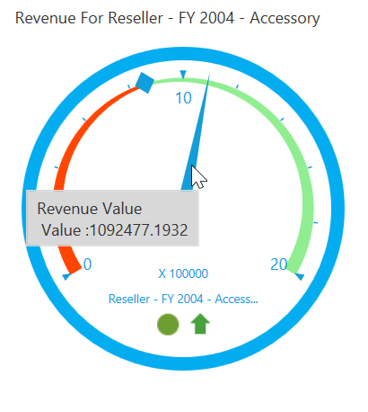
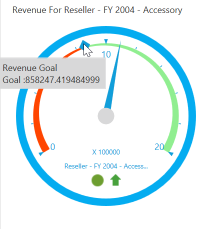

# Tooltip in WPF OLAP Gauge

The OLAP gauge provides information about the values when the mouse pointer is moved over the gauge.

## Pointer tooltip

The OLAP gauge provides value information when the mouse pointer is moved over the pointer. This can be achieved by enabling the [ShowPointersTooltip](https://help.syncfusion.com/cr/wpf/Syncfusion.Windows.Gauge.Olap.OlapGauge.html#Syncfusion_Windows_Gauge_Olap_OlapGauge_ShowPointersTooltip) property.

The following code snippet illustrates how to show a tooltip for pointers.





<syncfusion:OlapGauge x:Name="OlapGauge1" ShowPointersTooltip="True"/>





this.OlapGauge1.ShowPointersTooltip = true;





Me.OlapGauge1.ShowPointersTooltip = True





## Marker tooltip

The OLAP gauge provides goal information when the mouse pointer is moved over the marker. This can be achieved by enabling the [ShowMarkersTooltip](https://help.syncfusion.com/cr/wpf/Syncfusion.Windows.Gauge.Olap.OlapGauge.html#Syncfusion_Windows_Gauge_Olap_OlapGauge_ShowMarkersTooltip) property.

The following code snippet illustrates how to show a tooltip for markers.





<syncfusion:OlapGauge x:Name="OlapGauge1" ShowMarkersTooltip="True"/>





this.OlapGauge1.ShowMarkersTooltip = true;





Me.OlapGauge1.ShowMarkersTooltip = True





A demo sample is available at the following location.

{system drive}:\Users\&lt;User Name&gt;\AppData\Local\Syncfusion\EssentialStudio\&lt;Version Number&gt;\WPF\OlapGauge.WPF\Samples\Product ShowCase\KPI\
