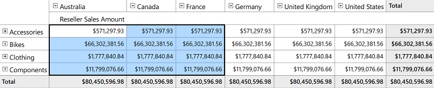

# Cell Selection in WPF Olap Grid

The OLAP grid supports Excel-like cell selection, where you can select grid value cells as in the Microsoft Excel. This can be achieved by setting the `AllowSelection` property of the OLAP grid to true.

On cell selection, an event named **"SelectionChanged"** will be triggered, and the **"OlapGridSelectionChangedEventArgs"** returns an IEnumerable collection of column, row, and value of the corresponding selected cell. The event argument also returns the cell range and selection reason such as mouse down, mouse move, and mouse up.
 
The following code sample shows how to enable cell selection.


  


<!--Adding OlapGrid and enabling cell selection-->
<syncfusion:OlapGrid AllowSelection="True" SelectionChanged="olapGrid1_SelectionChanged"> 
</syncfusion:OlapGrid>





public MainWindow()
{
    InitializeComponent();
            
    //OlapGrid Instantiation
    OlapGrid olapGrid1 = new OlapGrid();
    //OlapGrid added to an parent Grid present in the Main Window
    this.gridContainer.Children.Add(olapGrid1);
    //Connection string is passed to OlapDataManager as an argument
    OlapDataManager olapDataManager = new OlapDataManager("Enter a valid connection string");
    //Set current report for OlapDataManager.
    olapDataManager.SetCurrentReport(CreateOlapReport());
    //Specifying OlapDataManager to Grid.
    olapGrid1.OlapDataManager = olapDataManager;
    //Enable Cell Selection
    olapGrid1.AllowSelection = true;
    olapGrid1.SelectionChanged += olapGrid1_SelectionChanged;
    olapGrid1.DataBind();      
}

private void olapGrid1_SelectionChanged(object sender, OlapGridSelectionChangedEventArgs e)
{
    //Enter your code
}
 




Public Sub New()
    InitializeComponent()
       
    Dim OlapGrid1 As OlapGrid = New OlapGrid()
    ' OlapGrid added to an parent Grid present in the Main Window
    Me.gridContainer.Children.Add(olapGrid1);
    ' Instantiating OlapDataManager. 
    Dim olapDataManager As OlapDataManager = New OlapDataManager("Enter a valid connection string")
    ' Set current report for OlapDataManager.
    olapDataManager.SetCurrentReport(olapReport())
    ' Specifying OlapDataManager to Grid.
    Me.OlapGrid1.OlapDataManager = OlapDataManager
    ' Enable Cell Selection.
    Me.OlapGrid1.AllowSelection = True
    Me.OlapGrid1.SelectionChanged += OlapGrid1_SelectionChanged;
    Me.OlapGrid1.DataBind()
End Sub
    
Private Sub OlapGrid1_SelectionChanged(ByVal sender As Object, ByVal e As Syncfusion.Windows.Grid.Olap.OlapGridSelectionChangedEventArgs)
    'Enter your code here
End Sub





A sample demo is available in the following location.

{system drive}:\Users\&lt;User Name&gt;\AppData\Local\Syncfusion\EssentialStudio\&lt;Version Number&gt;\WPF\OlapGrid.WPF\Samples\Selection\Cell Selection

