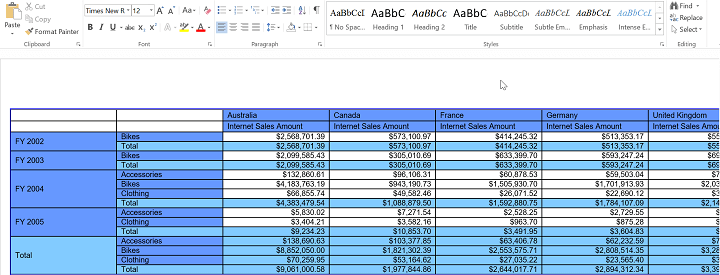
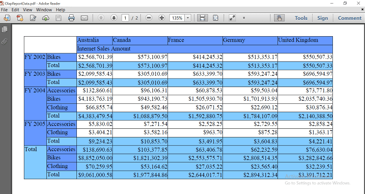
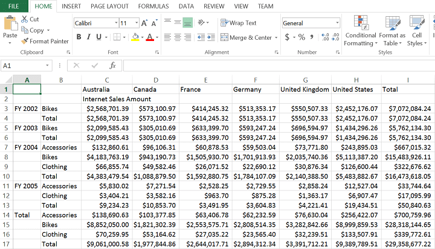

# Exporting in WPF Olap Grid

The OLAP grid can be exported to Microsoft Excel, Microsoft Word, PDF, and CSV file formats. To perform exporting operation, add the following assembly along with default assemblies in the reference folder.

* Syncfusion.OlapGridConverter.Wpf 
 
The OLAP grid can be exported using the following methods.

**Excel export**
 

  


SaveFileDialog saveFileDialog = new SaveFileDialog();
saveFileDialog.AddExtension = true;
saveFileDialog.FileName = "OlapGrid Report";
saveFileDialog.DefaultExt = "xls";
saveFileDialog.Filter = "Excel file (.xls)|*.xls";
if (saveFileDialog.ShowDialog() == true)
{
    if (this.olapGrid.InternalGrid != null && this.olapGrid.InternalGrid.Engine != null)
    {
        GridExcelExport  gridExcelExport = new GridExcelExport(this.olapGrid.InternalGrid.Engine);
        gridExcelExport.Export(saveFileDialog.FileName);
        MessageBox.Show("Excel document exported successfully!");
    }
}





Dim saveFileDialog As New SaveFileDialog()
saveFileDialog.AddExtension = True
saveFileDialog.FileName = "OlapGrid Report"
saveFileDialog.DefaultExt = "xls"
saveFileDialog.Filter = "Excel file (.xsl)|*.xls"
If saveFileDialog.ShowDialog() = True Then
    If Me.olapGrid.InternalGrid IsNot Nothing AndAlso Me.olapGrid.InternalGrid.Engine IsNot Nothing Then
        Dim gridExcelExport As New GridExcelExport(Me.olapGrid.InternalGrid.Engine)
        gridExcelExport.Export(saveFileDialog.FileName)
        MessageBox.Show("Excel document exported successfully!")
    End If
End If
    




**Word export**


  


SaveFileDialog saveFileDialog = new SaveFileDialog();
saveFileDialog.AddExtension = true;
saveFileDialog.FileName = "OlapGrid Report";
saveFileDialog.DefaultExt = "Doc";
saveFileDialog.Filter =  "Word file (.Doc)|*.Doc";
if (saveFileDialog.ShowDialog() == true)
{
    if (this.olapGrid.InternalGrid != null && this.olapGrid.InternalGrid.Engine != null)
    {
        GridWordExport  gridWordExport = new GridWordExport(this.olapGrid.InternalGrid.Engine);
        gridWordExport.Export(saveFileDialog.FileName);
        MessageBox.Show("Word document exported successfully!");
    }
}





Dim saveFileDialog As New SaveFileDialog()
saveFileDialog.AddExtension = True
saveFileDialog.FileName = "OlapGrid Report"
saveFileDialog.DefaultExt = "Doc"
saveFileDialog.Filter = "Word file (.Doc)|*.Doc"
If saveFileDialog.ShowDialog() = True Then
    If Me.olapGrid.InternalGrid IsNot Nothing AndAlso Me.olapGrid.InternalGrid.Engine IsNot Nothing Then
        Dim gridWordExport As New GridWordExport(Me.olapGrid.InternalGrid.Engine)
        gridWordExport.Export(saveFileDialog.FileName)
        MessageBox.Show("Word document exported successfully!")
    End If
End If





**PDF export**


 


SaveFileDialog saveFileDialog = new SaveFileDialog();
saveFileDialog.AddExtension = true;
saveFileDialog.FileName = "OlapGrid Report";
saveFileDialog.DefaultExt = "Pdf";
saveFileDialog.Filter =  = "Pdf file (.pdf)|*.pdf";
if (saveFileDialog.ShowDialog() == true)
{
    if (this.olapGrid.InternalGrid != null && this.olapGrid.InternalGrid.Engine != null)
    {
        GridPdfExport  gridPdfExport = new GridPdfExport(this.olapGrid.InternalGrid.Engine);
        gridPdfExport.Export(saveFileDialog.FileName);
        MessageBox.Show("Pdf document exported successfully!");
    }
}





Dim saveFileDialog As New SaveFileDialog()
saveFileDialog.AddExtension = True
saveFileDialog.FileName = "OlapGrid Report"
saveFileDialog.DefaultExt = "Pdf"
saveFileDialog.Filter = "Pdf file (.pdf)|*.pdf"
If saveFileDialog.ShowDialog() = True Then
    If Me.olapGrid.InternalGrid IsNot Nothing AndAlso Me.olapGrid.InternalGrid.Engine IsNot Nothing Then
        Dim gridPdfExport As New GridPdfExport(Me.olapGrid.InternalGrid.Engine)
        gridPdfExport.Export(saveFileDialog.FileName)
        MessageBox.Show("Pdf document exported successfully!")
    End If
End If





**CSV export**


  


SaveFileDialog saveFileDialog = new SaveFileDialog();
saveFileDialog.AddExtension = true;
saveFileDialog.FileName = "OlapGrid Report";
saveFileDialog.DefaultExt = "CSV";
saveFileDialog.Filter = "Csv file (.csv)|*.csv";
if (saveFileDialog.ShowDialog() == true)
{
    if (this.olapGrid.InternalGrid != null && this.olapGrid.InternalGrid.Engine != null)
    {
        GridCsvExport gridCsvExport = new GridCsvExport(this.olapGrid.InternalGrid.Engine);
        gridCsvExport.Export(saveFileDialog.FileName);
        MessageBox.Show("CSV document exported successfully!");
    }
}





Dim saveFileDialog As New SaveFileDialog()
saveFileDialog.AddExtension = True
saveFileDialog.FileName = "OlapGrid Report"
saveFileDialog.DefaultExt = "CSV"
saveFileDialog.Filter = "Csv file (.csv)|*.csv"
If saveFileDialog.ShowDialog() = True Then
    If Me.olapGrid.InternalGrid IsNot Nothing AndAlso Me.olapGrid.InternalGrid.Engine IsNot Nothing Then
        Dim gridCsvExport As New GridCsvExport(Me.olapGrid.InternalGrid.Engine)
        gridCsvExport.Export(saveFileDialog.FileName)
        MessageBox.Show("CSV document exported successfully!")
    End If
End If





A sample demo is available in the following location.

{system drive}:\Users\&lt;User Name&gt;\AppData\Local\Syncfusion\EssentialStudio\&lt;Version Number&gt;\WPF\OlapGrid.WPF\Samples\Exporting\Exporting Grid
