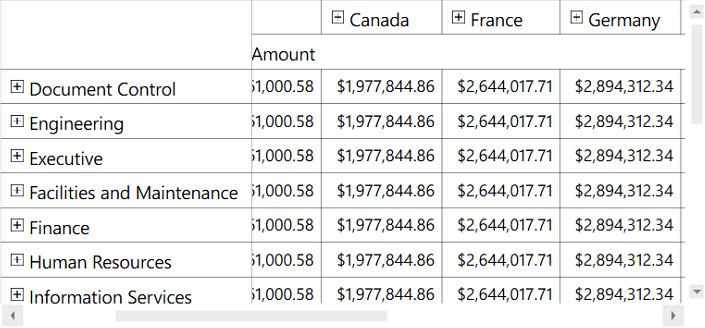

# Freeze Headers in WPF OlapGrid

The OLAP grid provides built-in support to freeze the column and row headers. This can be achieved by setting the `FreezeHeaders` property of OLAP grid to **"true"**.


  


<syncfusion:OlapGrid  FreezeHeaders="True"> 
</syncfusion:OlapGrid>





// To freeze OlapGrid Headers
this.OlapGrid1.FreezeHeaders = true;





' To freeze OlapGrid Headers
Me.OlapGrid1.FreezeHeaders = True





A sample demo is available in the following location.

{system drive:}\Users\&lt;User Name&gt;\AppData\Local\Syncfusion\EssentialStudio\&lt;Version Number&gt;\WPF\OlapGrid.WPF\Samples\Appearance\Frozen Header

