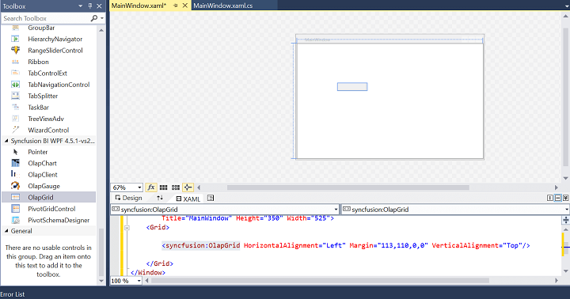
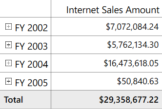

# Getting Started with WPF Olap Grid

>**Important**
Starting with v16.2.0.x, if you refer to Syncfusion assemblies from trial setup or from the NuGet feed, include a license key in your projects. Refer to this [link](https://help.syncfusion.com/common/essential-studio/licensing/license-key) to learn about registering Syncfusion license key in your WPF application to use the components.

This section covers the information required to create a simple OLAP grid bound to the OLAP data source.

## Through Visual Studio

Open Visual Studio IDE and go to File > New > Project > WPF Application (inside Visual C# Templates) to create a new WPF application.
  
After creating the WPF application, go to View menu and select Toolbox option. Now, the Toolbox will appear inside Visual Studio IDE. From the Visual Studio Toolbox, drag and drop the OLAP grid under the **Syncfusion BI WPF** tag. It will automatically add the required assemblies into the application.

Add a **Name** to the OLAP grid component for accessing it through code-behind as shown in the following code sample.



<Window x:Class="WpfApplication.MainWindow1"
        xmlns="http://schemas.microsoft.com/winfx/2006/xaml/presentation"
        xmlns:x="http://schemas.microsoft.com/winfx/2006/xaml"
        xmlns:syncfusion="http://schemas.syncfusion.com/wpf">
        <Grid>
            <syncfusion:OlapGrid Name="olapGrid1" HorizontalAlignment="Left" Margin="248,137,0,0" VerticalAlignment="Top"/>
        </Grid>
</Window>



Include the following namespaces in the code-behind for using OlapReport and OlapDataManger in the application.

   * Syncfusion.Olap.Manager
   * Syncfusion.Olap.Reports
   

   

 
using Syncfusion.Olap.Manager;
using Syncfusion.Olap.Reports;
public partial class MainWindow : SampleWindow
{
    private OlapDataManager olapDataManager = null;
    private string _connectionSting = "Enter a valid connection string";
    public MainWindow
    {
        //Connection string is passed to OlapDataManager as an argument
        olapDataManager = new OlapDataManager(_connectionSting);
        InitializeComponent();
        //A default OlapReport is set to OlapDataManager
        olapDataManager.SetCurrentReport(CreateOlapReport());
        // Finally OlapGrid gets information from the OlapDataManager
        this.olapGrid1.OlapDataManager = olapDataManager;
        this.olapGrid1.DataBind();
    }
        
    /// 

    /// Defining OlapReport with Dimension and Measure
    /// 

    private OlapReport CreateOlapReport()
    {
        OlapReport olapReport = new OlapReport();
        //Setting the Cube name
        olapReport.CurrentCubeName = "Adventure Works";
        DimensionElement dimensionElementColumn = new DimensionElement();
        //Specifying the name of the Dimension
        dimensionElementColumn.Name = "Customer";
        //Specifying the Hierarchy and Level name
        dimensionElementColumn.AddLevel("Customer Geography", "Country");
        MeasureElements measureElementColumn = new MeasureElements();
        //Specifying the Measure name
        measureElementColumn.Elements.Add(new MeasureElement { Name = "Reseller Sales Amount" });
        DimensionElement dimensionElementRow = new DimensionElement();
        // Specifying the name of the Dimension
        dimensionElementRow.Name = "Date";
        // Specifying the Hierarchy and Level name
        dimensionElementRow.AddLevel("Fiscal", "Fiscal Year");
        ///Adding Dimension in column axis
        olapReport.CategoricalElements.Add(dimensionElementColumn);
        ///Adding Measure in column axis
        olapReport.CategoricalElements.Add(measureElementColumn);
        ///Adding Dimension in row axis
        olapReport.SeriesElements.Add(dimensionElementRow);
        return olapReport;
    }		
}
        



 
Imports Syncfusion.Olap.Manager
Imports Syncfusion.Olap.Reports
Partial Public Class MainWindow 
    Inherits SampleWindow
    Private olapDataManager As OlapDataManager = Nothing
    Private _connectionSting As String = " Enter valid connection string;"
    Private Sub MainWindow() As Public
        'Connection string is passed to OlapDataManager as an argument
        olapDataManager = New OlapDataManager(_connectionSting)
        InitializeComponent()
        'A default OlapReport is set to OlapDataManager
        'Finally OlapGrid gets information from the OlapDataManager
        Me.olapGrid1.OlapDataManager = olapDataManager
        Me.olapGrid1.DataBind()
    End Sub
    
    ''' 

    ''' Defining OlapReport with Dimension and Measure
    ''' 

    Private Function CreateOlapReport() As OlapReport
        Dim olapReport As OlapReport = New OlapReport()
        'Setting the Cube name
        olapReport.CurrentCubeName = "Adventure Works"
        Dim dimensionElementColumn As DimensionElement = New DimensionElement()
        'Specifying the name of the Dimension
        dimensionElementColumn.Name = "Customer"
        'Specifying the Hierarchy and Level name
        dimensionElementColumn.AddLevel("Customer Geography", "Country")
        Dim measureElementColumn As MeasureElements = New MeasureElements()
        ' Specifying the Measure name
        measureElementColumn.Elements.Add(New MeasureElement With {.Name = "Reseller Sales Amount"})
        Dim dimensionElementRow As DimensionElement = New DimensionElement()
        ' Specifying the name of the Dimension
        dimensionElementRow.Name = "Date"
        ' Specifying the Hierarchy and Level name
        dimensionElementRow.AddLevel("Fiscal", "Fiscal Year")
        ''' Adding Dimension in column axis
        olapReport.CategoricalElements.Add(dimensionElementColumn)
        ''' Adding Measure in column axis
        olapReport.CategoricalElements.Add(measureElementColumn)
        ''' Adding Dimension in row axis
        olapReport.SeriesElements.Add(dimensionElementRow)
        Return olapReport
    End Function
End Class


   


Run the application. The following output will be generated.

   
## Through Expression Blend

Open Blend for Visual Studio and go to File > New project > WPF > WPF Application to create a new WPF application.

Select the **Project** tab available in the left corner of the Blend IDE. Right-click the **References** and select **Add Reference**. Now, browse and add the following assemblies to the project.

* Syncfusion.Grid.Wpf
* Syncfusion.Olap.Base
* Syncfusion.OlapGrid.Wpf
* Syncfusion.OlapGridCommon.Wpf
* Syncfusion.OlapShared.Wpf

N> You can also get the assemblies by browsing to the default assembly location: {System Drive}:\Program Files (x86)\Syncfusion\Essential Studio\&lt;version number&gt;\precompiledassemblies\&lt;version number&gt;\&lt;framework version&gt;\
  
On adding the above assemblies, the OLAP grid control will be added under the **Assets** tab automatically. Now, choose the **Assets** tab and drag the OLAP grid to the designer.

Add a **Name** to the OLAP grid component for accessing it through code-behind as shown in the following code sample.



<Window
    xmlns="http://schemas.microsoft.com/winfx/2006/xaml/presentation"
    xmlns:x="http://schemas.microsoft.com/winfx/2006/xaml"
    xmlns:syncfusion="http://schemas.syncfusion.com/wpf"                
    x:Class="WpfApplication.MainWindow"
    xmlns:local ="c"
    Title="MainWindow" Height="350" Width="525"                        
    Loaded="Window_Loaded_1" >
    <Grid>
        <syncfusion:olapGrid Name="olapGrid1"/>
    </Grid>
</Window>
	

    
Include the following namespaces in the code-behind for using OlapReport and OlapDataManger in the application.

    * Syncfusion.Olap.Manager
    * Syncfusion.Olap.Reports


   

   
using Syncfusion.Olap.Manager;
using Syncfusion.Olap.Reports;
public partial class MainWindow : SampleWindow
{
    private OlapDataManager olapDataManager = null;
    private string _connectionSting = "Enter a valid connection string";
    public MainWindow()
    {
        InitializeComponent();
        //Connection string is passed to OlapDataManager as an argument
        olapDataManager = new OlapDataManager(_connectionSting);
        //A default OlapReport is set to OlapDataManager
        olapDataManager.SetCurrentReport(CreateOlapReport());
        // Finally OLAP Grid gets the information from the OlapDataManager
        this.olapGrid1.OlapDataManager = olapDataManager;
        this.olapGrid1.DataBind();
    }
         
    /// 

    /// Defining OlapReport with Dimension and Measure
    /// 

    private OlapReport CreateOlapReport()
    {
        OlapReport olapReport = new OlapReport();
        // Setting the Cube name
        olapReport.CurrentCubeName = "Adventure Works";
        DimensionElement dimensionElementColumn = new DimensionElement();
        // Specifying the name of the Dimension
        dimensionElementColumn.Name = "Customer";
        // Specifying the Hierarchy and Level name
        dimensionElementColumn.AddLevel("Customer Geography", "Country");
        MeasureElements measureElementColumn = new MeasureElements();
        //Specifying the Measure name
        measureElementColumn.Elements.Add(new MeasureElement { Name = "Internet Sales Amount" });
        DimensionElement dimensionElementRow = new DimensionElement();
        // Specifying the name of the Dimension
        dimensionElementRow.Name = "Date";
        // Specifying the Hierarchy and Level name
        dimensionElementRow.AddLevel("Fiscal", "Fiscal Year");
        ///Adding Dimension in column axis
        olapReport.CategoricalElements.Add(dimensionElementColumn);
        ///Adding Measure in column axis
        olapReport.CategoricalElements.Add(measureElementColumn);
        ///Adding Dimension in row axis
        olapReport.SeriesElements.Add(dimensionElementRow);
        return olapReport;
    }
}
				        

    

 
Imports Syncfusion.Olap.Manager
Imports Syncfusion.Olap.Reports
Partial Public Class MainWindow Inherits SampleWindow
    Private olapDataManager As OlapDataManager = Nothing
    Private _connectionSting As String = "Enter a valid connection string"
    Private Sub MainWindow() As Public
       Connection string is passed to OlapDataManager as an argument
       olapDataManager = New OlapDataManager(_connectionSting)
       InitializeComponent()
       'A default OlapReport is set to OlapDataManager
       olapdata.SetCurrentReport(CreateOlapReport())
       'Finally OLAP Grid gets the information from the OlapDataManager
       Me.olapGrid1.OlapDataManager = olapDataManager
       Me.olapGrid1.DataBind()
    End Sub
    
    ''' 

    ''' Defining OlapReport with Dimension and Measure
    ''' 

    Private Function CreateOlapReport() As OlapReport
       Dim olapReport As OlapReport = New OlapReport()
       ' Setting the Cube name
       olapReport.CurrentCubeName = "Adventure Works"
       Dim dimensionElementColumn As DimensionElement = New DimensionElement()
       ' Specifying the name of the Dimension
       dimensionElementColumn.Name = "Customer"
       ' Specifying the Hierarchy and Level name
       dimensionElementColumn.AddLevel("Customer Geography", "Country")
       Dim measureElementColumn As MeasureElements = New MeasureElements()
       ' Specifying the Measure name
       measureElementColumn.Elements.Add(New MeasureElement With {.Name = "Internet Sales Amount"})
       Dim dimensionElementRow As DimensionElement = New DimensionElement()
       ' Specifying the name of the Dimension
       dimensionElementRow.Name = "Date"
       ' Specifying the Hierarchy and Level name
       dimensionElementRow.AddLevel("Fiscal", "Fiscal Year")
       ''' Adding Dimension in column axis
       olapReport.CategoricalElements.Add(dimensionElementColumn)
       ''' Adding Measure in column axis
       olapReport.CategoricalElements.Add(measureElementColumn)
       ''' Adding Dimension in row axis
       olapReport.SeriesElements.Add(dimensionElementRow)
       Return olapReport
    End Function
End Class


  

    
Run the application. The following output will be generated.

   
## Through code-behind

Open Visual Studio IDE and go to File > New > Project > WPF Application (inside Visual C# Templates) to create a new WPF application.
   
To add the dependency assemblies within the application, right-click the **References** and select **Add Reference**. Then, add the following Syncfusion assemblies manually to the project from the installed location.

   * Syncfusion.Core
   * Syncfusion.Grid.Wpf
   * Syncfusion.Olap.Base
   * Syncfusion.OlapGrid.Wpf
   * Syncfusion.OlapGridCommon.Wpf
   * Syncfusion.OlapShared.Wpf
 
N> You can also get the assemblies by browsing to the default assembly location: {System Drive}:\Program Files (x86)\Syncfusion\Essential Studio\&lt;version number&gt;\precompiledassemblies\&lt;version number&gt;\&lt;framework version&gt;\

Include the following namespace in code-behind for OlapGrid, OlapDataManager, and OlapReport.

   * Syncfusion.Windows.Grid.Olap
   * Syncfusion.Olap.Manager
   * Syncfusion.Olap.Reports





using Syncfusion.Windows.Grid.Olap;
using Syncfusion.Olap.Manager;
using Syncfusion.Olap.Reports;
namespace WpfApplication1
{
    public partial class MainWindow : Window
    {
        public MainWindow()
        {
            //OlapGrid Instantiation
            OlapGrid olapGrid1 = new OlapGrid();
            InitializeComponent();
            //Connection string is passed to OlapDataManager as an argument
            OlapDataManager olapDataManager = new OlapDataManager("Enter a valid connection string");
            //A default OlapReport is set to OlapDataManager
            olapDataManager.SetCurrentReport(CreateOlapReport());
            //Finally OlapGrid gets information from the OlapDataManager 
            olapGrid1.OlapDataManager = olapDataManager;
            olapGrid1.DataBind();
            // OlapGrid added to the Main Window grid region
            grid.Children.Add(olapGrid1);
        }
             
        /// 

        /// Defining OlapReport with Dimension and Measure
        /// 

        private OlapReport CreateOlapReport()
        {
            OlapReport olapReport = new OlapReport();
            // Setting the Cube name
            olapReport.CurrentCubeName = "Adventure Works";
            DimensionElement dimensionElementColumn = new DimensionElement();
            DimensionElement dimensionElementRow = new DimensionElement();
            // Specifying the name of the Dimension
            dimensionElementColumn.Name = "Customer";
            // Specifying the Hierarchy and Level name
            dimensionElementColumn.AddLevel("Customer Geography", "Country");
            MeasureElements measureElementColumn = new MeasureElements();
            //Specifying the Measure name
            measureElementColumn.Elements.Add(new MeasureElement { Name = "Reseller Sales Amount" });
            // Specifying the name of the Dimension
            dimensionElementRow.Name = "Date";
            // Specifying the Hierarchy and Level name
            dimensionElementRow.AddLevel("Fiscal", "Fiscal Year");
            ///Adding Dimension in column axis
            olapReport.CategoricalElements.Add(dimensionElementColumn);
            ///Adding Measure in column axis
            olapReport.CategoricalElements.Add(measureElementColumn);
            ///Adding Dimension in row axis
            olapReport.SeriesElements.Add(dimensionElementRow);
            return olapReport;
        }
    }
}





Imports Syncfusion.Windows.Grid.Olap
Imports Syncfusion.Olap.Manager
Imports Syncfusion.Olap.Reports
    Partial Public Class MainWindow Inherits Window
    Public Sub New()
        'OlapGrid Instantiation
        Dim olapGrid1 As OlapGrid = New OlapGrid()
        InitializeComponent()
        'Connection string is passed to OlapDataManager as an argument
        Dim olapDataManager As OlapDataManager = New OlapDataManager("Enter a valid connection string")
        'A default OlapReport is set to OlapDataManager
        olapDataManager.SetCurrentReport(CreateOlapReport())
        'Finally OlapGrid gets the information from the OlapDataManager
        olapGrid1.OlapDataManager = olapDataManager
        olapGrid1.DataBind()
        'OlapGrid added to the Main Window grid region
        grid.Children.Add(olapGrid1)
    End Sub
    
    ''' 

    ''' Defining OlapReport with Dimension and Measure
    ''' 

    Private Function CreateOlapReport() As OlapReport
        Dim olapReport As OlapReport = New OlapReport()
        ' Setting the Cube name
        olapReport.CurrentCubeName = "Adventure Works"
        Dim dimensionElementColumn As DimensionElement = New DimensionElement()
        ' Specifying the name of the Dimension
        dimensionElementColumn.Name = "Customer"
        ' Specifying the Hierarchy and Level name
        dimensionElementColumn.AddLevel("Customer Geography", "Country")
        Dim measureElementColumn As MeasureElements = New MeasureElements()
        ' Specifying the Measure name
	    measureElementColumn.Elements.Add(New MeasureElement With {.Name = "Reseller Sales Amount"})
        Dim dimensionElementRow As DimensionElement = New DimensionElement()
	    ' Specifying the name of the Dimension
        dimensionElementRow.Name = "Date"
        ' Specifying the Hierarchy and Level name
        dimensionElementRow.AddLevel("Fiscal", "Fiscal Year")
        ''' Adding Dimension in column axis
        olapReport.CategoricalElements.Add(dimensionElementColumn)
        ''' Adding Measure in column axis
	    olapReport.CategoricalElements.Add(measureElementColumn)
        ''' Adding Dimension in row axis
        olapReport.SeriesElements.Add(dimensionElementRow)
        Return olapReport
    End Function
End Class





Run the application. The following output will be generated.

   
## Design-time binding

Design-time binding support for OLAP grid allows you to reduce the time spent on creating and customizing the report. Normally, it takes 5 to 10 minutes for creating a report and in the case of unfamiliar cubes it may extend further, but by using design-time support you can create a report in a couple of minutes. The following section explain how to create a report during design-time.

First drag the OLAP grid control from the toolbox to the Visual Studio designer surface.

Right-click the OLAP grid available in the designer and go to **Configure data source > Create/Edit data source…** option in the context menu. Now, the **Data Source Properties** wizard opens.

From the **Data Source Properties** wizard, select the connection type. If you want to connect to SSAS, select **Use server name and database to connect to a server** and specify the necessary information to connect to the server. If you want to connect to an offline cube, select **Use a connection string to connect to a server** and enter your connection string path.

If you want to test the connection, click the **Test Connection** button that is displayed on the bottom-left corner of the window. Click the **Next** button, to proceed.

N> The next button is enabled only when any one of the connection options is filled properly.

When the connection is valid, it displays the summary page of the **Data Source Properties** wizard. When you create a query for the first time, the MDX query textbox in the summary page is empty. When you edit an existing query, it displays the current query in the text box.

 
For creating or editing a query, click the **Create/Edit** link that is displayed on the top-right side of the MDX query textbox. This opens a **Query Designer** dialog.

When you edit an existing query, it displays the required dimensions in the specific axis of the query designer and the preview of that query is displayed in a grid control.
   
N> It does not display any style/formatting applied to the grid. It only displays the result of the query.

Drag and drop dimensions to frame a new query. Then, click OK, to save the query or click Cancel, to revert the changes made during this session.
 
The summary page of the **Data Source Properties** wizard displays the resultant MDX query.

Click **Finish** and run the application.

    
