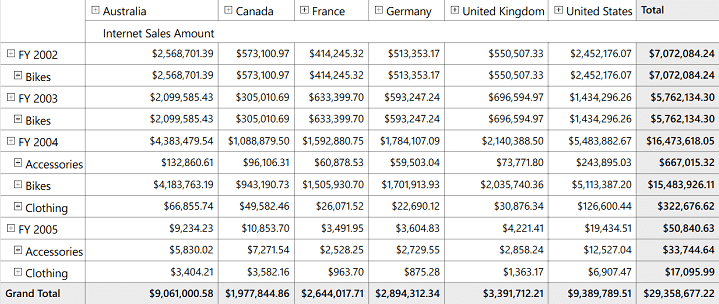
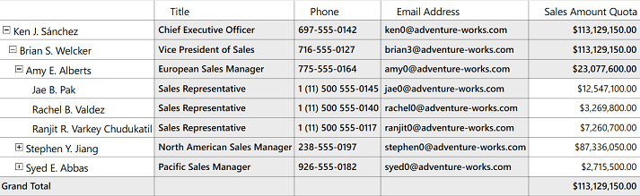
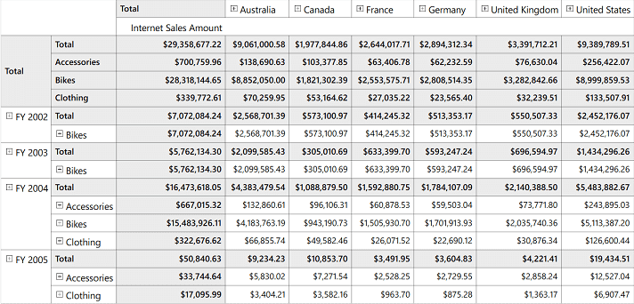

# Grid Layout in WPF Olap Grid

The position of summary cells in the OLAP grid can be customized with the help of grid layouts. It can be positioned at the top or bottom of each parent member.

The following are the five different types of layouts supported by the OLAP grid:

* Normal layout.
* Excel-like layout.
* Excel-like layout with member properties.
* Normal top summary.
* No summaries layout.

**Normal layout**

Normal layout is the default layout of OLAP grid. In normal layout, the summary cells are positioned at the bottom of each parent member and the child members are positioned adjacent to it.


  


/// Grid Layout will be Normal
this.OlapGrid1.Layout = GridLayout.Normal; 





' Grid Layout will be Normal
Me.OlapGrid1.Layout = GridLayout.Normal





**Excel-like layout**

In the Excel-like layout, the summary cells are positioned at the bottom alone and the child members are positioned below the parent member with some indent space.


  


/// Excel-like Grid Layout
this.OlapGrid1.Layout = GridLayout.ExceLikeLayout; 





' Excel-like Grid Layout
Me.OlapGrid1.Layout = GridLayout.ExceLikeLayout





**Excel-like layout with member properties**

This layout is used to display member properties along with dimension members. These properties appear adjacent to each member.

N> This layout is applicable only for members having properties defined in the OLAP cube and those members are bound to the OLAP grid through the OLAP report.


  


/// Excel-like Grid Layout with Member Properties 
this.OlapGrid1.Layout = GridLayout.ExcelLikeLayoutWithMemberProperties;





' Excel-like Grid Layout with Member Properties
Me.OlapGrid1.Layout = GridLayout.ExcelLikeLayoutWithMemberProperties





**Normal top summary layout**

In normal top summary layout, the summary cells are positioned at the top of each parent member and the child members are positioned adjacent to it.


  


/// Grid Layout will be Normal with summary positioned at the top
this.OlapGrid1.Layout = GridLayout.NormalTopSummary; 





' Grid Layout will be Normal with summary positioned at the top
Me.OlapGrid1.Layout = GridLayout.NormalTopSummary





**No summaries layout**

In no summaries layout, the summary cells are hidden and the child members appear adjacent to the parent member.


  


/// Grid Layout without Summaries
this.OlapGrid1.Layout = GridLayout.NoSummaries; 





' Grid Layout without Summaries
Me.OlapGrid1.Layout = GridLayout.NoSummaries





A sample demo is available in the following location.

{system drive}:\Users\&lt;User Name&gt;\AppData\Local\Syncfusion\EssentialStudio\&lt;Version Number&gt;\WPF\OlapGrid.WPF\Samples\Appearance\Grid Layout
