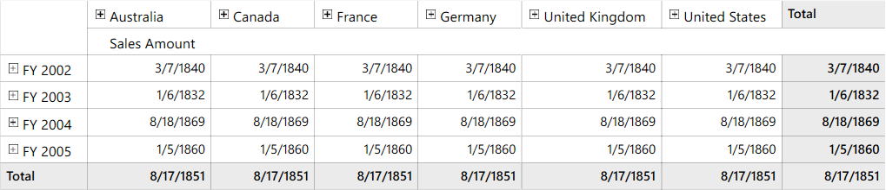
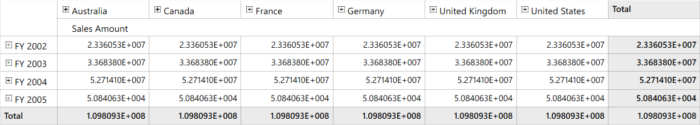
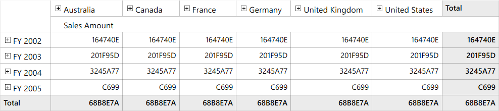
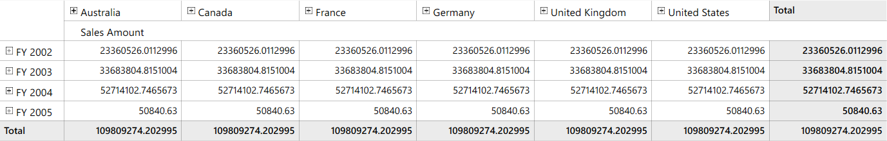
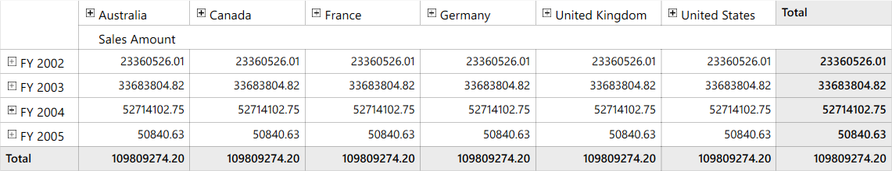

# Apply Formatting for Measure and Value Elements

The values of measure and value element can be formatted by using the `Format` property of corresponding elements. The following are the format types supported by measure and value elements:

* Currency
* Percent
* Number
* Date
* Scientific
* Accounting
* Time
* Fraction
* HexaDecimal
* Decimal
* RoundTrip
* General
* FixedPoint
* Custom
* None

N> To read the [DisplayMeasuresInDesiredOrder](https://help.syncfusion.com/wpf/olap-grid/how-to/display-measures-and-kpis-in-desired-order) section of the documentation for adding the value elements.

## Percent format

This format displays the values of measure and value element in percentage format.

Refer to the following code sample to format the measure element values in percentage format.





MeasureElements measureElementGroup = new MeasureElements();
measureElementGroup.Elements.Add(new MeasureElement() { ElementName = "Sales Amount", Format = NumberFormat.Percent });
olapReport.CategoricalElements.Add(measureElementGroup);





Dim measureElementGroup As New MeasureElements()
measureElementGroup.Elements.Add(New MeasureElement() With {.ElementName = "Sales Amount", .Format = NumberFormat.Percent})
olapReport.CategoricalElements.Add(measureElementGroup)





Refer to the following code sample to format the value element values in percentage format.





ValueElements valueElementGroup = new ValueElements();
valueElementGroup.Elements.Add(new ValueElement() { ElementName = "Sales Amount", Format = NumberFormat.Percent });
olapReport.CategoricalElements.Add(valueElementGroup);





Dim valueElementGroup As New ValueElements()
valueElementGroup.Elements.Add(New ValueElement() With {.ElementName = "Sales Amount", .Format = NumberFormat.Percent})
olapReport.CategoricalElements.Add(valueElementGroup)





## Currency format

This format displays the values of measure and value element in currency format.

Refer to the following code sample to format the measure element values in currency format.





MeasureElements measureElementGroup = new MeasureElements();
measureElementGroup.Elements.Add(new MeasureElement() { ElementName = "Sales Amount", Format = NumberFormat.Currency });
olapReport.CategoricalElements.Add(measureElementGroup);





Dim measureElementGroup As New MeasureElements()
measureElementGroup.Elements.Add(New MeasureElement() With {.ElementName = "Sales Amount", .Format = NumberFormat.Currency})
olapReport.CategoricalElements.Add(measureElementGroup)





Refer to the following code sample to format the value element values in currency format.





ValueElements valueElementGroup = new ValueElements();
valueElementGroup.Elements.Add(new ValueElement() { ElementName = "Sales Amount", Format = NumberFormat.Currency });
olapReport.CategoricalElements.Add(valueElementGroup);





Dim valueElementGroup As New ValueElements()
valueElementGroup.Elements.Add(New ValueElement() With {.ElementName = "Sales Amount", .Format = NumberFormat.Currency})
olapReport.CategoricalElements.Add(valueElementGroup)





## Number format

This format displays the values of measure and value element in numeric format.

Refer to the following code sample to format the measure element values in number format.





MeasureElements measureElementGroup = new MeasureElements();
measureElementGroup.Elements.Add(new MeasureElement() { ElementName = "Sales Amount", Format = NumberFormat.Number });
olapReport.CategoricalElements.Add(measureElementGroup);





Dim measureElementGroup As New MeasureElements()
measureElementGroup.Elements.Add(New MeasureElement() With {.ElementName = "Sales Amount", .Format = NumberFormat.Number})
olapReport.CategoricalElements.Add(measureElementGroup)





Refer to the following code sample to format the value element values in number format.





ValueElements valueElementGroup = new ValueElements();
valueElementGroup.Elements.Add(new ValueElement() { ElementName = "Sales Amount", Format = NumberFormat.Number });
olapReport.CategoricalElements.Add(valueElementGroup);





Dim valueElementGroup As New ValueElements()
valueElementGroup.Elements.Add(New ValueElement() With {.ElementName = "Sales Amount", .Format = NumberFormat.Number})
olapReport.CategoricalElements.Add(valueElementGroup)





## Date format

This format displays the values of measure and value element in date format.

Refer to the following code sample to format the measure element values in date format.





MeasureElements measureElementGroup = new MeasureElements();
measureElementGroup.Elements.Add(new MeasureElement() { ElementName = "Sales Amount", Format = NumberFormat.Date });
olapReport.CategoricalElements.Add(measureElementGroup);





Dim measureElementGroup As New MeasureElements()
measureElementGroup.Elements.Add(New MeasureElement() With {.ElementName = "Sales Amount", .Format = NumberFormat.Date})
olapReport.CategoricalElements.Add(measureElementGroup)





Refer to the following code sample to format the value element values in date format.





ValueElements valueElementGroup = new ValueElements();
valueElementGroup.Elements.Add(new ValueElement() { ElementName = "Sales Amount", Format = NumberFormat.Date });
olapReport.CategoricalElements.Add(valueElementGroup);





Dim valueElementGroup As New ValueElements()
valueElementGroup.Elements.Add(New ValueElement() With {.ElementName = "Sales Amount", .Format = NumberFormat.Date})
olapReport.CategoricalElements.Add(valueElementGroup)





## Scientific format

This format displays the values of measure and value element in scientific(exponential) format.

Refer to the following code sample to format the measure element values in scientific format.





MeasureElements measureElementGroup = new MeasureElements();
measureElementGroup.Elements.Add(new MeasureElement() { ElementName = "Sales Amount", Format = NumberFormat.Scientific });
olapReport.CategoricalElements.Add(measureElementGroup);





Dim measureElementGroup As New MeasureElements()
measureElementGroup.Elements.Add(New MeasureElement() With {.ElementName = "Sales Amount", .Format = NumberFormat.Scientific})
olapReport.CategoricalElements.Add(measureElementGroup)





Refer to the following code sample to format the value element values in scientific format.





ValueElements valueElementGroup = new ValueElements();
valueElementGroup.Elements.Add(new ValueElement() { ElementName = "Sales Amount", Format = NumberFormat.Scientific });
olapReport.CategoricalElements.Add(valueElementGroup);





Dim valueElementGroup As New ValueElements()
valueElementGroup.Elements.Add(New ValueElement() With {.ElementName = "Sales Amount", .Format = NumberFormat.Scientific})
olapReport.CategoricalElements.Add(valueElementGroup)





## Accounting format

This format displays the values of measure and value element in accounting format.

Refer to the following code sample to format the measure element values in accounting format.





MeasureElements measureElementGroup = new MeasureElements();
measureElementGroup.Elements.Add(new MeasureElement() { ElementName = "Sales Amount", Format = NumberFormat.Accounting });
olapReport.CategoricalElements.Add(measureElementGroup);





Dim measureElementGroup As New MeasureElements()
measureElementGroup.Elements.Add(New MeasureElement() With {.ElementName = "Sales Amount", .Format = NumberFormat.Accounting})
olapReport.CategoricalElements.Add(measureElementGroup)





Refer to the following code sample to format the value element values in accounting format.





ValueElements valueElementGroup = new ValueElements();
valueElementGroup.Elements.Add(new ValueElement() { ElementName = "Sales Amount", Format = NumberFormat.Accounting });
olapReport.CategoricalElements.Add(valueElementGroup);





Dim valueElementGroup As New ValueElements()
valueElementGroup.Elements.Add(New ValueElement() With {.ElementName = "Sales Amount", .Format = NumberFormat.Accounting})
olapReport.CategoricalElements.Add(valueElementGroup)





## Time format

This format displays the values of measure and value element in time format.

Refer to the following code sample to format the measure element values in time format.





MeasureElements measureElementGroup = new MeasureElements();
measureElementGroup.Elements.Add(new MeasureElement() { ElementName = "Sales Amount", Format = NumberFormat.Time });
olapReport.CategoricalElements.Add(measureElementGroup);





Dim measureElementGroup As New MeasureElements()
measureElementGroup.Elements.Add(New MeasureElement() With {.ElementName = "Sales Amount", .Format = NumberFormat.Time})
olapReport.CategoricalElements.Add(measureElementGroup)





Refer to the following code sample to format the value element values in time format.





ValueElements valueElementGroup = new ValueElements();
valueElementGroup.Elements.Add(new ValueElement() { ElementName = "Sales Amount", Format = NumberFormat.Time });
olapReport.CategoricalElements.Add(valueElementGroup);





Dim valueElementGroup As New ValueElements()
valueElementGroup.Elements.Add(New ValueElement() With {.ElementName = "Sales Amount", .Format = NumberFormat.Time})
olapReport.CategoricalElements.Add(valueElementGroup)





## Fraction format

This format displays the values of measure and value element in fraction number format.

Refer to the following code sample to format the measure element values in fraction format.





MeasureElements measureElementGroup = new MeasureElements();
measureElementGroup.Elements.Add(new MeasureElement() { ElementName = "Sales Amount", Format = NumberFormat.Fraction });
olapReport.CategoricalElements.Add(measureElementGroup);





Dim measureElementGroup As New MeasureElements()
measureElementGroup.Elements.Add(New MeasureElement() With {.ElementName = "Sales Amount", .Format = NumberFormat.Fraction})
olapReport.CategoricalElements.Add(measureElementGroup)





Refer to the following code sample to format the value element values in fraction format.





ValueElements valueElementGroup = new ValueElements();
valueElementGroup.Elements.Add(new ValueElement() { ElementName = "Sales Amount", Format = NumberFormat.Fraction });
olapReport.CategoricalElements.Add(valueElementGroup);





Dim valueElementGroup As New ValueElements()
valueElementGroup.Elements.Add(New ValueElement() With {.ElementName = "Sales Amount", .Format = NumberFormat.Fraction})
olapReport.CategoricalElements.Add(valueElementGroup)





## HexaDecimal format

This format displays the values of measure and value element in hexadecimal format.

Refer to the following code sample to format the measure element values in hexadecimal format.





MeasureElements measureElementGroup = new MeasureElements();
measureElementGroup.Elements.Add(new MeasureElement() { ElementName = "Sales Amount", Format = NumberFormat.HexaDecimal });
olapReport.CategoricalElements.Add(measureElementGroup);





Dim measureElementGroup As New MeasureElements()
measureElementGroup.Elements.Add(New MeasureElement() With {.ElementName = "Sales Amount", .Format = NumberFormat.HexaDecimal})
olapReport.CategoricalElements.Add(measureElementGroup)





Refer to the following code sample to format the value element values in hexadecimal format.





ValueElements valueElementGroup = new ValueElements();
valueElementGroup.Elements.Add(new ValueElement() { ElementName = "Sales Amount", Format = NumberFormat.HexaDecimal });
olapReport.CategoricalElements.Add(valueElementGroup);





Dim valueElementGroup As New ValueElements()
valueElementGroup.Elements.Add(New ValueElement() With {.ElementName = "Sales Amount", .Format = NumberFormat.HexaDecimal})
olapReport.CategoricalElements.Add(valueElementGroup)





## Decimal format

This format displays the values of measure and value element in decimal format.

Refer to the following code sample to format the measure element values in decimal format.





MeasureElements measureElementGroup = new MeasureElements();
measureElementGroup.Elements.Add(new MeasureElement() { ElementName = "Sales Amount", Format = NumberFormat.Decimal });
olapReport.CategoricalElements.Add(measureElementGroup);





Dim measureElementGroup As New MeasureElements()
measureElementGroup.Elements.Add(New MeasureElement() With {.ElementName = "Sales Amount", .Format = NumberFormat.Decimal})
olapReport.CategoricalElements.Add(measureElementGroup)





Refer to the following code sample to format the value element values in decimal format.





ValueElements valueElementGroup = new ValueElements();
valueElementGroup.Elements.Add(new ValueElement() { ElementName = "Sales Amount", Format = NumberFormat.Decimal });
olapReport.CategoricalElements.Add(valueElementGroup);





Dim valueElementGroup As New ValueElements()
valueElementGroup.Elements.Add(New ValueElement() With {.ElementName = "Sales Amount", .Format = NumberFormat.Decimal})
olapReport.CategoricalElements.Add(valueElementGroup)





## Round trip format

This format displays the values of measure and value element in round trip format.

Refer to the following code sample to format the measure element values in round trip format.





MeasureElements measureElementGroup = new MeasureElements();
measureElementGroup.Elements.Add(new MeasureElement() { ElementName = "Sales Amount", Format = NumberFormat.RoundTrip });
olapReport.CategoricalElements.Add(measureElementGroup);





Dim measureElementGroup As New MeasureElements()
measureElementGroup.Elements.Add(New MeasureElement() With {.ElementName = "Sales Amount", .Format = NumberFormat.RoundTrip})
olapReport.CategoricalElements.Add(measureElementGroup)





Refer to the following code sample to format the value element values in round trip format.





ValueElements valueElementGroup = new ValueElements();
valueElementGroup.Elements.Add(new ValueElement() { ElementName = "Sales Amount", Format = NumberFormat.RoundTrip });
olapReport.CategoricalElements.Add(valueElementGroup);





Dim valueElementGroup As New ValueElements()
valueElementGroup.Elements.Add(New ValueElement() With {.ElementName = "Sales Amount", .Format = NumberFormat.RoundTrip})
olapReport.CategoricalElements.Add(valueElementGroup)





## General format

This format displays the values of measure and value element in general number format.

Refer to the following code sample to format the measure element values in general format.





MeasureElements measureElementGroup = new MeasureElements();
measureElementGroup.Elements.Add(new MeasureElement() { ElementName = "Sales Amount", Format = NumberFormat.General });
olapReport.CategoricalElements.Add(measureElementGroup);





Dim measureElementGroup As New MeasureElements()
measureElementGroup.Elements.Add(New MeasureElement() With {.ElementName = "Sales Amount", .Format = NumberFormat.General})
olapReport.CategoricalElements.Add(measureElementGroup)





Refer to the following code sample to format the value element values in general format.





ValueElements valueElementGroup = new ValueElements();
valueElementGroup.Elements.Add(new ValueElement() { ElementName = "Sales Amount", Format = NumberFormat.General });
olapReport.CategoricalElements.Add(valueElementGroup);





Dim valueElementGroup As New ValueElements()
valueElementGroup.Elements.Add(New ValueElement() With {.ElementName = "Sales Amount", .Format = NumberFormat.General})
olapReport.CategoricalElements.Add(valueElementGroup)





## Fixed point format

This format displays the values of measure and value element in fixed point format.

Refer to the following code sample to format the measure element values in fixed point format.





MeasureElements measureElementGroup = new MeasureElements();
measureElementGroup.Elements.Add(new MeasureElement() { ElementName = "Sales Amount", Format = NumberFormat.FixedPoint });
olapReport.CategoricalElements.Add(measureElementGroup);





Dim measureElementGroup As New MeasureElements()
measureElementGroup.Elements.Add(New MeasureElement() With {.ElementName = "Sales Amount", .Format = NumberFormat.FixedPoint})
olapReport.CategoricalElements.Add(measureElementGroup)





Refer to the following code sample to format the value element values in fixed point format.





ValueElements valueElementGroup = new ValueElements();
valueElementGroup.Elements.Add(new ValueElement() { ElementName = "Sales Amount", Format = NumberFormat.FixedPoint });
olapReport.CategoricalElements.Add(valueElementGroup);





Dim valueElementGroup As New ValueElements()
valueElementGroup.Elements.Add(New ValueElement() With {.ElementName = "Sales Amount", .Format = NumberFormat.FixedPoint})
olapReport.CategoricalElements.Add(valueElementGroup)





## Custom format

This format displays the values of measure and value element in custom format. You can define the format of values by using the `FormatString` property.

Refer to the following code sample to format the measure element values in custom format.





MeasureElements measureElementGroup = new MeasureElements();
measureElementGroup.Elements.Add(new MeasureElement() { ElementName = "Sales Amount", Format = NumberFormat.Custom, FormatString = "#0.000" });
olapReport.CategoricalElements.Add(measureElementGroup);





Dim measureElementGroup As New MeasureElements()
measureElementGroup.Elements.Add(New MeasureElement() With {.ElementName = "Sales Amount", .Format = NumberFormat.Custom, .FormatString = "#0.000"})
olapReport.CategoricalElements.Add(measureElementGroup)





Refer to the following code sample to format the value element values in custom format.





ValueElements valueElementGroup = new ValueElements();
valueElementGroup.Elements.Add(new MeasureElement() { ElementName = "Sales Amount", Format = NumberFormat.Custom, FormatString = "#0.000" });
olapReport.CategoricalElements.Add(valueElementGroup);





Dim valueElementGroup As New MeasureElements()
valueElementGroup.Elements.Add(New ValueElement() With {.ElementName = "Sales Amount", .Format = NumberFormat.Custom, .FormatString = "#0.000"})
olapReport.CategoricalElements.Add(valueElementGroup)





## None format

This format displays the actual value from the cube without formatting the cell value.

Refer to the following code sample to format the measure element values in none format.





MeasureElements measureElementGroup = new MeasureElements();
measureElementGroup.Elements.Add(new MeasureElement() { ElementName = "Sales Amount", Format = NumberFormat.None });
olapReport.CategoricalElements.Add(measureElementGroup);





Dim measureElementGroup As New MeasureElements()
measureElementGroup.Elements.Add(New MeasureElement() With {.ElementName = "Sales Amount", .Format = NumberFormat.None})
olapReport.CategoricalElements.Add(measureElementGroup)





Refer to the following code sample to format the value element values in none format.





ValueElements valueElementGroup = new ValueElements();
valueElementGroup.Elements.Add(new ValueElement() { ElementName = "Sales Amount", Format = NumberFormat.None });
olapReport.CategoricalElements.Add(valueElementGroup);





Dim valueElementGroup As New ValueElements()
valueElementGroup.Elements.Add(New ValueElement() With {.ElementName = "Sales Amount", .Format = NumberFormat.None})
olapReport.CategoricalElements.Add(valueElementGroup)





