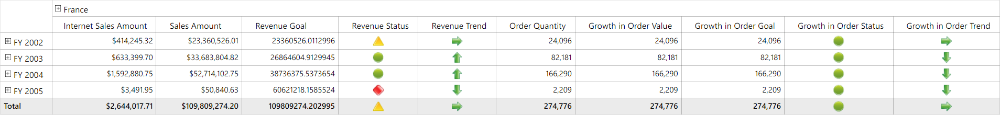
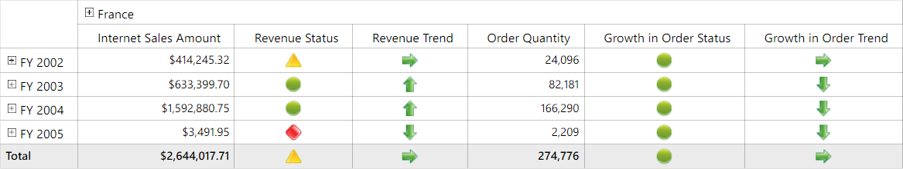

# Displaying Measures and KPIs in Desired Order

By default, the measure items and KPI items are separately grouped and displayed one after another in the OLAP grid control. To display them in the desired order, the `DisplayMeasuresInDesiredOrder` property of the OLAP report should be set to `true` and the elements of measures and KPIs should be defined by using the `ValueElements` object.

Refer to the following code sample to display the measures and KPIs in the desired order.





public MainWindow()
{
    InitializeComponent();
    this.OlapGrid1.OlapDataManager = new OlapDataManager("Data Source=http://bi.syncfusion.com/olap/msmdpump.dll; Initial Catalog=Adventure Works DW 2008 SE;");
    this.OlapGrid1.OlapDataManager.CurrentReport = GetOlapReport();
}

OlapReport GetOlapReport()
{
    OlapReport olapReport = new OlapReport();
    olapReport.CurrentCubeName = "Adventure Works";

    // To display measures and KPIs in desired order
    olapReport.DisplayMeasuresInDesiredOrder = true;

    DimensionElement rowDimensionElement = new DimensionElement();
    rowDimensionElement.Name = "Date";
    rowDimensionElement.AddLevel("Fiscal", "Fiscal");

    DimensionElement colDimensionElement = new DimensionElement();
    colDimensionElement.Name = "Customer";
    colDimensionElement.AddLevel("Customer Geography", "Country");
    colDimensionElement.Hierarchy.LevelElements["Country"].IncludeAvailableMembers = true;
    colDimensionElement.Hierarchy.LevelElements["Country"].Add("France");

    VirtualKpiElement VirtualElement = new VirtualKpiElement();
    VirtualElement.Name = "Growth in Order Quantity";
    VirtualElement.KpiGoalExpression = "[Measures].[Order Quantity]";
    VirtualElement.KpiStatusExpression = "Case When [Measures].[Order Quantity] > 1 Then 1 Else -1 End";
    VirtualElement.KpiTrendExpression = "Case When IsEmpty ( ParallelPeriod ( [Date].[Fiscal].[Fiscal Year], 1, [Date].[Fiscal].CurrentMember ) ) Then 0  Else -1 End";
    VirtualElement.KpiValueExpression = "[Measures].[Order Quantity]";

    ValueElements valueElements = new ValueElements();
    valueElements.VirtualKpiElements.Add(VirtualElement);
    // Measure element
    valueElements.Elements.Add(new ValueElement { Name = "Internet Sales Amount" });
    // KPI element
    valueElements.Elements.Add(new ValueElement { Name = "Internet Revenue", IsKPI = true });
    // Measure element
    valueElements.Elements.Add(new ValueElement { Name = "Sales Amount" });
    // KPI element
    valueElements.Elements.Add(new ValueElement { Name = "Revenue", IsKPI = true });

    olapReport.CategoricalElements.Add(colDimensionElement);
    olapReport.CategoricalElements.Add(valueElements);
    olapReport.SeriesElements.Add(rowDimensionElement);

    return olapReport;
}





Public Sub New()
    InitializeComponent()
    Me.OlapGrid1.OlapDataManager = New OlapDataManager("Data Source=http://bi.syncfusion.com/olap/msmdpump.dll; Initial Catalog=Adventure Works DW 2008 SE;")
    Me.OlapGrid1.OlapDataManager.CurrentReport = GetOlapReport()
End Sub

Private Function GetOlapReport() As OlapReport
    Dim olapReport As New OlapReport()
    olapReport.CurrentCubeName = "Adventure Works"

    ' To display measures and KPIs in desired order
    olapReport.DisplayMeasuresInDesiredOrder = True

    Dim rowDimensionElement As New DimensionElement()
    rowDimensionElement.Name = "Date"
    rowDimensionElement.AddLevel("Fiscal", "Fiscal")

    Dim colDimensionElement As New DimensionElement()
    colDimensionElement.Name = "Customer"
    colDimensionElement.AddLevel("Customer Geography", "Country")
    colDimensionElement.Hierarchy.LevelElements("Country").IncludeAvailableMembers = True
    colDimensionElement.Hierarchy.LevelElements("Country").Add("France")

    Dim VirtualElement As New VirtualKpiElement()
    VirtualElement.Name = "Growth in Order Quantity"
    VirtualElement.KpiGoalExpression = "[Measures].[Order Quantity]"
    VirtualElement.KpiStatusExpression = "Case When [Measures].[Order Quantity] > 1 Then 1 Else -1 End"
    VirtualElement.KpiTrendExpression = "Case When IsEmpty ( ParallelPeriod ( [Date].[Fiscal].[Fiscal Year], 1, [Date].[Fiscal].CurrentMember ) ) Then 0  Else -1 End"
    VirtualElement.KpiValueExpression = "[Measures].[Order Quantity]"

    Dim valueElements As New ValueElements()
    valueElements.VirtualKpiElements.Add(VirtualElement)
    ' Measure element
    valueElements.Elements.Add(New ValueElement With {.Name = "Internet Sales Amount"})
    ' KPI element
    valueElements.Elements.Add(New ValueElement With {.Name = "Internet Revenue", .IsKPI = True})
    ' Measure element
    valueElements.Elements.Add(New ValueElement With {.Name = "Sales Amount"})
    ' KPI element
    valueElements.Elements.Add(New ValueElement With {.Name = "Revenue", .IsKPI = True})

    olapReport.CategoricalElements.Add(colDimensionElement)
    olapReport.CategoricalElements.Add(valueElements)
    olapReport.SeriesElements.Add(rowDimensionElement)

    Return olapReport
End Function





## Hiding individual elements of KPI

The individual elements of KPI such as value, goal, status, and trend can be hidden using the following properties.

* `ShowKPIValue`: Indicates whether to display the KPI's value element.
* `ShowKPIGoal`: Indicates whether to display the KPI's goal element.
* `ShowKPIStatus`: Indicates whether to display the KPI's status element.
* `ShowKPITrend`: Indicates whether to display the KPI's trend element.

Refer to the following code snippet to hide the value and goal elements of "Revenue" KPIs.





// To define measure elements and KPI elements through value elements
ValueElements valueElements = new ValueElements();
// To add measure element
valueElements.Elements.Add(new ValueElement { Name = "Internet Sales Amount" });
// To add KPI element
valueElements.Elements.Add(new ValueElement { Name = "Revenue", IsKPI = true, ShowKPIValue = false, ShowKPIGoal = false });
// To add measure element
valueElements.Elements.Add(new ValueElement { Name = "Order Quantity" });
// To add virtual KPI element
valueElements.VirtualKpiElements.Add(VirtualElement);
valueElements.Elements.Add(new ValueElement { Name = "Growth in Order", IsKPI = true, ShowKPIValue = false, ShowKPIGoal = false });





' To define measure elements and KPI elements through value elements
Dim valueElements As New ValueElements()
' To add measure element
valueElements.Elements.Add(New ValueElement With {.Name = "Internet Sales Amount"})
' To add KPI element
valueElements.Elements.Add(New ValueElement With {.Name = "Revenue", .IsKPI = True, .ShowKPIValue = False, .ShowKPIGoal = False})
' To add measure element
valueElements.Elements.Add(New ValueElement With {.Name = "Order Quantity"})
' To add virtual KPI element
valueElements.VirtualKpiElements.Add(VirtualElement)
valueElements.Elements.Add(New ValueElement With {.Name = "Growth in Order", .IsKPI = True, .ShowKPIValue = False, .ShowKPIGoal = False})





