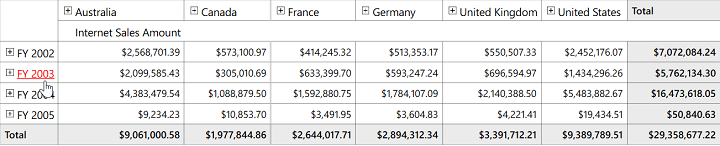

# Hyperlink Cells in WPF Olap Grid

The OLAP grid allows hyperlinking of cells to retrieve a detailed information about a particular cell. The OLAP grid generates a separate event called **"LinkClick"** for the clicked hyperlink cell and the **"LinkLabelClickEventHander"** will return the clicked OlapGridCellInfo.

The hyperlink cell’s property can be applied to the following regions:

* Column header
* Row header
* Value cell
* Summary cell

It is possible to enable or disable the hyperlink options separately for all row header, column header, summary header, and value cells through the `IsHyperlinkCell` property. Refer to the following code sample.





public MainWindow()
{
    InitializeComponent();
            
    //OlapGrid Instantiation
    OlapGrid olapGrid1 = new OlapGrid();
    //OlapGrid added to an parent Grid present in the Main Window
    this.gridContainer.Children.Add(olapGrid1);
    //Connection string is passed to OlapDataManager as an argument
    OlapDataManager olapDataManager = new OlapDataManager("Enter a valid connection string");
    //Set current report for OlapDataManager.
    olapDataManager.SetCurrentReport(CreateOlapReport());
    //Specifying OlapDataManager to Grid.
    olapGrid1.OlapDataManager = olapDataManager;
        
    // To enable hyperlink for Column Header
    this.OlapGrid1.ColumnHeaderStyle.IsHyperlinkCell = true;
    // To enable hyperlink for Row Header
    this.OlapGrid1.RowHeaderStyle.IsHyperlinkCell = true;
    // To enable hyperlink for Value Cell
    this.OlapGrid1.ValueCellStyle.IsHyperlinkCell = true;
    // To enable hyperlink for Summary Column
    this.OlapGrid1.SummaryColumnStyle.IsHyperlinkCell = true;
    // To enable hyperlink for Summary Row
    this.OlapGrid1.SummaryRowStyle.IsHyperlinkCell = true;
        
    // Tag hyperlink cell click event
    this.OlapGrid1.LinkClick += new Syncfusion.Windows.Grid.Olap.LinkLabelClickEventHandler(OlapGrid1_LinkClick);
    olapGrid1.DataBind();      
}
private void OlapGrid1_LinkClick(object sender, Syncfusion.Windows.Grid.Olap.LinkLabelEventArgs e)
{
    string uniqueName = e.PivotCellDescriptor.UniqueName;   
}  





Public Sub New()
    InitializeComponent()
       
    Dim OlapGrid1 As OlapGrid = New OlapGrid()
    ' OlapGrid added to an parent Grid present in the Main Window
    Me.gridContainer.Children.Add(olapGrid1);
    ' Instantiating OlapDataManager. 
    Dim olapDataManager As OlapDataManager = New OlapDataManager("Enter a valid connection string")
    ' Set current report for OlapDataManager.
    olapDataManager.SetCurrentReport(olapReport())
    ' Specifying OlapDataManager to Grid.
    ' To enable hyperlink for Column Header
    Me.OlapGrid1.ColumnHeaderStyle.IsHyperlinkCell = True
    ' To enable hyperlink for Row Header
    Me.OlapGrid1.RowHeaderStyle.IsHyperlinkCell = True
    ' To enable hyperlink for Value Cell
    Me.OlapGrid1.ValueCellsStyle.IsHyperlinkCell = True
    ' To enable hyperlink for Summary Column
    Me.OlapGrid1.SummaryColumnStyle.IsHyperlinkCell = True
    ' To enable hyperlink for Summary Row
    Me.OlapGrid1.SummaryRowStyle.IsHyperlinkCell = True
    
    ' Tag hyperlink cell click event
    Me.OlapGrid1.LinkClick += New Syncfusion.Windows.Grid.Olap.LinkLabelClickEventHandler(OlapGrid1_LinkClick);
    Me.OlapGrid1.DataBind()
End Sub
    
Private Sub OlapGrid1_LinkClick(ByVal sender As Object, ByVal e As Syncfusion.Windows.Grid.Olap.LinkLabelEventArgs)
    Dim uniqueName As String = e.PivotCellDescriptor.UniqueName
End Sub





A sample demo is available in the following location.

{system drive}:\Users\&lt;User Name&gt;\AppData\Local\Syncfusion\EssentialStudio\&lt;Version Number&gt;\WPF\OlapGrid.WPF\Samples\Appearance\Hyperlink Cell 

