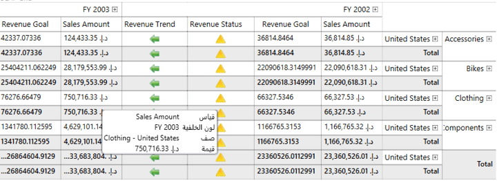

# Localization in WPF Olap Grid

Localization is the key feature for providing software solutions targeted at global users. The OLAP grid allows users to localize the control to a specific locale and supports "resx" based localization.

The following steps should be performed to localize the control:

* Translation.
* Resource file and file name conventions.
* Tag inclusion into the project file.
* Specification of the CurrentUICulture.

### Translation

The first step in localization is translating the strings that can be localized to the destination locale.

N> Localization key field should be same for all locales. Do not translate it.

### Resource file and file name conventions

Steps to be followed in the application, after translating the strings that can be localized:

1. Right-click the **Project File** to create a new folder in the project. Select **Add** > **New Folder** and rename the folder as "Resources".

N> The folder name should strictly be "Resources".

2. Right-click the Resources folder to create a new resource file in the Visual Studio project. Go to **Add** > **New Item**.

3. Select "Resources File" from the list. Then, name the resource file: Syncfusion.OlapGrid.WPF.ar-AE.resx and click **Add**.

N> The resource file name should strictly be in the format "Syncfusion.OlapGrid.WPF.&lt;Culture Code&gt;.resx".
   
4. Copy and paste the translated locale to the resource file created in the earlier step.

### Specifying the CurrentUICulture

Now, you need to specify the CurrentUICulture of the application. You can specify the CurrentUICulture from the Application_Startup in App.xaml.cs or the constructor in the main page (if you are specifying the current culture on the main page, make sure that it is assigned before the InitializeComponent method).


 
public MainWindow()
{
    //Set the current thread culture to load the localization resource file.    
    System.Threading.Thread.CurrentThread.CurrentUICulture = new System.Globalization.CultureInfo("ar-AE");
    InitializeComponent();
    if (System.Globalization.CultureInfo.CurrentUICulture.ToString() == "ar-AE") 
        this.FlowDirection = System.Windows.FlowDirection.RightToLeft;
}



## RTL support

The RTL support for OLAP grid is used to display the content from right-to-left by setting the `FlowDirection` property to "RightToLeft". The following code sample explains how to set this property.


  


<syncfusion:OlapGrid x:Name="olapGrid" FlowDirection="RightToLeft" ReportName="SalesReport" SharedDataManagerName="localManager" olapshared:DataSource.DataManagerName="localManager"/>  





this.olapGrid.FlowDirection = System.Windows.FlowDirection.RightToLeft;





Me.olapGrid.FlowDirection = System.Windows.FlowDirection.RightToLeft;





A sample is locally available in the following location.

{system drive}:\Users\&lt;User Name&gt;\AppData\Local\Syncfusion\EssentialStudio\&lt;Version Number&gt;\WPF\OlapGrid.WPF\Samples\Localization\Localization
