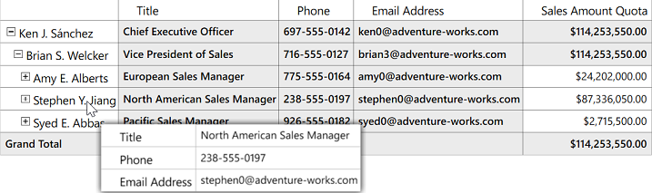

# Member Properties in WPF Olap Grid

The OLAP grid allows binding of members along with their properties. Member properties cover the basic information about each member in each tuple. This basic information includes the member name, parent level, number of children, and so on. Member properties are available for all members at a given level. To display the member properties along with the dimension member, OLAP report requires member properties to be defined in the concerned dimension element. Also, the OLAP grid layout should be set to **"ExcelLikeLayoutWithMemberProperties"**.


 

     
private OlapReport ReportWithMemberProperties()
{
    OlapReport olapReport = new OlapReport();
    // Specifying the current cube name
    olapReport.CurrentCubeName = "Adventure Works";
    MeasureElements measureElementColumn = new MeasureElements();
    // Specifying the Name for the Measure Element
    measureElementColumn.Elements.Add(new MeasureElement { Name = "Sales Amount Quota" });
    DimensionElement dimensionElementRow = new DimensionElement();
    // Specifying the Dimension Name
    dimensionElementRow.Name = "Employee";
    // Specifying the Hierarchy and level name for the Dimension Element
    dimensionElementRow.AddLevel("Employees", "Employee Level 02");
    dimensionElementRow.Hierarchy.LevelElements["Employee Level 02"].IncludeAvailableMembers = true;
    // Adding the Member properties to the Dimension Element
    dimensionElementRow.MemberProperties.Add(new MemberProperty("Title", "[Employee].[Employees].[Title]"));
    dimensionElementRow.MemberProperties.Add(new MemberProperty("Phone", "[Employee].[Employees].[Phone]"));
    dimensionElementRow.MemberProperties.Add(new MemberProperty("Email Address", "[Employee].[Employees].[Email Address]"));
    // Adding Row Members
    olapReport.SeriesElements.Add(dimensionElementRow);
    ///Adding Column Members
    olapReport.CategoricalElements.Add(measureElementColumn);
    return olapReport;
}
   



    
    
''' 

''' OlapReport with KPI Elements
''' 

''' <returns></returns>
Private Function ReportWithMemberProperties() As OlapReport
    Dim olapReport As New OlapReport()
    ' Selecting the Cube
    olapReport.CurrentCubeName = "Adventure Works"
    Dim measureElements As New MeasureElements()
    measureElements.Add(New MeasureElement With {.Name = " Sales Amount Quota"})
    olapReport.SeriesElements.Add(measureElements)
    Dim dimensionElementRow As New DimensionElement()
    ' Specifying the Name for Row Dimension Element
    dimensionElementRow.Name = "Employee"
    ' Specifying the Level element
    dimensionElementRow.AddLevel("Employees", "Employee Level 02")
    dimensionElementRow.Hierarchy.LevelElements["Employee Level 02"].IncludeAvailableMembers = true;
    ' Adding the Member properties to the Dimension Element
    dimensionElementRow.MemberProperties.Add(new MemberProperty("Title", "[Employee].[Employees].[Title]"));
    dimensionElementRow.MemberProperties.Add(new MemberProperty("Phone", "[Employee].[Employees].[Phone]"));
    dimensionElementRow.MemberProperties.Add(new MemberProperty("Email Address", "[Employee].[Employees].[Email Address]"));
    ' Adding Row Elements
    olapReport.SeriesElements.Add(dimensionElementRow)
    ' Adding Column Elements
    olapReport.CategoricalElements.Add(measureElements)
    Return olapReport
End Function





To display member properties through the header tooltip, the following property of OLAP grid should be set to true.


  


// To Display Member Properties in ToolTip
this.OlapGrid1.ShowMemberPropertiesToolTip = true;





' To Display Member Properties in ToolTip
Me.OlapGrid1.ShowMemberPropertiesToolTip = True





A sample demo is available in the following location.

{system drive}:\Users\&lt;User Name&gt;\AppData\Local\Syncfusion\EssentialStudio\&lt;Version Number&gt;\WPF\OlapGrid.WPF\Samples\Product Showcase\Member Properties 
