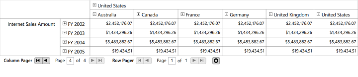

# Paging in WPF Olap Grid

Paging in the OLAP grid supports loading and rendering large amounts of data without any performance constraints.

The OLAP pager (user control) is included and bound with the OlapDataManager object of the respective OLAP grid. To enable paging, set the `EnablePaging` property to true.

When you process a large cell set, it is split into several segments and each segment is assigned and rendered in a separate page. You can navigate back and forth in all possible ways by using the UI options in the OLAP pager. You can also change the page size and other pager settings at runtime by using the **PageSetting** window.

Include the following Syncfusion assembly from the installed location to add the OLAP pager with OLAP grid:

* Syncfusion.OlapShared.Wpf

N> You can also get the assemblies by browsing to the default assembly location: {System Drive}:\Program Files (x86)\Syncfusion\Essential Studio\\{version number}\precompiledassemblies\\{version number}\\{framework version}\

**Enable paging through XAML**


			
<Window xmlns="http://schemas.microsoft.com/winfx/2006/xaml/presentation"
        xmlns:x="http://schemas.microsoft.com/winfx/2006/xaml"
        xmlns:syncfusion="http://schemas.syncfusion.com/wpf"
        xmlns:pager="clr-namespace:Syncfusion.Windows.Shared.Olap;assembly=Syncfusion.OlapShared.WPF"
        x:Class="SampleApplication.MainWindow"
        Title="MainWindow" Height="350" Width="525">
        <Grid>
            <Grid.RowDefinitions>
                <RowDefinition Height="*"/>
                <RowDefinition Height="Auto"/>
            </Grid.RowDefinitions>
            <GroupBox  Header="OlapGrid" Grid.Row="0">
                <syncfusion:OlapGrid  Name="olapGrid" Background="Transparent" SeriesStrokeThickness="0"></syncfusion:OlapGrid>
            </GroupBox>
            <GroupBox Grid.Row="1" Header="OlapPager" Margin="5" >
                <pager:OlapPager x:Name="olapPager" ></pager:OlapPager>
            </GroupBox>
        </Grid>
</Window>
				


**Enable paging through report:**





using Syncfusion.Olap.Manager;
using Syncfusion.Olap.Reports;
namespace SampleApplication
{
    public partial class MainWindow : SampleWindow
    {
        private string _connectionString;
        private OlapDataManager _olapDataManager;
        public MainWindow()
        {  
            InitializeComponent();
            _connectionString = "Enter a valid connection string";
            //Created connection string is passed to OlapDataManager as argument
            _olapDataManager = new OlapDataManager(_connectionString);
            //Created OlapReport is set as a current report to OlapDataManager
            _olapDataManager.SetCurrentReport(SimpleDimensions());
            //Finally OlapGrid control gets the data from the created OlapDataManager
            this.olapGrid.OlapDataManager = _olapDataManager;
            this.olapPager.OlapDataManager= _olapDataManager;
            this.olapGrid.DataBind();
        }
            
        private OlapReport SimpleDimensions()
        {
            OlapReport olapReport = new OlapReport();
            olapReport.CurrentCubeName = "Adventure Works";
            olapReport.EnablePaging = true;
            olapReport.PagerOptions.CategorialPageSize = 10;
            olapReport.PagerOptions.SeriesPageSize = 10;
            DimensionElement dimensionElement = new DimensionElement() { Name = "Customer", HierarchyName = "Customer" };
            dimensionElement.AddLevel("Customer Geography", "Country");
            olapReport.CategoricalElements.Add(dimensionElement);
            MeasureElements measureElements = new MeasureElements();
            measureElements.Add(new MeasureElement { Name = "Internet Sales Amount" });
            olapReport.SeriesElements.Add(measureElements);
            dimensionElement = new DimensionElement() { Name = "Geography", HierarchyName = "Geography" };
            dimensionElement.AddLevel("Geography", "Country");
            olapReport.CategoricalElements.Add(dimensionElement);
            dimensionElement = new DimensionElement() { Name = "Date" };
            dimensionElement.AddLevel("Fiscal", "Fiscal Year");
            olapReport.SeriesElements.Add(dimensionElement);
            return olapReport;
        }
    }
}



  

Imports Syncfusion.Olap.Manager
Imports Syncfusion.Olap.Reports
Namespace SampleApplication
    Partial Public Class MainWindow
        Inherits SampleWindow
        Private _connectionString As String
        Private _olapDataManager As OlapDataManager
        Public Sub New()
            InitializeComponent()
            _connectionString = "Enter a valid connection string"
            'Created connection string is passed to OlapDataManager as argument
            _olapDataManager = New OlapDataManager(_connectionString)
            'Created OlapReport is set as a current report to OlapDataManager
            _olapDataManager.SetCurrentReport(SimpleDimensions())
            'Finally OlapGrid control gets the data from the created OlapDataManager
            Me.olapGrid.OlapDataManager = _olapDataManager
            Me.olapPager.OlapDataManager= _olapDataManager
            Me.olapGrid.DataBind()
        End Sub

        Private Function SimpleDimensions() As OlapReport
            Dim olapReport As New OlapReport()
            olapReport.CurrentCubeName = "Adventure Works"
            olapReport.EnablePaging = True
            olapReport.PagerOptions.CategorialPageSize = 10
            olapReport.PagerOptions.SeriesPageSize = 10
            Dim dimensionElement As New DimensionElement() With {.Name = "Customer", .HierarchyName = "Customer"}
            dimensionElement.AddLevel("Customer Geography", "Country")
            olapReport.CategoricalElements.Add(dimensionElement)
            Dim measureElements As New MeasureElements()
            measureElements.Add(New MeasureElement With {.Name = "Internet Sales Amount"})
            olapReport.SeriesElements.Add(measureElements)
            dimensionElement = New DimensionElement() With {.Name = "Geography", .HierarchyName = "Geography"}
            dimensionElement.AddLevel("Geography", "Country")
            olapReport.CategoricalElements.Add(dimensionElement)
            dimensionElement = New DimensionElement() With {.Name = "Date"}
            dimensionElement.AddLevel("Fiscal", "Fiscal Year")
            olapReport.SeriesElements.Add(dimensionElement)
            Return olapReport
        End Function
    End Class
End Namespace
				




A sample demo is available in the following location.

{system drive}:\Users\&lt;User Name&gt;\AppData\Local\Syncfusion\EssentialStudio\&lt;Version Number&gt;\WPF\OlapGrid.WPF\Paging

