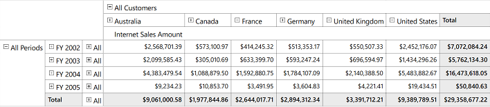

# "All" - Level Member

This feature enables you to display the “All” level type member across the rows and columns in the OLAP grid. This member behaves as parent to other members in its hierarchy by controlling their visibility through an expander.

To display the “All” level type member, set the _ShowLevelTypeAll_ property to _true_. By default this is set to _false_. Refer to the following code sample.


  


OlapDataManager DataManager = new OlapDataManager() { ShowLevelTypeAll = true};





OlapDataManager DataManager = New OlapDataManager() { ShowLevelTypeAll = True }





A sample demo is available in the following location.

{system drive}:\Users\&lt;User Name&gt;\AppData\Local\Syncfusion\EssentialStudio\&lt;Version Number&gt;\WPF\OlapGrid.WPF\Samples\Defining Reports\Reports-in-code
