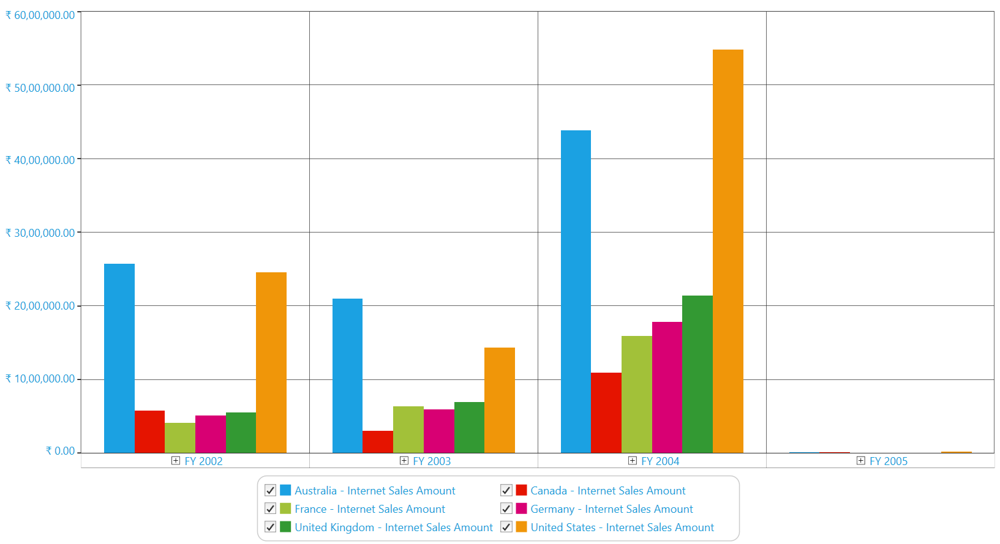
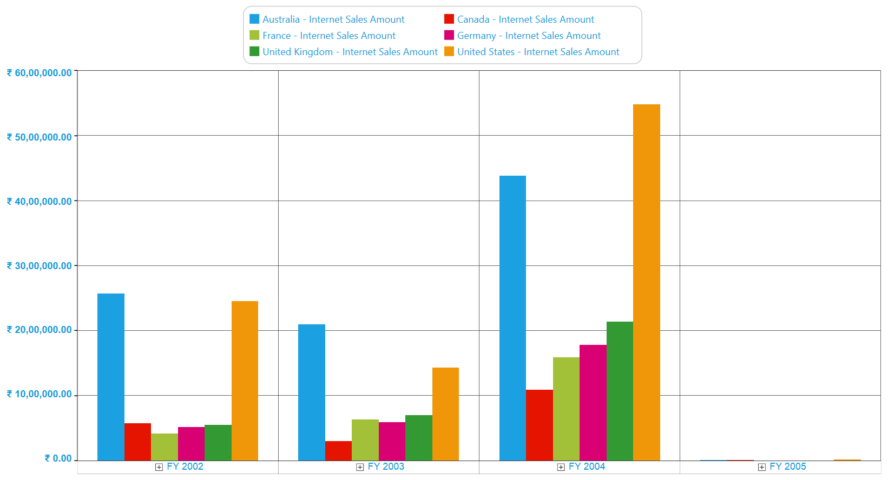

# Appearance

OlapChart provides support to customize the chart appearance. You can customize the Chart Style, Legend Style, Border and Background Style, Point Label Style and Label Style of the Primary and the Secondary Axes.

## Chart Style and Legends   

OlapChart provides options to set the Chart Type, Chart Color, Chart Legend Position, Chart Legend and Legend Check Box visibility.

* **ChartType** - Sets the chart type for the OlapChart control.
* **ColorModel.Palette** - Specifies the chart color for the OlapChart control.
* **Legend.Visibility** - Specifies the visibility of the chart legend.
* **Legend.CheckBoxVisibility** - Specifies the visibility of the chart legend check box.
* **ChartDockPanel.SetDock** - Specifies the position of the Chart Legend.

The following code sample illustrate how to customize the Chart Style and Legends:




 
// Set the Chart Type.
this.olapChart.ChartType = ChartTypes.Column;
// Set the Chart Series Color.
this.olapChart.ColorModel.Palette = ChartColorPalette.Colorful;
// Set the Chart Legend and Legend Check Box Visibility.
this.olapChart.Legend.Visibility = Visibility.Visible;
this.olapChart.Legend.Visibility = Visibility.Collapsed;
this.olapChart.Legend.CheckBoxVisibility = Visibility.Visible;
this.olapChart.Legend.CheckBoxVisibility = Visibility.Collapsed;
// Set the Chart Legend Position.
ChartDockPanel.SetDock(this.olapChart.Legend, ChartDock.Right);
ChartDockPanel.SetDock(this.olapChart.Legend, ChartDock.Left);
ChartDockPanel.SetDock(this.olapChart.Legend, ChartDock.Top);
ChartDockPanel.SetDock(this.olapChart.Legend, ChartDock.Bottom);
ChartDockPanel.SetDock(this.olapChart.Legend, ChartDock.Floating);




  
' Set the Chart Type.
Me.olapChart.ChartType = ChartTypes.Column
' Set the Chart Series Color.
Me.olapChart.ColorModel.Palette = ChartColorPalette.Colorful
' Set the Chart Legend and Legend Check Box Visibility.
Me.olapChart.Legend.Visibility = Visibility.Visible
Me.olapChart.Legend.Visibility = Visibility.Collapsed
Me.olapChart.Legend.CheckBoxVisibility = Visibility.Visible
Me.olapChart.Legend.CheckBoxVisibility = Visibility.Collapsed
' Set the Chart Legend Position.
ChartDockPanel.SetDock(Me.olapChart.Legend, ChartDock.Right)
ChartDockPanel.SetDock(Me.olapChart.Legend, ChartDock.Left)
ChartDockPanel.SetDock(Me.olapChart.Legend, ChartDock.Top)
ChartDockPanel.SetDock(Me.olapChart.Legend, ChartDock.Bottom)
ChartDockPanel.SetDock(Me.olapChart.Legend, ChartDock.Floating)





## Chart Border and Background Style

OlapChart provides options to set the Chart Border and the Background Style.

* **BorderThickness** - Sets the border thickness for the OlapChart control.
* **BorderBrush** - Specifies the border color for the OlapChart control.
* **Background** - Specifies the background color for the OlapChart control.
* **GridBackground** - Specifies the interior background color for the OlapChart control.

The following code sample illustrate how to customize the Chart Border and the Background Style:





// Set the Chart Border Style.
this.olapChart.BorderThickness = new Thickness(2);
this.olapChart.BorderBrush = Brushes.Blue;
// Set the Chart Background Style.
this.olapChart.Background = Brushes.LightBlue;
this.olapChart.GridBackground = Brushes.LightGray;




  
' Set the Chart Border Style.
Me.olapChart.BorderThickness = New Thickness(2)
Me.olapChart.BorderBrush = Brushes.Blue
' Set the Chart Background Style.
Me.olapChart.Background = Brushes.LightBlue
Me.olapChart.GridBackground = Brushes.LightGray




 

## Chart Points Labels

OlapChart provides support to customize the labels and the symbols of the chart points. This is illustrated in the following code sample:




 
foreach (ChartSeries series in this.Series)
{
    series.AdornmentsInfo.Visible = true;
    ChartAdornmentInfo cai = series.AdornmentsInfo;
    // To display the x-axis label value.
    series.AdornmentsInfo.LabelContentPath = "DataPoint.X";
    // To display the y-axis label value.
    series.AdornmentsInfo.LabelContentPath = "DataPoint.Y";
    // To display the Series label value.
    series.AdornmentsInfo.LabelContentPath = "Series.Label";
}




  
For Each series As ChartSeries In Me.Series
    series.AdornmentsInfo.Visible = True
    Dim cai As ChartAdornmentInfo = series.AdornmentsInfo
    ' To display the x-axis label value.
    series.AdornmentsInfo.LabelContentPath = "DataPoint.X"
    ' To display the y-axis label value.
    series.AdornmentsInfo.LabelContentPath = "DataPoint.Y"
    ' To display the Series label value.
    series.AdornmentsInfo.LabelContentPath = "Series.Label"
Next series





## Chart Axis Labels

OlapChart provides support to customize the labels of the Primary and the Secondary Axes.

### Customizing the Font Style of the Primary Axis

OlapChart provides support to dynamically change the Font Family, Font Color and Font Weight for the Labels of the Primary Axis.

* **PrimaryAxis.LabelFontFamily** - Specifies the font family for the label of the Primary Axis.
* **PrimaryAxis.LabelForeground** - Specifies the font color for the label of the Primary Axis.
* **PrimaryAxis.LabelFontWeight** - Specifies the font weight for the label of the Primary Axis.

The following code sample illustrate how to customize the font style of the Primary Axis:




 
// Set the Font Family.
this.olapChart.PrimaryAxis.LabelFontFamily = new FontFamily("Arial");
// Set the Font Color.
this.olapChart.PrimaryAxis.LabelForeground = Brushes.LightBlue;
// Set the Font Weight.
this.olapChart.PrimaryAxis.LabelFontWeight = FontWeights.Bold;




  
' Set the Font Family.
Me.olapChart.PrimaryAxis.LabelFontFamily = New FontFamily("Arial")
' Set the Font Color.
Me.olapChart.PrimaryAxis.LabelForeground = Brushes.LightBlue
' Set the Font Weight.
Me.olapChart.PrimaryAxis.LabelFontWeight = FontWeights.Bold




 
### Customizing the Font Style of the Secondary Axis

OlapChart provides support to dynamically change the Font Family, Font Color and Font Weight for the Labels of the Secondary Axis.

* **SecondaryAxis.LabelFontFamily** - Specifies the font family for the label of the Secondary Axis.
* **SecondaryAxis.LabelForeground** - Specifies the font color for the label of the Secondary Axis.
* **SecondaryAxis.LabelFontWeight** - Specifies the font weight for the label of the Secondary Axis.

The following code sample illustrate how to customize the font style of the Secondary Axis:




 
// Set the Font Family.
this.olapChart.SecondaryAxis.LabelFontFamily = new FontFamily("Arial");
// Set the Foreground Color.
this.olapChart.SecondaryAxis.LabelForeground = Brushes.LightBlue;
// Set the Font Weight.
this.olapChart.SecondaryAxis.LabelFontWeight = FontWeights.Bold;




  
' Set the Font Family.
Me.olapChart.SecondaryAxis.LabelFontFamily = New FontFamily("Arial")
' Set the Foreground Color.
Me.olapChart.SecondaryAxis.LabelForeground = Brushes.LightBlue
' Set the Font Weight.
Me.olapChart.SecondaryAxis.LabelFontWeight = FontWeights.Bold





A sample demo is available at the following location:  

{system drive}:\Users\&lt;User Name&gt;\AppData\Local\Syncfusion\EssentialStudio\&lt;Version Number&gt;\WPF\OlapChart.WPF\Samples\Chart Appearance\Appearance
