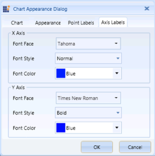

# Appearance

Essential OLAP Chart provides support to customize the chart appearance by using the Chart Appearance dialog box. You can customize the Chart Style, Legend Style, Border and Background Style, Point Label Style, and Label Style of the Primary and the Secondary Axes by using this Appearance dialog box.

The following code illustrates how to invoke the Chart Appearance dialog box:

 
 

this.olapClient1.OlapChart.ShowAppearanceDialog();

 

 
  

Me.olapClient1.OlapChart.ShowAppearanceDialog()

 

The following topics illustrate the customization options provided by the Chart Appearance dialog box.

* Chart Style and Legends
* Chart Border and Background Style
* Chart Points Labels
* Chart Axis Labels

A sample, which demonstrates all the appearance properties, is available in the following installation location:

..\Syncfusion\<Version Number>\BI\WPF\OlapChart.WPF\Samples\Chart Appearance

## Chart Style and Legends   

The Chart Appearance dialog box of the OLAP Chart provides options to set the Chart Type, Chart Color, Chart Legend Position, and Chart Legend and Legend Check Box Visibility.

The following table lists the properties and methods that are used to customize the Chart Style and Legends programmatically:

### Property table

<table>
<tr>
<th>
Property</th><th>
Description</th></tr>
<tr>
<td>
ChartType</td><td>
Sets the chart type for the OLAP Chart control.</td></tr>
<tr>
<td>
ColorModel.Palette</td><td>
Specifies the chart color for the OLAP Chart control.</td></tr>
<tr>
<td>
Legend.Visibility</td><td>
Specifies the visibility of the Chart Legend.The options included are as follows:* Visible* Collapsed</td></tr>
<tr>
<td>
 Legend.CheckBoxVisibility</td><td>
Specifies the visibility of the Chart Legend Check Box.The options included are as follows:* Visible* Collapsed</td></tr>
</table>

### Methods table

<table>
<tr>
<th>
Method</th><th>
Description</th></tr>
<tr>
<td>
ChartDockPanel.SetDock</td><td>
Specifies the position of the Chart Legend.The options included are as follows:* Right* Left* Top* Bottom* Floating</td></tr>
</table>

The following code examples illustrate how to customize the Chart Style and Legends:

 
 
   

// Set the Chart Type.
this.olapchart1.ChartType = ChartTypes.Column;

// Set the Chart Color.
this.olapchart1.ColorModel.Palette = ChartColorPalette.Colorful;

// Set the Chart Legend and Legend Check Box Visibility.
this.olapchart1.Legend.Visibility = Visibility.Visible;
this.olapchart1.Legend.Visibility = Visibility.Collapsed;
this.olapchart1.Legend.CheckBoxVisibility = Visibility.Visible;
this.olapchart1.Legend.CheckBoxVisibility = Visibility.Collapsed;

// Set the Chart Legend Position.
ChartDockPanel.SetDock(this.olapchart1.Legend, ChartDock.Right);
ChartDockPanel.SetDock(this.olapchart1.Legend, ChartDock.Left);
ChartDockPanel.SetDock(this.olapchart1.Legend, ChartDock.Top);
ChartDockPanel.SetDock(this.olapchart1.Legend, ChartDock.Bottom);
ChartDockPanel.SetDock(this.olapchart1.Legend, ChartDock.Floating);

 

 
  
   

' Set the Chart Type.
Me.olapchart1.ChartType = ChartTypes.Column

' Set the Chart Series Color.
Me.olapchart1.ColorModel.Palette = ChartColorPalette.Colorful

' Set the Chart Legend and Legend Check Box Visibility.
Me.olapchart1.Legend.Visibility = Visibility.Visible
Me.olapchart1.Legend.Visibility = Visibility.Collapsed
Me.olapchart1.Legend.CheckBoxVisibility = Visibility.Visible
Me.olapchart1.Legend.CheckBoxVisibility = Visibility.Collapsed

' Set the Chart Legend Position.
ChartDockPanel.SetDock(Me.olapchart1.Legend, ChartDock.Right)
ChartDockPanel.SetDock(Me.olapchart1.Legend, ChartDock.Left)
ChartDockPanel.SetDock(Me.olapchart1.Legend, ChartDock.Top)
ChartDockPanel.SetDock(Me.olapchart1.Legend, ChartDock.Bottom)
ChartDockPanel.SetDock(Me.olapchart1.Legend, ChartDock.Floating)

 

A sample, which demonstrates all the appearance properties, is available in the following installation location:

..\Syncfusion\<Version Number>\BI\WPF\OlapChart.WPF\Samples\Chart Appearance

## Chart Border and Background Style

The Chart Appearance dialog box of the OLAP Chart also provides options to set the Chart Border and the Background Style.

The following table lists the properties that are used to customize the Chart Border and the Background Style programmatically:

### Property Table

<table>
<tr>
<th>
Property</th><th>
Description</th></tr>
<tr>
<td>
BorderThickness</td><td>
Sets the border thickness for the OLAP Chart control.</td></tr>
<tr>
<td>
BorderBrush</td><td>
Specifies the border color for the OLAP Chart control.</td></tr>
<tr>
<td>
Background</td><td>
Specifies the background color for the OLAP Chart control.</td></tr>
<tr>
<td>
GridBackground</td><td>
Specifies the interior background color for the OLAP Chart control.</td></tr>
</table>
The following code examples illustrate how to customize the Chart Border and the Background Style:

 
 
  

// Set the Chart Border Style.

this.olapchart1.BorderThickness = new Thickness(2);

this.olapchart1.BorderBrush = Brushes.Blue;

// Set the Chart Background Style.

this.olapchart1.Background = Brushes.LightBlue;

this.olapchart1.GridBackground = Brushes.LightGray;

 

 
  
    

' Set the Chart Border Style.
Me.olapchart1.BorderThickness = New Thickness(2)
Me.olapchart1.BorderBrush = Brushes.Blue

' Set the Chart Background Style.
Me.olapchart1.Background = Brushes.LightBlue
Me.olapchart1.GridBackground = Brushes.LightGray

 

A sample, which demonstrates all the appearance properties, is available in the following installation location:

..\Syncfusion\<Version Number>\BI\WPF\OlapChart.WPF\Samples\Chart Appearance

## Chart Points Labels

The OLAP Chart provides support to customize the Labels and the Symbols of the chart points. This is illustrated in the following code example:

 
 
   

foreach (ChartSeries series in this.Series)
{
    series.AdornmentsInfo.Visible = false;
    ChartAdornmentInfo cai = series.AdornmentsInfo;

    // To display the x-axis label value.
    series.AdornmentsInfo.LabelContentPath = "DataPoint.X";

    // To display the y-axis label value.
    series.AdornmentsInfo.LabelContentPath = "DataPoint.Y";

    // To display the Series label value.
    series.AdornmentsInfo.LabelContentPath = "Series.Label";
}

 

 
  
   

For Each series As ChartSeries In Me.Series
    series.AdornmentsInfo.Visible = False
    Dim cai As ChartAdornmentInfo = series.AdornmentsInfo

    ' To display the x-axis label value.
    series.AdornmentsInfo.LabelContentPath = "DataPoint.X"

    ' To display the y-axis label value.
    series.AdornmentsInfo.LabelContentPath = "DataPoint.Y"

    ' To display the Series label value.
    series.AdornmentsInfo.LabelContentPath = "Series.Label"
Next series

 

A sample, which demonstrates all the appearance properties, is available in the following installation location:

..\Syncfusion\<Version Number>\BI\WPF\OlapChart.WPF\Samples\Chart Appearance

## Chart Axis Labels

The Appearance dialog box enables you to customize the Labels of the Primary and the Secondary Axes.

### Customizing the Font Style of the Primary Axis

OLAP Chart provides support to dynamically change the Font Family, Font Color, and Font Weight for the Labels of the Primary Axis.

### Property Table

<table>
<tr>
<th>
{{ '**Property**' | markdownify }}</th><th>
{{ '**Description**' | markdownify }}</th></tr>
<tr>
<td>
PrimaryAxis.LabelFontFamily</td><td>
Specifies the font family for the label of the Primary Axis.</td></tr>
<tr>
<td>
PrimaryAxis.LabelForeground</td><td>
Specifies the font color for the label of the Primary Axis.</td></tr>
<tr>
<td>
PrimaryAxis.LabelFontWeight</td><td>
Specifies the font weight for the label of the Primary Axis.</td></tr>
</table>
The following code examples illustrate how to customize the font style of the Primary Axis:

 
 
   

// Set the Font Family.
this.olapchart1.PrimaryAxis.LabelFontFamily = new FontFamily("Arial");

// Set the Font Color.
this.olapchart1.PrimaryAxis.LabelForeground = Brushes.LightGray;

// Set the Font Weight.
this.olapchart1.PrimaryAxis.LabelFontWeight = FontWeights.Bold;

 

 
  
    

' Set the Font Family.
Me.olapchart1.PrimaryAxis.LabelFontFamily = New FontFamily("Arial")

' Set the Font Color.
Me.olapchart1.PrimaryAxis.LabelForeground = Brushes.LightGray

' Set the Font Weight.
Me.olapchart1.PrimaryAxis.LabelFontWeight = FontWeights.Bold

 

## Customizing the Font Style of the Secondary Axis

OLAP Chart provides support to dynamically change the Font Family, Font Color, and Font Weight for the Labels of the Secondary Axis.

### Property Table

<table>
<tr>
<th>
Property</th><th>
Description</th></tr>
<tr>
<td>
PrimaryAxis.LabelFontFamily</td><td>
Specifies the font family for the label of the Secondary Axis.</td></tr>
<tr>
<td>
PrimaryAxis.LabelForeground</td><td>
Specifies the font color for the label of the Secondary Axis.</td></tr>
<tr>
<td>
PrimaryAxis.LabelFontWeight</td><td>
Specifies the font weight for the label of the Secondary Axis.</td></tr>
</table>

The following code examples illustrate how to customize the font style of the Secondary Axis:

 
 
    

// Set the Font Family.
this.olapchart1.SecondaryAxis.LabelFontFamily = new FontFamily("Arial");

// Set the Foreground Color.
this.olapchart1.SecondaryAxis.LabelForeground = Brushes.LightGray;

// Set the Font Weight.
this.olapchart1.SecondaryAxis.LabelFontWeight = FontWeights.Bold;

 

 
  
 

' Set the Font Family.
Me.olapchart1.SecondaryAxis.LabelFontFamily = New FontFamily("Arial")

' Set the Foreground Color.
Me.olapchart1.SecondaryAxis.LabelForeground = Brushes.LightGray

' Set the Font Weight.
Me.olapchart1.SecondaryAxis.LabelFontWeight = FontWeights.Bold

 

A sample, which demonstrates all the appearance properties, is available in the following installation location:

..\Syncfusion\<Version Number>\BI\WPF\OlapChart.WPF\Samples\Chart Appearance