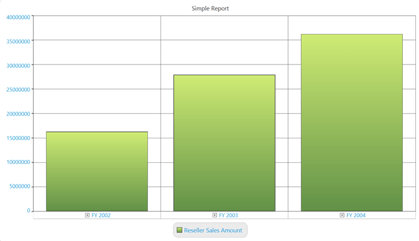

# Area

OlapArea is a ChartArea, which contains the ChartSeries and ChartAxes.

## Adding Chart Header

Chart header is the title of the chart, which is usually displayed at the top center of the ChartArea. The following illustration displays the Chart header displayed in the chart area:

In general, ChartSeries contains the ChartArea instance, which can be used to customize the OlapArea. The following code sample describes how to add a chart header to an OlapChart:





this.olapchart1.Series[0].Area.Header = "Simple Report";
	




Me.olapchart1.Series(0).Area.Header = "Simple Report"
	



   
N> The series will be available only after the data is bound to the control. In other words, you can access the series property of the OlapChart only after the call to DataBind() is made.

## Area Customization

OlapArea is basically derived from the ChartArea class belonging to the base Chart WPF control. So, it has the advantage of the customization options available in the ChartArea. However, 3D charts and multiple chart areas are not supported in an OlapChart. So, those customizations are not applicable.

The following are the frequently used customization options that are available in the ChartArea:

* Background
* GridBackground
* Foreground
* FontFamily
* FontSize
* FontStyle
* FontWeight
* BorderBrush
* BorderThickness
* CornerRadius

OlapArea allows you to customize the border properties. The following code sample explain how these properties can be customized:

### BorderBrush




 
this.olapChart.Series[0].Area.BorderBrush = Brushes.Black;




 
Me.olapChart.Series(0).Area.BorderBrush = Brushes.Black





### BorderThickness




 
this.olapChart.Series[0].Area.BorderThickness = new Thickness(2);




 
Me.olapChart.Series(0).Area.BorderThickness = New Thickness(2)





### CornerRadius




 
this.olapChart.Series[0].Area.CornerRadius = new CornerRadius(5);




  
Me.olapChart.Series(0).Area.CornerRadius = New CornerRadius(5)





### Background





this.olapChart.Series[0].Area.Background = Brushes.SkyBlue;




  
Me.olapChart.Series(0).Area.Background = Brushes.SkyBlue





### GridBackground




 
this.olapChart.Series[0].Area.GridBackground = Brushes.LightBlue;




  
Me.olapChart.Series(0).Area.GridBackground = Brushes.LightBlue





### FontStyle




 
this.olapChart.Series[0].Area.FontStyle = FontStyles.Italic;




  
Me.olapChart.Series(0).Area.FontStyle = FontStyles.Italic


 

