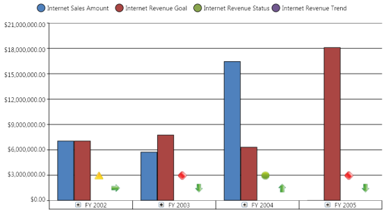
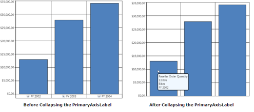

# Axes

An OlapArea contains a minimum of two axes namely primary axis and secondary axis in an OlapChart control. Values or data in the chart are plotted against these axes. In this section the following topics will be discussed:

## How to disable horizontal grid lines?

In general, for column type charts, the horizontal grid line belongs to the secondary axis. To disable the horizontal grid lines for these types of charts, you need to use the ShowGridLines property of the secondary axis.

The following illustration describes how the chart will look after the horizontal grid lines are disabled:

The following code snippet describes how to disable the horizontal grid lines:

  

    

      this.olapChart.Series[0].Area.SecondaryAxis.SetValue(

      ChartArea.ShowGridLinesProperty, false);

    

  

   

Me.olapChart.Series(0).Area.SecondaryAxis.SetValue(

      ChartArea.ShowGridLinesProperty, False)

    

N> For bar type charts, such as Bar, Stacking bar, and Stacking100 Bar you can disable the horizontal grid lines by using the ShowGridLinesProperty of the PrimaryAxis.

## How to disable vertical grid lines?

In general, for column type charts, the vertical grid line belongs to the primary axis. To disable the vertical grid lines for these types of charts, you need to use the ShowGridLines property of the primary axis.

The following illustration describes how the chart will look after the vertical grid lines are disabled:

The following code snippet describes how to disable the horizontal grid lines:


  

   

      this.olapChart.Series[0].Area.PrimaryAxis.SetValue(

      ChartArea.ShowGridLinesProperty, false);

    

  

   

Me.olapChart.Series(0).Area.PrimaryAxis.SetValue(

      ChartArea.ShowGridLinesProperty, False)

    


N> For bar type charts, such as Bar, Stacking bar, and Stacking100 Bar you can disable the vertical grid lines by using the ShowGridLinesProperty of the SecondaryAxis.

## How to display % in secondary axis?

To display the ‘%’ symbol in secondary axis, you need to set the secondary axis label format property. The following code snippet describes the usage of ‘%’ in the secondary axis label:

  

  

       <syncfusion:OlapChart.SecondaryAxis>

              <syncfusion:ChartAxis LabelFormat="00.00%" />

       </syncfusion:OlapChart.SecondaryAxis>

    

## How to display currency in secondary axis?

To display the currency symbol in the secondary axis, you need to set the secondary axis label format property. The following code snippet describes the usage of currency in the secondary axis label:

  

    

       <syncfusion:OlapChart.SecondaryAxis>

              <syncfusion:ChartAxis LabelFormat="C" />

       </syncfusion:OlapChart.SecondaryAxis>

    

## How to customize the OlapAxis label font settings?

The label font settings of the primary and the secondary axis can easily be applied to an OlapChart by specifying the label font properties, which are available under the PrimaryAxis and the SecondaryAxis of the OlapChart.


  

    

<syncfusion:OlapChart.PrimaryAxis>
<syncfusion:ChartAxis LabelFormat="C"

                         LabelFontFamily="Arial" 

                         LabelFontSize="14" 

                         LabelFontWeight="ExtraBold" 

                         LabelForeground="DarkGray"  />
       </syncfusion:OlapChart.PrimaryAxis>

<syncfusion:OlapChart.SecondaryAxis>
<syncfusion:ChartAxis LabelFormat="C"

                         LabelFontFamily="Arial" 

                         LabelFontSize="14" 

                         LabelFontWeight="ExtraBold" 

                         LabelForeground="DarkGray"  />
       </syncfusion:OlapChart.SecondaryAxis>

    

  

  

       this.olapChart.PrimaryAxis.LabelForeground = Brushes.DarkGray;
       this.olapChart.PrimaryAxis.LabelFontFamily = new FontFamily("Arial");
       this.olapChart.PrimaryAxis.LabelFontSize = 14d;
       this.olapChart.PrimaryAxis.LabelFontWeight = FontWeights.ExtraBold;

       this.olapChart.SecondaryAxis.LabelForeground = Brushes.DarkGray;
       this.olapChart.SecondaryAxis.LabelFontFamily = new FontFamily("Arial");
       this.olapChart.SecondaryAxis.LabelFontSize = 14d;
       this.olapChart.SecondaryAxis.LabelFontWeight = FontWeights.ExtraBold;

    

  

    

Me.olapChart.PrimaryAxis.LabelForeground = Brushes.DarkGray

Me.olapChart.PrimaryAxis.LabelFontFamily = New FontFamily("Arial")

Me.olapChart.PrimaryAxis.LabelFontSize = 14R

Me.olapChart.PrimaryAxis.LabelFontWeight = FontWeights.ExtraBold

Me.olapChart.SecondaryAxis.LabelForeground = Brushes.DarkGray

Me.olapChart.SecondaryAxis.LabelFontFamily = New FontFamily("Arial")

Me.olapChart.SecondaryAxis.LabelFontSize = 14R

Me.olapChart.SecondaryAxis.LabelFontWeight = FontWeights.ExtraBold

    



## How to toggle the visibility of the PrimaryAxis LabelPanel

The PrimaryAxisLabelPanel visibility can be toggled by setting the PrimaryAxisLabelVisibility property.

The following code snippet is used to collapse the PrimaryAxis label:


  

   

<syncfusion:OlapChart Name="olapchart1" PrimaryAxisLabelVisibility="Collapsed" />

    

  

  

this.olapchart1.PrimaryAxisLabelVisibility = System.Windows.Visibility.Collapsed;

    

  

    

Me.olapchart1.PrimaryAxisLabelVisibility = System.Windows.Visibility.Collapsed

    


The following illustration shows how the OlapChart will look after collapsing the PrimaryAxis label.

