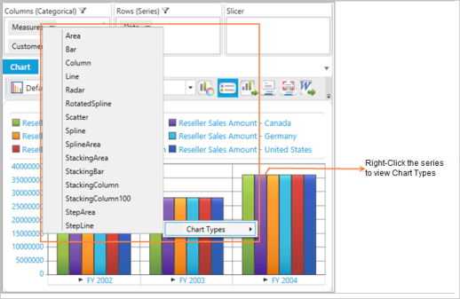
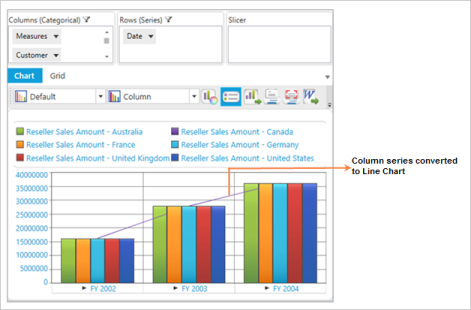

# Changing chart type for specific series

Essential OlapChart WPF provides support to change the chart type of each series using a _context menu_. When a user right-clicks on a chart series in OlapChart, a context menu with a list of chart types is displayed. The user can select the desired chart type for a specific series from the context 

## Changing the chart type for a specific series in an application

To change the chart type of a specific series, right-click on the particular series; a context menu with the list of available chart type appears. From the list of chart types in context menu, you can select the required chart type. In the following example illustrated in the screen shot, the data is displayed in column series chart type. The context menu appears by right-clicking the purple series and you can select the desired chart type.

The following screen shot shows how a specific column chart series is changed to line chart series.

The following screenshot shows a column chart series changed to line chart.

