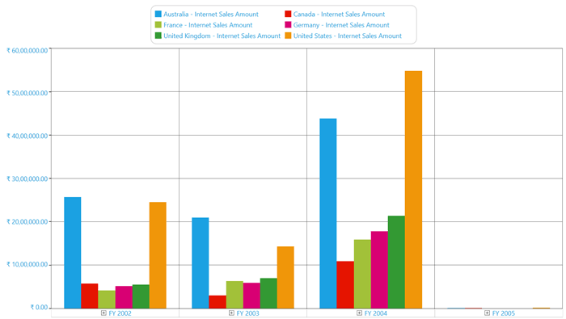
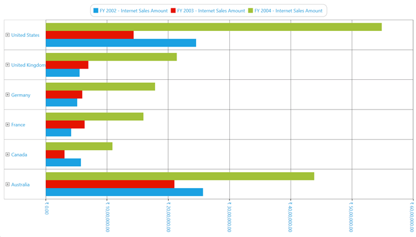
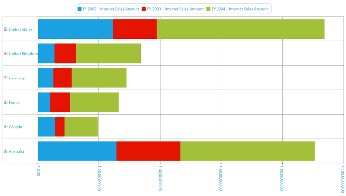
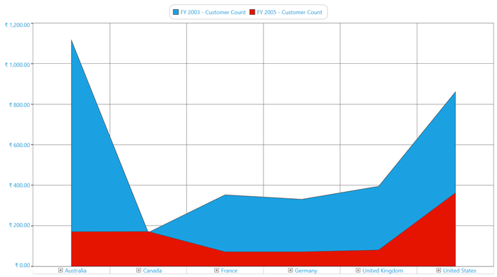
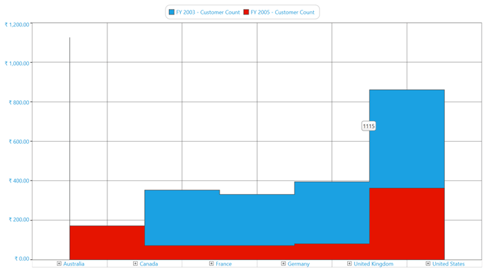
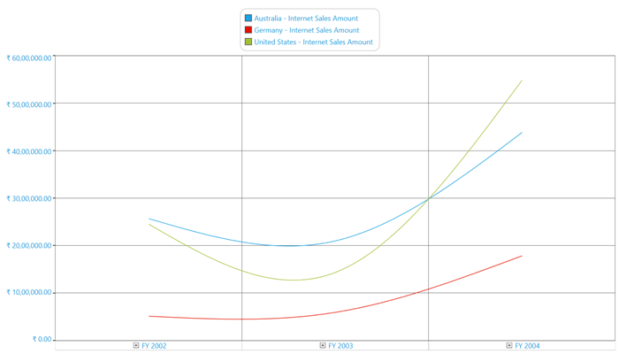
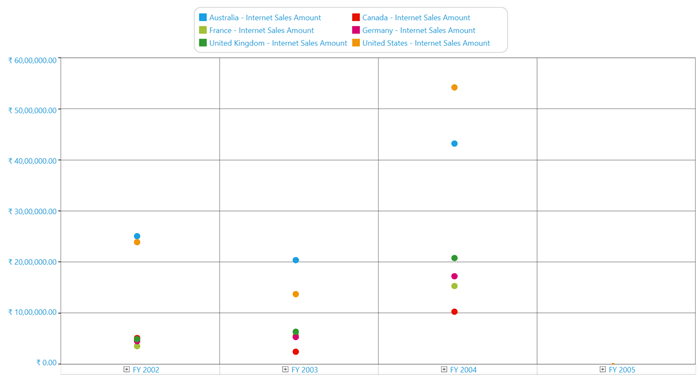

# Chart Types

OlapChart supports 16 different types of Charts as follows:

* Column
* StackingColumn
* StackingColumn100
* Bar
* StackingBar
* StackingBar100
* Area
* StackingArea
* SplineArea
* StepArea
* Line
* Spline
* RotatedSpline
* StepLine
* Scatter
* Pie

N> Chart type must be set before invoking the DataBind() method. Whenever you change the Chart type, you need to call the DataBind() method to get the changes reflected.

## Column Chart

Column chart is the most basic type of all charts. Column charts are widely used for comparison analysis.

The following code sample shows how to select a simple Column chart:





<syncfusion:OlapChart Name="olapChart" ChartType="Column" />





OlapChart olapChart = new OlapChart();
olapChart.ChartType = ChartTypes.Column;





Dim olapChart As OlapChart = New OlapChart()
olapChart.ChartType = ChartTypes.Column





A sample demo is available at the following link:  

{system drive}:\Users\\{User Name}\AppData\Local\Syncfusion\EssentialStudio\\{Version Number}\WPF\OlapChart.WPF\Samples\Chart Types\Column Chart Demo

## Stacking Column Chart

Stacking Column Chart is a simple form of chart, which contains segments in each series. This chart type is widely used for proportional analysis over a particular period of time.

The following code sample shows how to select a Stacking Column chart:





<syncfusion:OlapChart Name="olapChart" ChartType="StackingColumn" />





OlapChart olapChart = new OlapChart();
olapChart.ChartType = ChartTypes.StackingColumn;




  
Dim olapChart As OlapChart = New OlapChart()
olapChart.ChartType = ChartTypes.StackingColumn





A sample demo is available at the following link:  

{system drive}:\Users\\{User Name}\AppData\Local\Syncfusion\EssentialStudio\\{Version Number}\WPF\OlapChart.WPF\Samples\Chart Types\Column Chart Demo

## Stacking Column 100 Chart

Stacking Column 100 Chart is a simple form of chart.  Similar to the Stacking Column chart, the Stacking Column 100 chart contains segments in each series added so that each series is equated to 100%. This chart type is widely used for proportional analysis over a particular period of time.

The following code sample shows how to select a Stacking Column 100 chart:





<syncfusion:OlapChart Name="olapChart" ChartType="StackingColumn100" />




 
OlapChart olapChart = new OlapChart();
olapChart.ChartType = ChartTypes.StackingColumn100;




  
Dim olapChart As OlapChart = New OlapChart()
olapChart.ChartType = ChartTypes.StackingColumn100





A sample demo is available at the following link:  

{system drive}:\Users\\{User Name}\AppData\Local\Syncfusion\EssentialStudio\\{Version Number}\WPF\OlapChart.WPF\Samples\Chart Types\Column Chart Demo

## Bar Chart

Bar Chart is the same as the Column chart, the variation is it is rotated 90 degrees in the clockwise direction. This chart type is widely used for comparison analysis over a particular period of time.

The following code sample shows how to select a Bar chart:





<syncfusion:OlapChart Name="olapChart" ChartType="Bar" />




 
OlapChart olapChart = new OlapChart();
olapChart.ChartType = ChartTypes.Bar;




  
Dim olapChart As OlapChart = New OlapChart()
olapChart.ChartType = ChartTypes.Bar





A sample demo is available at the following link: 

{system drive}:\Users\\{User Name}\AppData\Local\Syncfusion\EssentialStudio\\{Version Number}\WPF\OlapChart.WPF\Samples\Chart Types\Bar Chart Demo

## Stacking Bar Chart

Stacking Bar Chart is the same as the Stacking Column chart, the variation is it is rotated 90 degrees in the clockwise direction. This chart type is widely used for proportional analysis over a particular period of time.

The following code sample shows how to select a Stacking Bar chart:





<syncfusion:OlapChart Name="olapChart" ChartType="StackingBar" />




 
OlapChart olapChart = new OlapChart();
olapChart.ChartType = ChartTypes.StackingBar;





Dim olapChart As OlapChart = New OlapChart()
olapChart.ChartType = ChartTypes.StackingBar





A sample demo is available at the following link: 

{system drive}:\Users\\{User Name}\AppData\Local\Syncfusion\EssentialStudio\\{Version Number}\WPF\OlapChart.WPF\Samples\Chart Types\Bar Chart Demo

## Stacking Bar 100 Chart

Stacking Bar 100 Chart is the same as the Stacking Column 100 chart, the variation is it is rotated 90 degree in the clockwise direction. This chart type is widely used for proportional analysis over a particular period of time.

The following code sample shows how to select a Stacking Bar 100 chart:





<syncfusion:OlapChart Name="olapChart" ChartType="StackingBar100" />





OlapChart olapChart = new OlapChart();
olapChart.ChartType = ChartTypes.StackingBar100;




  
Dim olapChart As OlapChart = New OlapChart()
olapChart.ChartType = ChartTypes.StackingBar100





A sample demo is available at the following link: 

{system drive}:\Users\\{User Name}\AppData\Local\Syncfusion\EssentialStudio\\{Version Number}\WPF\OlapChart.WPF\Samples\Chart Types\Bar Chart Demo

## Area Chart

Area Chart fills the quantitative data over a period of time. It is mainly used to compare the quantity plotted over two or more series.

The following code sample shows how to select an Area chart:





<syncfusion:OlapChart Name="olapChart" ChartType="Area" />





OlapChart olapChart = new OlapChart();
olapChart.ChartType = ChartTypes.Area;




  
Dim olapChart As OlapChart = New OlapChart()
olapChart.ChartType = ChartTypes.Area





A sample demo is available at the following link:

{system drive}:\Users\\{User Name}\AppData\Local\Syncfusion\EssentialStudio\\{Version Number}\WPF\OlapChart.WPF\Samples\Chart Types\Area Chart Demo

## Stacking Area Chart

Stacking Area Chart fills the quantitative data over a period of time just like the line Area chart. The variation in the StackingArea is while plotting the series. Each series is plotted on the top of the previous series rather than starting from 0 of the horizontal axis. It is mainly used to compare the quantity plotted over two or more series.

The following code sample shows how to select a Stacking Area chart:





<syncfusion:OlapChart Name="olapChart" ChartType="StackingArea" />




 
OlapChart olapChart = new OlapChart();
olapChart.ChartType = ChartTypes.StackingArea;





Dim olapChart As OlapChart = New OlapChart()
olapChart.ChartType = ChartTypes.StackingArea





A sample demo is available at the following link:

{system drive}:\Users\\{User Name}\AppData\Local\Syncfusion\EssentialStudio\\{Version Number}\WPF\OlapChart.WPF\Samples\Chart Types\Area Chart Demo

## Spline Area Chart

Spline Area Chart is usually used in the case of approximating the intervals by using spline curve. It is often used when data points are in limited number.

The following code sample shows how to select a Spline Area chart:





<syncfusion:OlapChart Name="olapChart" ChartType="SplineArea" />




 
OlapChart olapChart = new OlapChart();
olapChart.ChartType = ChartTypes.SplineArea;




  
Dim olapChart As OlapChart = New OlapChart()
olapChart.ChartType = ChartTypes.SplineArea





A sample demo is available at the following link:

{system drive}:\Users\\{User Name}\AppData\Local\Syncfusion\EssentialStudio\\{Version Number}\WPF\OlapChart.WPF\Samples\Chart Types\Area Chart Demo

## Step Area Chart

In the Step Area Chart, the points are plotted instead of a straight line tracing the shortest path between points; the values are connected by continuous vertical and horizontal lines. 

The following code sample shows how to select a Step Area chart:





<syncfusion:OlapChart Name="olapChart" ChartType="StepArea" />




 
OlapChart olapChart = new OlapChart();
olapChart.ChartType = ChartTypes.StepArea;




  
Dim olapChart As OlapChart = New OlapChart()
olapChart.ChartType = ChartTypes.StepArea





A sample demo is available at the following link:

{system drive}:\Users\\{User Name}\AppData\Local\Syncfusion\EssentialStudio\\{Version Number}\WPF\OlapChart.WPF\Samples\Chart Types\Area Chart Demo

## Line Chart

Line Chart is a simple form of chart, which connects a series of data points. Usually, it is used for Trend analysis, Forecasting, or in the case of large data points.

The following code sample shows how to select a Line chart:





<syncfusion:OlapChart Name="olapChart" ChartType="Line" />




 
OlapChart olapChart = new OlapChart();
olapChart.ChartType = ChartTypes.Line;




  
Dim olapChart As OlapChart = New OlapChart()
olapChart.ChartType = ChartTypes.Line




 
A sample demo is available at the following link:

{system drive}:\Users\\{User Name}\AppData\Local\Syncfusion\EssentialStudio\\{Version Number}\WPF\OlapChart.WPF\Samples\Chart Types\Line Chart Demo

## Spline Chart

Spline Chart is a simple form of chart, which connects the series of data points with an arc rather than a straight line. 

The following code sample shows how to select a Spline chart:





<syncfusion:OlapChart Name="olapChart" ChartType="Spline" />




 
OlapChart olapChart = new OlapChart();
olapChart.ChartType = ChartTypes.Spline;




  
Dim olapChart As OlapChart = New OlapChart()
olapChart.ChartType = ChartTypes.Spline





A sample demo is available at the following link:

{system drive}:\Users\\{User Name}\AppData\Local\Syncfusion\EssentialStudio\\{Version Number}\WPF\OlapChart.WPF\Samples\Chart Types\Line Chart Demo

## Rotated Spline Chart

Rotated Spline Chart is similar to the Spline chart, but is rotated 90 degrees in the clockwise direction.

The following code sample shows how to select a Rotated Spline chart.





<syncfusion:OlapChart Name="olapChart" ChartType="RotatedSpline" />





OlapChart olapChart = new OlapChart();
olapChart.ChartType = ChartTypes.RotatedSpline;




  
Dim olapChart As OlapChart = New OlapChart()
olapChart.ChartType = ChartTypes.RotatedSpline





A sample demo is available at the following link:

{system drive}:\Users\\{User Name}\AppData\Local\Syncfusion\EssentialStudio\\{Version Number}\WPF\OlapChart.WPF\Samples\Chart Types\Line Chart Demo

## Step Line Chart

Step Line Chart is another form of chart, which connects the series of data points by using horizontal and vertical lines.

The following code sample shows how to select a Step Line chart:





<syncfusion:OlapChart Name="olapChart" ChartType="StepLine" />




 
OlapChart olapChart = new OlapChart();
olapChart.ChartType = ChartTypes.StepLine;




  
Dim olapChart As OlapChart = New OlapChart()
olapChart.ChartType = ChartTypes.StepLine





A sample demo is available at the following link:

{system drive}:\Users\\{User Name}\AppData\Local\Syncfusion\EssentialStudio\\{Version Number}\WPF\OlapChart.WPF\Samples\Chart Types\Line Chart Demo

## Scatter Chart

Scatter Chart is a collection of points plotted in the rectangular co-ordinate system. It is often used in relationship analysis upto one independent variable.

The following code sample shows how to select a Scatter chart:

 



<syncfusion:OlapChart Name="olapChart" ChartType="Scatter" />




 
OlapChart olapChart = new OlapChart();
olapChart.ChartType = ChartTypes.Scatter;





Dim olapChart As OlapChart = New OlapChart()
olapChart.ChartType = ChartTypes.Scatter





A sample demo is available at the following link:

{system drive}:\Users\\{User Name}\AppData\Local\Syncfusion\EssentialStudio\\{Version Number}\WPF\OlapChart.WPF\Samples\Chart Types\Scatter Chart Demo

## Pie Chart

Pie Chart renders the data points in segments. It is capable of rendering only one series at a time. Usually, it is used for proportional analysis for a small set of data points.

The following code sample shows how to select a Pie chart:





<syncfusion:OlapChart Name="olapChart" ChartType="Pie" />




 
OlapChart olapChart = new OlapChart();
olapChart.ChartType = ChartTypes.Pie;




  
Dim olapChart As OlapChart = New OlapChart()
olapChart.ChartType = ChartTypes.Pie





N> Pie Chart should not be used for Comparison analysis of large data points, because it is harder for people to estimate angles rather than distance.

A sample demo is available at the following link:

{system drive}:\Users\\{User Name}\AppData\Local\Syncfusion\EssentialStudio\\{Version Number}\WPF\OlapChart.WPF\Samples\Chart Types\Pie Chart Demo
