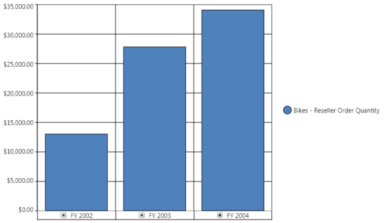
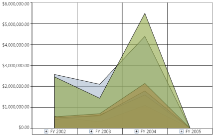
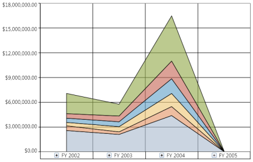
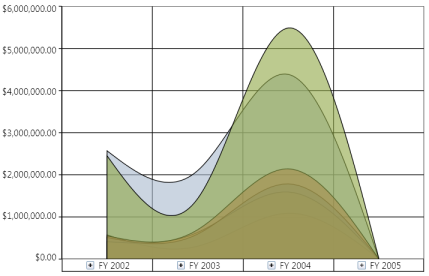
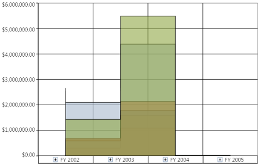
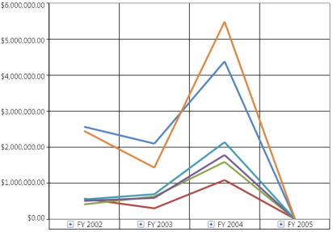
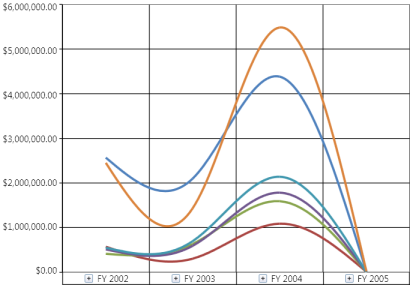
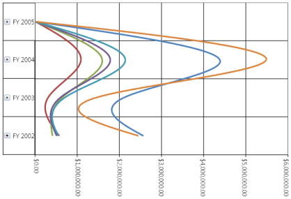
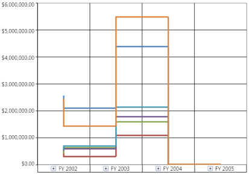

# Chart Types

OlapChart includes a comprehensive set of more than 16 chart types for all your business needs.

The supported chart types are as follows: 

* Column
* StackingColumn
* StackingColumn100
* Bar
* StackingBar
* StackingBar100
* Area
* StackingArea
* SplineArea
* StepArea
* Line
* Spline
* RotatedSpline
* StepLine
* Scatter
* Pie

The default chart type is Column chart. The following illustration shows a column chart:

N> The ChartType must be set before invoking the DataBind() method. Whenever you change the ChartType, you need to call the DataBind() method to reflect the changes.

## How to create a simple column chart?

Column chart is the most basic type of chart. Column charts are widely used for comparison analysis.

The following illustration shows the basic column chart:

The following code snippet shows how to select a simple column chart:

  

   

<syncfusion:OlapChart Name="olapchart1" ChartType="Column" />

    

  

    

OlapChart olapChart = new OlapChart();

olapChart.ChartType = ChartTypes.Column;

    

  

   

Dim olapChart As OlapChart = New OlapChart()

olapChart.ChartType = ChartTypes.Column

    

A sample, which demonstrates all the available type of Column charts, can be found in the following installation location:

..\Syncfusion\<Version Number>\BI\WPF\OlapChart.WPF\Samples\Chart Types\Column Chart Demo

## How to create a stacking column chart?

Stacking column chart is a simple form of chart, which contains segments in each series. This chart type is widely used for proportional analysis over a particular period of time.

The following illustration shows the stacking column chart:

The following code snippet shows how to select a stacking column chart:

  

   

<syncfusion:OlapChart Name="olapchart1" ChartType="StackingColumn" />

    

  

   

OlapChart olapChart = new OlapChart();

olapChart.ChartType = ChartTypes.StackingColumn;

    

	
	
  
   

Dim olapChart As OlapChart = New OlapChart()

olapChart.ChartType = ChartTypes.StackingColumn

 

A sample, which demonstrates all the available type of Column charts, can be found in the following installation location:

..\Syncfusion\<Version Number>\BI\WPF\OlapChart.WPF\Samples\Chart Types\Column Chart Demo

## How to create a stacking column 100 chart?

Stacking column 100 chart is a simple form of chart.  Similar to the stacking column chart, the stacking column 100 chart contains segments in each series added so that each series is equated to 100%. This chart type is widely used for proportional analysis over a particular period of time.

The following illustration shows the stacking column 100 chart:

The following code snippet shows how to select a stacking column 100 chart:

	 

    

<syncfusion:OlapChart Name="olapchart1" ChartType="StackingColumn100" />

 

 
 
    

OlapChart olapChart = new OlapChart();

olapChart.ChartType = ChartTypes.StackingColumn100;

 

 
  
   

Dim olapChart As OlapChart = New OlapChart()

olapChart.ChartType = ChartTypes.StackingColumn100

 

A sample, which demonstrates all the available type of Column charts, can be found in the following installation location:

..\Syncfusion\<Version Number>\BI\WPF\OlapChart.WPF\Samples\Chart Types\Column Chart Demo

## How to create a bar chart?

Bar chart is the same as the Column chart, the variation is it is rotated 90 degrees in the clockwise direction. This chart type is widely used for comparison analysis over a particular period of time.

The following illustration shows the simple bar chart:

The following code snippet shows how to select a bar chart:

	 

    

<syncfusion:OlapChart Name="olapchart1" ChartType="Bar" />

 

 
 
  

OlapChart olapChart = new OlapChart();

olapChart.ChartType = ChartTypes.Bar;

 

 
  
  

Dim olapChart As OlapChart = New OlapChart()

olapChart.ChartType = ChartTypes.Bar

 

A sample, which demonstrates all the available type of Bar charts, can be found in the following installation location:

..\Syncfusion\<Version Number>\BI\WPF\OlapChart.WPF\Samples\Chart Types\Bar Chart Demo

## How to create a stacking bar chart?

StackingBar chart is the same as the StackingColumn chart, the variation is it is rotated 90 degrees in the clockwise direction. This chart type is widely used for proportional analysis over a particular period of time.

The following illustration shows the simple bar chart:

The following code snippet shows how to select a bar chart:

	 

    

<syncfusion:OlapChart Name="olapchart1" ChartType="StackingBar" />

 

 
 
   

OlapChart olapChart = new OlapChart();

olapChart.ChartType = ChartTypes.StackingBar;

 

 
  
   

Dim olapChart As OlapChart = New OlapChart()

olapChart.ChartType = ChartTypes.StackingBar

 

A sample, which demonstrates all the available type of Bar charts, can be found in the following installation location:

..\Syncfusion\<Version Number>\BI\WPF\OlapChart.WPF\Samples\Chart Types\Bar Chart Demo

## How to create a stacking bar 100 chart?

StackingBar100 chart is the same as the StackingColumn100 chart, the variation is it is rotated 90 degree in the clockwise direction. This chart type is widely used for proportional analysis over a particular period of time.

The following illustration shows the StackingBar100 chart:

The following code snippet shows how to select a bar chart:

	 

    

<syncfusion:OlapChart Name="olapchart1" ChartType="StackingBar100" />

 

 
 
  

OlapChart olapChart = new OlapChart();

olapChart.ChartType = ChartTypes.StackingBar100;

 

 
  
   

Dim olapChart As OlapChart = New OlapChart()

olapChart.ChartType = ChartTypes.StackingBar100

 

A sample, which demonstrates all the available type of Bar charts, can be found in the following installation location:

..\Syncfusion\<Version Number>\BI\WPF\OlapChart.WPF\Samples\Chart Types\Bar Chart Demo

## How to create an Area chart?

Area chart fills the quantitative data over a period of time. It is mainly used to compare the quantity plotted over two or more series.

The following illustration shows the simple Area chart:

The following code snippet shows how to select an Area chart:

	 

    

<syncfusion:OlapChart Name="olapchart1" ChartType="Area" />

 

 
 
   

OlapChart olapChart = new OlapChart();

olapChart.ChartType = ChartTypes.Area;

 

 
  
 

Dim olapChart As OlapChart = New OlapChart()

olapChart.ChartType = ChartTypes.Area

 

A sample, which demonstrates all the available type of Area charts, can be found in the following installation location:

..\Syncfusion\<Version Number>\BI\WPF\OlapChart.WPF\Samples\Chart Types\Area Chart Demo

## How to create a stacking area chart?

StackingArea chart fills the quantitative data over a period of time just like the line Area chart. The variation in the StackingArea is while plotting the series. Each series is plotted on the top of the previous series rather than starting from 0 of the horizontal axis. It is mainly used to compare the quantity plotted over two or more series.

The following illustration shows the StackingArea chart:

The following code snippet shows how to select a StackingArea chart:

	 

    

<syncfusion:OlapChart Name="olapchart1" ChartType="StackingArea" />

 

 
 
  

OlapChart olapChart = new OlapChart();

olapChart.ChartType = ChartTypes.StackingArea;

 

 
  
   

Dim olapChart As OlapChart = New OlapChart()

olapChart.ChartType = ChartTypes.StackingArea

 

A sample, which demonstrates all the available type of Area charts, can be found in the following installation location:

..\Syncfusion\<Version Number>\BI\WPF\OlapChart.WPF\Samples\Chart Types\Area Chart Demo

## How to create a spline area?

Spline area chart is usually used in the case of approximating the intervals by using spline curve. It is often used when data points are in limited number.

The following illustration shows the Spline area chart:

The following code snippet shows how to select a Spline area chart:

	 

   

<syncfusion:OlapChart Name="olapchart1" ChartType="SplineArea" />

 

 
 
    

OlapChart olapChart = new OlapChart();

olapChart.ChartType = ChartTypes.SplineArea;

 

 
  
   

Dim olapChart As OlapChart = New OlapChart()

olapChart.ChartType = ChartTypes.SplineArea

 

A sample, which demonstrates all the available type of Area charts, can be found in the following installation location:

..\Syncfusion\<Version Number>\BI\WPF\OlapChart.WPF\Samples\Chart Types\Area Chart Demo

### How to create a step area?

In the Step area chart, the points are plotted instead of a straight line tracing the shortest path between points; the values are connected by continuous vertical and horizontal lines. 

The following illustration shows the Step area chart:

The following code snippet shows how to select a Step area chart:

	 

    

<syncfusion:OlapChart Name="olapchart1" ChartType="StepArea" />

 

 
 
   

OlapChart olapChart = new OlapChart();

olapChart.ChartType = ChartTypes.StepArea;

 

 
  
   

Dim olapChart As OlapChart = New OlapChart()

olapChart.ChartType = ChartTypes.StepArea

 

A sample, which demonstrates all the available type of Area charts, can be found in the following installation location:

..\Syncfusion\<Version Number>\BI\WPF\OlapChart.WPF\Samples\Chart Types\Area Chart Demo

## How to create a line chart?

Line chart is a simple form of chart, which connects a series of data points. Usually, it is used for Trend analysis, Forcasting, or in the case of large data points.

The following illustration shows the Line chart:

The following code snippet shows how to select a Line chart:

	 

    

<syncfusion:OlapChart Name="olapchart1" ChartType="Line" />

 

 
 
  

OlapChart olapChart = new OlapChart();

olapChart.ChartType = ChartTypes.Line;

 

 
  
 

Dim olapChart As OlapChart = New OlapChart()

olapChart.ChartType = ChartTypes.Line

 

A sample, which demonstrates all the available type of Line charts, can be found in the following installation location.

..\Syncfusion\<Version Number>\BI\WPF\OlapChart.WPF\Samples\Chart Types\Line Chart Demo

## How to create a spline chart?

Spline chart is a simple form of chart, which connects the series of data points with an arc rather than a straight line. 

The following illustration shows the Spline chart:

The following code snippet shows how to select a Spline chart:

	 

    

<syncfusion:OlapChart Name="olapchart1" ChartType="Spline" />

 

 
 
   

OlapChart olapChart = new OlapChart();

olapChart.ChartType = ChartTypes.Spline;

 

 
  
    

Dim olapChart As OlapChart = New OlapChart()

olapChart.ChartType = ChartTypes.Spline

 

A sample, which demonstrates all the available type of Line charts, can be found in the following installation location:

..\Syncfusion\<Version Number>\BI\WPF\OlapChart.WPF\Samples\Chart Types\Line Chart Demo

## How to create a rotate spline chart?

RotatedSpline chart is similar to the Spline chart, but is rotated 90 degrees in the clockwise direction.

The following illustration shows the RotatedSpline chart:

The following code snippet shows how to select a RotatedSpline chart.

	 

    

<syncfusion:OlapChart Name="olapchart1" ChartType="RotatedSpline" />

 

 
 
    

OlapChart olapChart = new OlapChart();

olapChart.ChartType = ChartTypes.RotatedSpline;

 

 
  
   

Dim olapChart As OlapChart = New OlapChart()

olapChart.ChartType = ChartTypes.RotatedSpline

 

A sample, which demonstrates all the available type of Line charts, can be found in the following installation location:

..\Syncfusion\<Version Number>\BI\WPF\OlapChart.WPF\Samples\Chart Types\Line Chart Demo

## How to create a step line chart?

StepLine chart is another form of chart, which connects the series of data points by using horizontal and vertical lines.

The following illustration shows the StepLine chart:

The following code snippet shows how to select a StepLine chart:

	 

   

<syncfusion:OlapChart Name="olapchart1" ChartType="StepLine" />

 

 
 
  

OlapChart olapChart = new OlapChart();

olapChart.ChartType = ChartTypes.StepLine;

 

 
  
   

Dim olapChart As OlapChart = New OlapChart()

olapChart.ChartType = ChartTypes.StepLine

 

A sample, which demonstrates all the available type of Line charts, can be found in the following installation location:

..\Syncfusion\<Version Number>\BI\WPF\OlapChart.WPF\Samples\Chart Types\Line Chart Demo

## How to create a scatter chart?

Scatter chart is a collection of points plotted in the rectangular co-ordinate system. It is often used in relationship analysis upto one independent variable.

The following illustration shows the Scatter chart:

The following code snippet shows how to select a Scatter chart:

	 

    

<syncfusion:OlapChart Name="olapchart1" ChartType="Scatter" />

 

 
 
  

OlapChart olapChart = new OlapChart();

olapChart.ChartType = ChartTypes.Scatter;

 

 
  
    

Dim olapChart As OlapChart = New OlapChart()

olapChart.ChartType = ChartTypes.Scatter

 

A sample, which demonstrates the Scatter chart, can be found in the following installation location:

..\Syncfusion\<Version Number>\BI\WPF\OlapChart.WPF\Samples\Chart Types\Scatter Chart Demo

## How to create a pie chart?

Pie chart renders the data points in segments. It is capable of rendering only one series at a time. Usually, it is used for proportional analysis for a small set of data points.

The following illustration shows the Pie chart:

The following code snippet shows how to select a Pie chart:

	 

   

<syncfusion:OlapChart Name="olapchart1" ChartType="Pie" />

 

 
 
    

OlapChart olapChart = new OlapChart();

olapChart.ChartType = ChartTypes.Pie;

 

 
  
   

Dim olapChart As OlapChart = New OlapChart()

olapChart.ChartType = ChartTypes.Pie

 

N> Pie chart should not be used for Comparison analysis of large data points, because it is harder for people to estimate angles rather than distance.

A sample, which demonstrates the Pie chart, can be found in the following installation location:

..\Syncfusion\<Version Number>\BI\WPF\OlapChart.WPF\Samples\Chart Types\Pie Chart Demo
