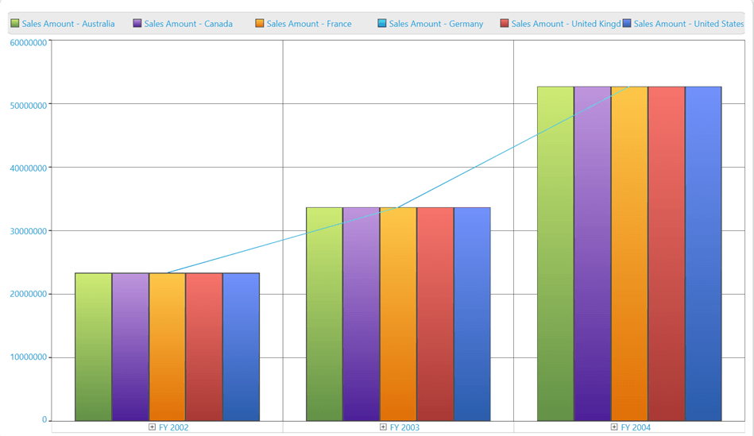

# Chart Type: Specific Series

OlapChart WPF provides support to change the chart type of each series using a context menu.

To change the chart type of a specific series, right-click on the particular series; a context menu with the list of available chart type appears. From the list of chart types in context menu, you can select the required chart type. 

**The following screen shot shows how a specific column chart series is changed to line chart series.**

**The following screenshot shows a column chart series changed to line chart.**

