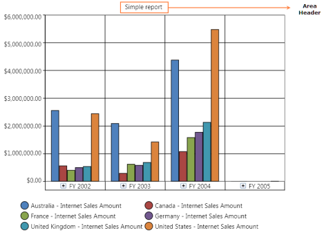
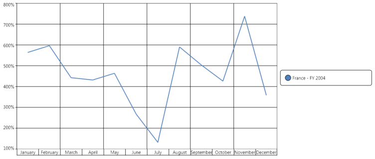
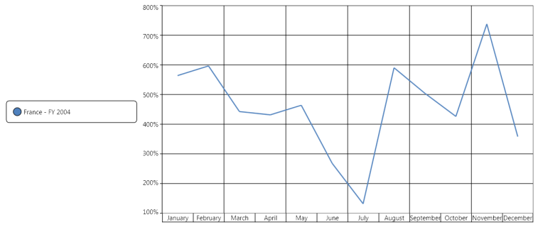
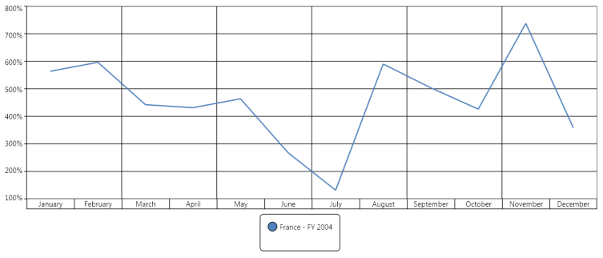
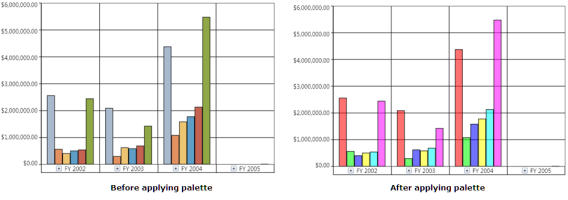
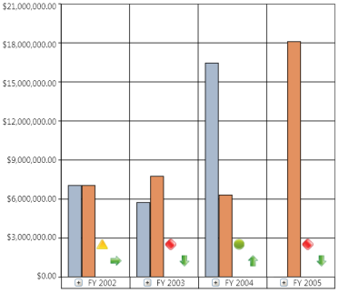
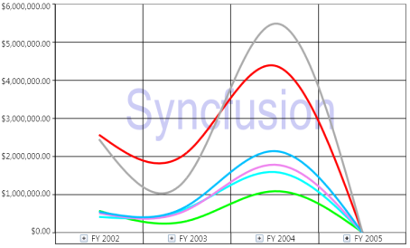
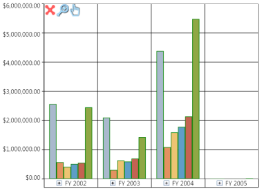

# Core Features

The following are the core feature elements of an OlapChart:

## OlapArea

The OlapArea is a ChartArea, which contains the ChartSeries and ChartAxes. This section discusses the following topics.

See also

ChartArea.

### How to add a Chart header to an OlapArea?

Chart header is the title of the chart, which is usually displayed at the top center of the ChartArea.  The following illustration displays the Chart header displayed in the chart area:

#### Steps to Add a Chart Header

The steps to add a chart header are as follows:

1. In general, ChartSeries contains the ChartArea instance, which can be used to customize the OlapArea. The following code snippet describes how to add a chart header to an OlapChart:

  



    this.olapchart1.Series[0].Area.Header = "Simple report";
	




    Me.olapchart1.Series(0).Area.Header = "Simple report"
	


   

N> The series will be available only after the data is bound to the control. In other words, you can access the series property of the OlapChart only after the call to DataBind() is made.

See also

Chart Area Header

###  How to customize the appearance of an OlapArea?

OlapArea is basically derived from the ChartArea of the Essential Chart WPF. So, it has the advantage of the customization options available in the ChartArea. However, 3D charts and multiple chart areas are not supported in an OlapChart. So, those customizations are not applicable.

The following are the frequently used customization options that are available in the ChartArea:

* Background
* GridBackground
* Foreground
* FontFamily
* FontSize
* FontStyle
* FontWeight
* BorderBrush
* BorderThickness
* CornerRadius

These properties are explained in the following topics:

* How to customize the border properties of the OlapArea.
* How to customize the background properties of the OlapArea.
* How to customize the font properties of the OlapArea.
* How to customize the border properties of the OlapArea?

OlapArea allows you to customize the border properties. The following code snippets explain how these properties can be customized:

### BorderBrush

 
 
   

this.olapchart1.Series[0].Area.BorderBrush = Brushes.Black;

 

 
  
  

      Me.olapchart1.Series(0).Area.BorderBrush = Brushes.Black

 

### BorderThickness

 
 
   

       this.olapchart1.Series[0].Area.BorderThickness = new Thickness(2);

 

 
  
   

      Me.olapchart1.Series(0).Area.BorderThickness = New Thickness(2)

 

### CornerRadius

 
 
   

       this.olapchart1.Series[0].Area.CornerRadius = new CornerRadius(5);

 

 
  
   

      Me.olapchart1.Series(0).Area.CornerRadius = New CornerRadius(5)

 

### How to customize the background properties of the OlapArea?

OlapArea allows you to customize the background properties in an easy manner. The following code snippets explain how to customize the OlapArea with various background properties:

 
 
   

       this.olapchart1.Series[0].Area.Background = Brushes.SkyBlue;

 

 
  
  

       Me.olapchart1.Series(0).Area.Background = Brushes.SkyBlue

 

### Background

### GridBackground

 
 
    

       this.olapchart1.Series[0].Area.GridBackground = Brushes.LightBlue;

 

 
  
   

       Me.olapchart1.Series(0).Area.GridBackground = Brushes.LightBlue

 

### How to customize the font properties of the OlapArea?

Typically, the primary axis and the secondary axis font settings will override the font properties applied to their content in the OlapArea. To set the font properties such as Foreground, FontFamily, FontSize, and FontWeight consider using the font properties available in the primary and the secondary axis.

### FontStyle

 
 
   

       this.olapchart1.Series[0].Area.FontStyle = FontStyles.Italic;

 

 
  
  

      Me.olapchart1.Series(0).Area.FontStyle = FontStyles.Italic

 

See also

How to customize PrimaryAxis font properties?

How to customize SecondaryAxis font properties?

## Series

Series are the data points plotted in the rectangular co-ordinate system. In this section the following topics will be discussed:

### Series customization quick reference:

_Chart Types table_

<table>
<tr>
<th>
{{ '**Chart Type**' | markdownify }}</th><th>
{{ '**Series Stroke**' | markdownify }}</th><th>
{{ '**Series Stroke Thickness**' | markdownify }}</th><th>
{{ '**Series Interior**' | markdownify }}</th></tr>
<tr>
<td>
{{ 'Column/Bar/Area' | markdownify }}</td><td>
Affects the border color of the series.</td><td>
Affects the border thickness of the series.</td><td>
Affects the series color.</td></tr>
<tr>
<td>
{{ 'Line/Spline' | markdownify }}</td><td>
No effect</td><td>
Affects the thickness of the particular line (series).</td><td>
Affects the color of the particular line (series).</td></tr>
<tr>
<td>
{{ 'Pie' | markdownify }}</td><td>
Affects the border color of the series.</td><td>
Affects the border thickness of the series.</td><td>
No effect</td></tr>
</table>

### See also

Series, ChartAdornmentInfo

### How to display a point label in an OlapChart?

Point label provides information about the data point. Data point can be added to a series by using the following code snippet:
  

   

for(int i=0; i< this.olapchart1.Series.Count; i++)
{
    //// Setting the visibility of adornment.
    this.olapchart1.Series[i].AdornmentsInfo.Visible = true;

    //// Setting horizontal alignment
    this.olapchart1.Series[i].AdornmentsInfo.SegmentHorizontalAlignment = 

System.Windows.HorizontalAlignment.Right;

    //// Makes the segment out from the series.
    this.olapchart1.Series[i].AdornmentsInfo.SegmentIsOut = true;

    this.olapchart1.Series[i].AdornmentsInfo.SegmentLabelContent = 

LabelContent.LabelContentPath;

    this.olapchart1.Series[i].AdornmentsInfo.SegmentLabelFontSize = 12;
    this.olapchart1.Series[i].AdornmentsInfo.SegmentLabelRotation = 325;
}

    

  

    

For i As Integer = 0 To Me.olapchart1.Series.Count - 1

' Setting the visibility of adornment.

Me.olapchart1.Series(i).AdornmentsInfo.Visible = True

' Setting horizontal alignment

Me.olapchart1.Series(i).AdornmentsInfo.SegmentHorizontalAlignment = System.Windows.HorizontalAlignment.Right

' Makes the segment out from the series.

Me.olapchart1.Series(i).AdornmentsInfo.SegmentIsOut = True

Me.olapchart1.Series(i).AdornmentsInfo.SegmentLabelContent = LabelContent.LabelContentPath

Me.olapchart1.Series(i).AdornmentsInfo.SegmentLabelFontSize = 12

Me.olapchart1.Series(i).AdornmentsInfo.SegmentLabelRotation = 325

Next i

    

The following figure shows an OlapChart with PointLabels enabled:

#### See also

ChartAdornmentInfo

### How to customize the chart series color?

You can set a custom color for each series in the OlapChart. The following code snippet explains this. To apply different colors to different series iterate through the series and apply the custom brush to the series.

  

   

       this.olapChart1.Series[0].Interior = Brushes.Orange;

    

  

    

      Me.olapChart1.Series(0).Interior = Brushes.Orange

    

### How to customize the series border properties?

You can customize the thickness of the series border of an OlapChart by using the following code snippet:

  

  

       this.olapchart1.Series[0].Stroke = Brushes.Black;
       this.olapchart1.Series[0].StrokeThickness = 4;

    

  

   

Me.olapchart1.Series(0).Stroke = Brushes.Black

Me.olapchart1.Series(0).StrokeThickness = 4

    

N> The behaviour of the series border will vary for different chart types. The following illustration describes them in detail.

The series border is applied for the first series of a Column chart by using the StrokeThickness property. Notice that the first series element is surrounded with the applied border.

Notice the variation. The same series border property is applied for a series in the line chart. Instead of creating a 4 pixel width border it increases the thickness of the particular series line.

Since, you know that the pie chart renders everything in a single series each block in the pie chart known as segments will have the border applied on them. This is described in the following illustration:

### How to customize the series with custom data templates?

Series can be customized with user defined data templates. The following sample usage describes how to apply a data template to the series in an OlapChart.

The following data template will be used to customize the series:

  

  

<DataTemplate x:Key="ColumnTemplate">
                <Canvas Name="myCanvas">
                    <Grid Name="OuterGrid" 

                          Canvas.Left="{Binding X}" 

                          Width="{Binding Width}" 

                          Height="{Binding ElementName=myCanvas, 

                          Path=ActualHeight}" >
                        <Border Name="ColumnRect"                           VerticalAlignment="Bottom"                           Width="{Binding Width}" Height="{Binding Height}"                          CornerRadius="8,8,0,0" Background="{Binding Interior}">
                        </Border>
                    </Grid>
                </Canvas>
</DataTemplate>

    

The following code snippet explains how to use a data template for a series:

  

   

       for (int i = 0; i < this.olapchart1.Series.Count; i++)
       {
           //Apply Series Template to display the series cylindrical style
           this.olapchart1.Series[i].Template = 

               this.Resources["ColumnTemplate"] as DataTemplate;

           // Apply Series Interior to display the series in different colors.
           this.olapchart1.Series[i].Interior = 

               App.Current.Resources["SeriesInterior" + i] as LinearGradientBrush;
       }

    

  

    

       For i As Integer = 0 To Me.olapchart1.Series.Count - 1

           'Apply Series Template to display the series cylindrical style

Me.olapchart1.Series(i).Template = TryCast(Me.Resources("ColumnTemplate"), DataTemplate)

           ' Apply Series Interior to display the series in different colors.

           Me.olapchart1.Series(i).Interior = TryCast(App.Current.Resources("SeriesInterior" & i), LinearGradientBrush)

       Next i

    

A sample, which demonstrates all the series customization, can be found in the following installation location:

..\Syncfusion\<Version Number>\BI\WPF\OlapChart.WPF\Samples\Customization\Series Customization Demo

### How to customize series thickness for line?

Series thickness in a line chart is the StrokeThickness. 

See the topic How to customize the series border properties, for more information.

### How to handle ChartMouseEventArgs

ChartMouseEventArgs are the arguments returned when the mouse events are triggered by the ChartSeries. ChartMouseEventArgs return the segment on which the mouse events are triggered along with the default mouse event args. This event args can be used to perform customization of a segment when a mouse event is encountered. The segment returns different values that can be used to perform calculations or operations.

The following code snippet demonstrates how the ChartMouseEventArgs can be used to retrieve information on the ChartSeries segment:

  

   

//// Event tagging

this.olapchart1.Series[0].MouseClick += new ChartMouseEventHandler(series_MouseClick);

//// Mouse click event for a series.
void series_MouseClick(object sender, ChartMouseEventArgs e)
{
    ChartPoint point = (ChartPoint)e.Segment.CorrespondingPoints[0].DataPoint;
    MessageBox.Show("X = " + point.X.ToString() + "\n" + "Y = " + point.Y.ToString());
}

    

  

   

' Event tagging

AddHandler olapchart1.Series(0).MouseClick, AddressOf series_MouseClick

' Mouse click event for a series.

Private Sub series_MouseClick(ByVal sender As Object, ByVal e As ChartMouseEventArgs)

Dim point As ChartPoint = CType(e.Segment.CorrespondingPoints(0).DataPoint, ChartPoint)

MessageBox.Show("X = " & point.X.ToString() & Constants.vbLf & "Y = " & point.Y.ToString())

End Sub

    

#### See Also

[Chart Series](http://docs.syncfusion.com/wpf/sfchart/series.html)

### How to enable chart animations

Animations can be added in the OlapChart control. It can be achieved through the following properties: SeriesAnimateOption, SeriesAnimateOnebyOne, EnableSeriesAnimation,and SeriesAnimationDuration for each chart series.

Properties

_Properties Table_

<table>
<tr>
<th>
{{ '**Property**' | markdownify }} </th><th>
{{ '**Description**' | markdownify }}</th><th>
{{ '**Type**' | markdownify }}</th><th>
{{ '**Data Type**' | markdownify }} </th></tr>
<tr>
<td>
SeriesAnimateOption</td><td>
Gets or sets animation for each series </td><td>
Dependency</td><td>
AnimationOptions</td></tr>
<tr>
<td>
SeriesAnimateOnebyOne</td><td>
Gets or sets whether each series animate one by one. By default false.</td><td>
Dependency</td><td>
bool</td></tr>
<tr>
<td>
EnableSeriesAnimation</td><td>
Gets or sets whether enable animation for each series.</td><td>
Dependency</td><td>
bool</td></tr>
<tr>
<td>
SeriesAnimationDuration</td><td>
Gets or sets the animation duration for each series.</td><td>
Dependency</td><td>
TimeSpan</td></tr>
</table>

#### Sample Link

The samples can be found in the following location:

C:\Users\<username>\AppData\Local\Syncfusion\EssentialStudio\10.4.0.53\BI\WPF\OLAPChart.WPF\Samples\Appearance\Chart Animations Demo\

### Adding Chart Animation Support to an Application 

We can use the following code sample for enabling chart animations: 

  

  <syn:OlapChart ChartType="{Binding OlapChartType}" Name="olapChart1"   

            OlapDataManager="{Binding DataManager}" Grid.Row="1"  

            Background="Transparent" ColorPalette="Metro"      

            SeriesAnimateOption="Bottom"  

            SeriesAnimateOneByOne="true"        

            EnableSeriesAnimation="true"

            SeriesAnimationDuration="00:00:3" />

    

			  

   

// To set the Series Animate Option to Bottom in OlapChart.

this.olapChart1.SeriesAnimateOption = Syncfusion.Windows.Chart.AnimationOptions.Bottom;

// To enable the Series Animate OneByOne in OlapChart.

this.olapChart1.SeriesAnimateOneByOne = true;

// To disable Series Animate OneByOne in OlapChart.

this.olapChart1.SeriesAnimateOneByOne = false;

// To disable Series Animation in OlapChart.

this.olapChart1.EnableSeriesAnimation = false;

// To set the Series Animation Duration in OlapChart.

this.olapChart1.SeriesAnimationDuration = new TimeSpan(1);

    

### How to customize pie chart series

We can set the explode index, explode radius, and enable or disable the series effects for the each series in a pie chart.

#### Sample Link

The installed samples can be found here:

C:\Users\<username>\AppData\Local\Syncfusion\EssentialStudio\10.4.0.53\BI\WPF\OLAPChart.WPF\Samples\Chart Types\Pie Chart Demo

### Adding Pie Chart features to an Application 

The following code sample demonstrates the customization each series of the Pie chart.

  

    

foreach (ChartSeries series in this. olapchart.Series)

{

//To enable the chart to explode we have pass the ChartSeries and true as parameter to SetExplodedAll method

ChartPieType.SetExplodedAll(series, true);

}

foreach (ChartSeries series in this. olapchart.Series)

{

//To enable the chart to explode we have pass the ChartSeries and false as parameter to                      disable the SetExplodedAll method

ChartPieType.SetExplodedAll(series, false);

}

foreach (ChartSeries series in this.olapchart.Series)

{

//To enable the effects in Pie chart

series.EnableEffects = true;

}

foreach (ChartSeries series in this. olapchart.Series)

{

//To disable the effects in Pie chart

series.EnableEffects = false;

}

foreach (ChartSeries series in this. olapchart.Series)

{

// to set the explore index value we have to pass the ChartSeries and the index value of which part of the Chart to explode

ChartPieType.SetExplodedIndex(series, 2);

}

foreach (ChartSeries series in this. olapchart.Series)

{

// to set the radius of the exploded chart we have to pass the ChartSeries and the radius which is n double value

ChartPieType.SetExplodeRadius(series, 8.0);

}

    

## Axes

An OlapArea contains a minimum of two axes namely primary axis and secondary axis in an OlapChart control. Values or data in the chart are plotted against these axes. In this section the following topics will be discussed:

### See also

Chart Axis

### How to disable horizontal grid lines?

In general, for column type charts, the horizontal grid line belongs to the secondary axis. To disable the horizontal grid lines for these types of charts, you need to use the ShowGridLines property of the secondary axis.

The following illustration describes how the chart will look after the horizontal grid lines are disabled:

The following code snippet describes how to disable the horizontal grid lines:

  

    

      this.olapChart.Series[0].Area.SecondaryAxis.SetValue(

      ChartArea.ShowGridLinesProperty, false);

    

  

   

Me.olapChart.Series(0).Area.SecondaryAxis.SetValue(

      ChartArea.ShowGridLinesProperty, False)

    

N> For bar type charts, such as Bar, Stacking bar, and Stacking100 Bar you can disable the horizontal grid lines by using the ShowGridLinesProperty of the PrimaryAxis.

### How to disable vertical grid lines?

In general, for column type charts, the vertical grid line belongs to the primary axis. To disable the vertical grid lines for these types of charts, you need to use the ShowGridLines property of the primary axis.

The following illustration describes how the chart will look after the vertical grid lines are disabled:

The following code snippet describes how to disable the horizontal grid lines:

  

   

      this.olapChart.Series[0].Area.PrimaryAxis.SetValue(

      ChartArea.ShowGridLinesProperty, false);

    

  

   

Me.olapChart.Series(0).Area.PrimaryAxis.SetValue(

      ChartArea.ShowGridLinesProperty, False)

    

N> For bar type charts, such as Bar, Stacking bar, and Stacking100 Bar you can disable the vertical grid lines by using the ShowGridLinesProperty of the SecondaryAxis.

### How to display % in secondary axis?

To display the ‘%’ symbol in secondary axis, you need to set the secondary axis label format property. The following code snippet describes the usage of ‘%’ in the secondary axis label:

  

  

       <syncfusion:OlapChart.SecondaryAxis>

              <syncfusion:ChartAxis LabelFormat="00.00%" />

       </syncfusion:OlapChart.SecondaryAxis>

    

### How to display currency in secondary axis?

To display the currency symbol in the secondary axis, you need to set the secondary axis label format property. The following code snippet describes the usage of currency in the secondary axis label:

  

    

       <syncfusion:OlapChart.SecondaryAxis>

              <syncfusion:ChartAxis LabelFormat="C" />

       </syncfusion:OlapChart.SecondaryAxis>

    

### How to customize the OlapAxis label font settings?

The label font settings of the primary and the secondary axis can easily be applied to an OlapChart by speicifying the label font properties, which are available under the PrimaryAxis and the SecondaryAxis of the OlapChart.

  

    

       <syncfusion:OlapChart.PrimaryAxis>
              <syncfusion:ChartAxis LabelFormat="C"

                         LabelFontFamily="Arial" 

                         LabelFontSize="14" 

                         LabelFontWeight="ExtraBold" 

                         LabelForeground="DarkGray"  />
       </syncfusion:OlapChart.PrimaryAxis>

       <syncfusion:OlapChart.SecondaryAxis>
              <syncfusion:ChartAxis LabelFormat="C"

                         LabelFontFamily="Arial" 

                         LabelFontSize="14" 

                         LabelFontWeight="ExtraBold" 

                         LabelForeground="DarkGray"  />
       </syncfusion:OlapChart.SecondaryAxis>

    

  

  

       this.olapChart.PrimaryAxis.LabelForeground = Brushes.DarkGray;
       this.olapChart.PrimaryAxis.LabelFontFamily = new FontFamily("Arial");
       this.olapChart.PrimaryAxis.LabelFontSize = 14d;
       this.olapChart.PrimaryAxis.LabelFontWeight = FontWeights.ExtraBold;

       this.olapChart.SecondaryAxis.LabelForeground = Brushes.DarkGray;
       this.olapChart.SecondaryAxis.LabelFontFamily = new FontFamily("Arial");
       this.olapChart.SecondaryAxis.LabelFontSize = 14d;
       this.olapChart.SecondaryAxis.LabelFontWeight = FontWeights.ExtraBold;

    

  

    

Me.olapChart.PrimaryAxis.LabelForeground = Brushes.DarkGray

Me.olapChart.PrimaryAxis.LabelFontFamily = New FontFamily("Arial")

Me.olapChart.PrimaryAxis.LabelFontSize = 14R

Me.olapChart.PrimaryAxis.LabelFontWeight = FontWeights.ExtraBold

Me.olapChart.SecondaryAxis.LabelForeground = Brushes.DarkGray

Me.olapChart.SecondaryAxis.LabelFontFamily = New FontFamily("Arial")

Me.olapChart.SecondaryAxis.LabelFontSize = 14R

Me.olapChart.SecondaryAxis.LabelFontWeight = FontWeights.ExtraBold

    

### How to toggle the visibility of the PrimaryAxis LabelPanel

The PrimaryAxisLabelPanel visibility can be toggled by setting the PrimaryAxisLabelVisibility property.

The following code snippet is used to collapse the PrimaryAxis label:

  

   

<syncfusion:OlapChart Name="olapchart1" PrimaryAxisLabelVisibility="Collapsed" />

    

  

  

this.olapchart1.PrimaryAxisLabelVisibility = System.Windows.Visibility.Collapsed;

    

  

    

Me.olapchart1.PrimaryAxisLabelVisibility = System.Windows.Visibility.Collapsed

    

The following illustration shows how the OlapChart will look after collapsing the PrimaryAxis label.

## Legend

Legends are used to display the name of the data series.

The following topics explain this in detail:

### See also

Chart Legend

### How to add legend to the OlapChart

The ChartLegend can be added to an OlapChart by adding the ChartLegend of the Essential Chart WPF, which is found under the Syncfusion.Windows.Chart namespace. The following code snippets explain how to add a legend to an OlapChart:

  

   

       <syncfusion:OlapChart.Legend>
            <baseChart:ChartLegend Background="Transparent"/>
       </syncfusion:OlapChart.Legend>

    

  

       this.olapChart.Legend = new ChartLegend();

    

  

   

      Me.olapChart.Legend = New ChartLegend()

    

### How to Show/Hide chart legend?

The ChartLegend has a visibility property using which you can show or hide the ChartLegend in an OlapChart. The following code snippets show how you can collapse the visibility of the ChartLegend:

  

    

<syncfusion:OlapChart.Legend>

        <baseChart:ChartLegend Visibility="Collapsed" />
</syncfusion:OlapChart.Legend>

    
 

  

 

this.olapChart.Legend.Visibility = System.Windows.Visibility.Collapsed;

    

  

   

Me.olapChart.Legend.Visibility = System.Windows.Visibility.Collapsed

    

### How to toggle the visibility of the legend check box?

The visibility of the legend check box can be toggled by using the CheckBoxVisibility property in the ChartLegend. The following code snippet shows how to toggle the visibility of the check box in the legend of an OlapChart:

  

    

<syncfusion:OlapChart.Legend>
    <baseChart:ChartLegend CheckBoxVisibility="Collapsed" />
</syncfusion:OlapChart.Legend>

    

  

    

this.olapChart.Legend.CheckBoxVisibility = System.Windows.Visibility.Collapsed;

    

  

    

Me.olapChart.Legend.CheckBoxVisibility = System.Windows.Visibility.Collapsed

    

### How to toggle the visibility of the legend icon?

The visibility of the legend icon can be toggled by using the IconVisibility property in the ChartLegend. The following code snippet shows how to toggle the visibility of the icons in an OlapChart legend:

  

    

<syncfusion:OlapChart.Legend>
    <baseChart:ChartLegend IconVisibility="Collapsed" />
</syncfusion:OlapChart.Legend>

    

  

   

this.olapChart.Legend.IconVisibility = System.Windows.Visibility.Collapsed;

    

  

   

Me.olapChart.Legend.IconVisibility = System.Windows.Visibility.Collapsed

    

### How to set the dock position of the legend?

ChartLegend contains an enum property called ChartDock, which has the following values Floating, Right, Left, Top, and Bottom. You can choose the required docking position to dock the chart. The following code snippets explain how to set the docking position for an OlapChart legend: 

  

    

ChartDockPanel.SetDock(this.olapChart.Legend, ChartDock.Right);

    

  

    

ChartDockPanel.SetDock(Me.olapChart.Legend, ChartDock.Right)

    

### How to set the rows/columns in a legend?

You can use the RowsCount and ColumnsCount property to create the rows or the columns of an OlapChart legend. The RowsCount and ColumnsCount will internally be used to create a Grid layout control to place the legends. The following code snippet shows how to set the number of rows or columns in an OlapLegend:

  

    

<syncfusion:OlapChart.Legend>
    <baseChart:ChartLegend Background="Transparent" 

                           RowsCount="2" ColumnsCount="2" />
</syncfusion:OlapChart.Legend>

    

  

  

this.olapChart.Legend.RowsCount = 2;
this.olapChart.Legend.ColumnsCount = 2;

    

  

    

Me.olapChart.Legend.RowsCount = 2

Me.olapChart.Legend.ColumnsCount = 2

    

N> The RowsCount and the ColumnsCount is used to create the rows and the columns in the Grid layout control, which is used to place the legends. If you give extra row or column count than the legend availability then it will display empty spaces to fill the structure of the grid. The following illustration explains this in detail.

The following chart has only one legend, but we have set RowsCount = 2 and ColumnsCount = 2. Therefore, the resultant legend will appear as follows: 

## Chart Types

OlapChart includes a comprehensive set of more than 16 chart types for all your business needs.

The supported chart types are as follows: 

* Column
* StackingColumn
* StackingColumn100
* Bar
* StackingBar
* StackingBar100
* Area
* StackingArea
* SplineArea
* StepArea
* Line
* Spline
* RotatedSpline
* StepLine
* Scatter
* Pie

The default chart type is Column chart. The following illustration shows a column chart:

N> The ChartType must be set before invoking the DataBind() method. Whenever you change the ChartType, you need to call the DataBind() method to reflect the changes.

### How to create a simple column chart?

Column chart is the most basic type of chart. Column charts are widely used for comparison analysis.

The following illustration shows the basic column chart:

The following code snippet shows how to select a simple column chart:

  

   

<syncfusion:OlapChart Name="olapchart1" ChartType="Column" />

    

  

    

OlapChart olapChart = new OlapChart();

olapChart.ChartType = ChartTypes.Column;

    

  

   

Dim olapChart As OlapChart = New OlapChart()

olapChart.ChartType = ChartTypes.Column

    

A sample, which demonstrates all the available type of Column charts, can be found in the following installation location:

..\Syncfusion\<Version Number>\BI\WPF\OlapChart.WPF\Samples\Chart Types\Column Chart Demo

### How to create a stacking column chart?

Stacking column chart is a simple form of chart, which contains segments in each series. This chart type is widely used for proportional analysis over a particular period of time.

The following illustration shows the stacking column chart:

The following code snippet shows how to select a stacking column chart:

  

   

<syncfusion:OlapChart Name="olapchart1" ChartType="StackingColumn" />

    

  

   

OlapChart olapChart = new OlapChart();

olapChart.ChartType = ChartTypes.StackingColumn;

    

	
	
  
   

Dim olapChart As OlapChart = New OlapChart()

olapChart.ChartType = ChartTypes.StackingColumn

 

A sample, which demonstrates all the available type of Column charts, can be found in the following installation location:

..\Syncfusion\<Version Number>\BI\WPF\OlapChart.WPF\Samples\Chart Types\Column Chart Demo

### How to create a stacking column 100 chart?

Stacking column 100 chart is a simple form of chart.  Similar to the stacking column chart, the stacking column 100 chart contains segments in each series added so that each series is equated to 100%. This chart type is widely used for proportional analysis over a particular period of time.

The following illustration shows the stacking column 100 chart:

The following code snippet shows how to select a stacking column 100 chart:

	 

    

<syncfusion:OlapChart Name="olapchart1" ChartType="StackingColumn100" />

 

 
 
    

OlapChart olapChart = new OlapChart();

olapChart.ChartType = ChartTypes.StackingColumn100;

 

 
  
   

Dim olapChart As OlapChart = New OlapChart()

olapChart.ChartType = ChartTypes.StackingColumn100

 

A sample, which demonstrates all the available type of Column charts, can be found in the following installation location:

..\Syncfusion\<Version Number>\BI\WPF\OlapChart.WPF\Samples\Chart Types\Column Chart Demo

### How to create a bar chart?

Bar chart is the same as the Column chart, the variation is it is rotated 90 degrees in the clockwise direction. This chart type is widely used for comparison analysis over a particular period of time.

The following illustration shows the simple bar chart:

The following code snippet shows how to select a bar chart:

	 

    

<syncfusion:OlapChart Name="olapchart1" ChartType="Bar" />

 

 
 
  

OlapChart olapChart = new OlapChart();

olapChart.ChartType = ChartTypes.Bar;

 

 
  
  

Dim olapChart As OlapChart = New OlapChart()

olapChart.ChartType = ChartTypes.Bar

 

A sample, which demonstrates all the available type of Bar charts, can be found in the following installation location:

..\Syncfusion\<Version Number>\BI\WPF\OlapChart.WPF\Samples\Chart Types\Bar Chart Demo

### How to create a stacking bar chart?

StackingBar chart is the same as the StackingColumn chart, the variation is it is rotated 90 degrees in the clockwise direction. This chart type is widely used for proportional analysis over a particular period of time.

The following illustration shows the simple bar chart:

The following code snippet shows how to select a bar chart:

	 

    

<syncfusion:OlapChart Name="olapchart1" ChartType="StackingBar" />

 

 
 
   

OlapChart olapChart = new OlapChart();

olapChart.ChartType = ChartTypes.StackingBar;

 

 
  
   

Dim olapChart As OlapChart = New OlapChart()

olapChart.ChartType = ChartTypes.StackingBar

 

A sample, which demonstrates all the available type of Bar charts, can be found in the following installation location:

..\Syncfusion\<Version Number>\BI\WPF\OlapChart.WPF\Samples\Chart Types\Bar Chart Demo

### How to create a stacking bar 100 chart?

StackingBar100 chart is the same as the StackingColumn100 chart, the variation is it is rotated 90 degree in the clockwise direction. This chart type is widely used for proportional analysis over a particular period of time.

The following illustration shows the StackingBar100 chart:

The following code snippet shows how to select a bar chart:

	 

    

<syncfusion:OlapChart Name="olapchart1" ChartType="StackingBar100" />

 

 
 
  

OlapChart olapChart = new OlapChart();

olapChart.ChartType = ChartTypes.StackingBar100;

 

 
  
   

Dim olapChart As OlapChart = New OlapChart()

olapChart.ChartType = ChartTypes.StackingBar100

 

A sample, which demonstrates all the available type of Bar charts, can be found in the following installation location:

..\Syncfusion\<Version Number>\BI\WPF\OlapChart.WPF\Samples\Chart Types\Bar Chart Demo

### How to create an Area chart?

Area chart fills the quantitative data over a period of time. It is mainly used to compare the quantity plotted over two or more series.

The following illustration shows the simple Area chart:

The following code snippet shows how to select an Area chart:

	 

    

<syncfusion:OlapChart Name="olapchart1" ChartType="Area" />

 

 
 
   

OlapChart olapChart = new OlapChart();

olapChart.ChartType = ChartTypes.Area;

 

 
  
 

Dim olapChart As OlapChart = New OlapChart()

olapChart.ChartType = ChartTypes.Area

 

A sample, which demonstrates all the available type of Area charts, can be found in the following installation location:

..\Syncfusion\<Version Number>\BI\WPF\OlapChart.WPF\Samples\Chart Types\Area Chart Demo

### How to create a stacking area chart?

StackingArea chart fills the quantitative data over a period of time just like the line Area chart. The variation in the StackingArea is while plotting the series. Each series is plotted on the top of the previous series rather than starting from 0 of the horizontal axis. It is mainly used to compare the quantity plotted over two or more series.

The following illustration shows the StackingArea chart:

The following code snippet shows how to select a StackingArea chart:

	 

    

<syncfusion:OlapChart Name="olapchart1" ChartType="StackingArea" />

 

 
 
  

OlapChart olapChart = new OlapChart();

olapChart.ChartType = ChartTypes.StackingArea;

 

 
  
   

Dim olapChart As OlapChart = New OlapChart()

olapChart.ChartType = ChartTypes.StackingArea

 

A sample, which demonstrates all the available type of Area charts, can be found in the following installation location:

..\Syncfusion\<Version Number>\BI\WPF\OlapChart.WPF\Samples\Chart Types\Area Chart Demo

### How to create a spline area?

Spline area chart is usually used in the case of approximating the intervals by using spline curve. It is often used when data points are in limited number.

The following illustration shows the Spline area chart:

The following code snippet shows how to select a Spline area chart:

	 

   

<syncfusion:OlapChart Name="olapchart1" ChartType="SplineArea" />

 

 
 
    

OlapChart olapChart = new OlapChart();

olapChart.ChartType = ChartTypes.SplineArea;

 

 
  
   

Dim olapChart As OlapChart = New OlapChart()

olapChart.ChartType = ChartTypes.SplineArea

 

A sample, which demonstrates all the available type of Area charts, can be found in the following installation location:

..\Syncfusion\<Version Number>\BI\WPF\OlapChart.WPF\Samples\Chart Types\Area Chart Demo

### How to create a step area?

In the Step area chart, the points are plotted instead of a straight line tracing the shortest path between points; the values are connected by continuous vertical and horizontal lines. 

The following illustration shows the Step area chart:

The following code snippet shows how to select a Step area chart:

	 

    

<syncfusion:OlapChart Name="olapchart1" ChartType="StepArea" />

 

 
 
   

OlapChart olapChart = new OlapChart();

olapChart.ChartType = ChartTypes.StepArea;

 

 
  
   

Dim olapChart As OlapChart = New OlapChart()

olapChart.ChartType = ChartTypes.StepArea

 

A sample, which demonstrates all the available type of Area charts, can be found in the following installation location:

..\Syncfusion\<Version Number>\BI\WPF\OlapChart.WPF\Samples\Chart Types\Area Chart Demo

### How to create a line chart?

Line chart is a simple form of chart, which connects a series of data points. Usually, it is used for Trend analysis, Forcasting, or in the case of large data points.

The following illustration shows the Line chart:

The following code snippet shows how to select a Line chart:

	 

    

<syncfusion:OlapChart Name="olapchart1" ChartType="Line" />

 

 
 
  

OlapChart olapChart = new OlapChart();

olapChart.ChartType = ChartTypes.Line;

 

 
  
 

Dim olapChart As OlapChart = New OlapChart()

olapChart.ChartType = ChartTypes.Line

 

A sample, which demonstrates all the available type of Line charts, can be found in the following installation location.

..\Syncfusion\<Version Number>\BI\WPF\OlapChart.WPF\Samples\Chart Types\Line Chart Demo

### How to create a spline chart?

Spline chart is a simple form of chart, which connects the series of data points with an arc rather than a straight line. 

The following illustration shows the Spline chart:

The following code snippet shows how to select a Spline chart:

	 

    

<syncfusion:OlapChart Name="olapchart1" ChartType="Spline" />

 

 
 
   

OlapChart olapChart = new OlapChart();

olapChart.ChartType = ChartTypes.Spline;

 

 
  
    

Dim olapChart As OlapChart = New OlapChart()

olapChart.ChartType = ChartTypes.Spline

 

A sample, which demonstrates all the available type of Line charts, can be found in the following installation location:

..\Syncfusion\<Version Number>\BI\WPF\OlapChart.WPF\Samples\Chart Types\Line Chart Demo

### How to create a rotate spline chart?

RotatedSpline chart is similar to the Spline chart, but is rotated 90 degrees in the clockwise direction.

The following illustration shows the RotatedSpline chart:

The following code snippet shows how to select a RotatedSpline chart.

	 

    

<syncfusion:OlapChart Name="olapchart1" ChartType="RotatedSpline" />

 

 
 
    

OlapChart olapChart = new OlapChart();

olapChart.ChartType = ChartTypes.RotatedSpline;

 

 
  
   

Dim olapChart As OlapChart = New OlapChart()

olapChart.ChartType = ChartTypes.RotatedSpline

 

A sample, which demonstrates all the available type of Line charts, can be found in the following installation location:

..\Syncfusion\<Version Number>\BI\WPF\OlapChart.WPF\Samples\Chart Types\Line Chart Demo

### How to create a step line chart?

StepLine chart is another form of chart, which connects the series of data points by using horizontal and vertical lines.

The following illustration shows the StepLine chart:

The following code snippet shows how to select a StepLine chart:

	 

   

<syncfusion:OlapChart Name="olapchart1" ChartType="StepLine" />

 

 
 
  

OlapChart olapChart = new OlapChart();

olapChart.ChartType = ChartTypes.StepLine;

 

 
  
   

Dim olapChart As OlapChart = New OlapChart()

olapChart.ChartType = ChartTypes.StepLine

 

A sample, which demonstrates all the available type of Line charts, can be found in the following installation location:

..\Syncfusion\<Version Number>\BI\WPF\OlapChart.WPF\Samples\Chart Types\Line Chart Demo

### How to create a scatter chart?

Scatter chart is a collection of points plotted in the rectangular co-ordinate system. It is often used in relationship analysis upto one independent variable.

The following illustration shows the Scatter chart:

The following code snippet shows how to select a Scatter chart:

	 

    

<syncfusion:OlapChart Name="olapchart1" ChartType="Scatter" />

 

 
 
  

OlapChart olapChart = new OlapChart();

olapChart.ChartType = ChartTypes.Scatter;

 

 
  
    

Dim olapChart As OlapChart = New OlapChart()

olapChart.ChartType = ChartTypes.Scatter

 

A sample, which demonstrates the Scatter chart, can be found in the following installation location:

..\Syncfusion\<Version Number>\BI\WPF\OlapChart.WPF\Samples\Chart Types\Scatter Chart Demo

### How to create a pie chart?

Pie chart renders the data points in segments. It is capable of rendering only one series at a time. Usually, it is used for proportional analysis for a small set of data points.

The following illustration shows the Pie chart:

The following code snippet shows how to select a Pie chart:

	 

   

<syncfusion:OlapChart Name="olapchart1" ChartType="Pie" />

 

 
 
    

OlapChart olapChart = new OlapChart();

olapChart.ChartType = ChartTypes.Pie;

 

 
  
   

Dim olapChart As OlapChart = New OlapChart()

olapChart.ChartType = ChartTypes.Pie

 

N> Pie chart should not be used for Comparison analysis of large data points, because it is harder for people to estimate angles rather than distance.

A sample, which demonstrates the Pie chart, can be found in the following installation location:

..\Syncfusion\<Version Number>\BI\WPF\OlapChart.WPF\Samples\Chart Types\Pie Chart Demo

## Chart Palette

Chart Palette is a pre-defined collection of a set of colors that can be applied to a chart series. OlapChart comes with a support of 23 chart palette, which can be used to provide a rich look for your business applications.

The available palettes in the OlapChart control are as follows:      

* Default
* DefaultAlpha
* EarthTone
* Analog
* Colorful
* Nature
* Pastel
* Triad
* WarmCold
* Grayscale
* Office2007Blue
* Office2007Black 
* Office2007Silver
* Gradient
* Palette1
* Palette2
* Palette3
* Palette4
* Palette5
* Palette6
* Palette7
* Palette8 
* Custom

### How to apply a built-in chart palette to an OlapChart?

The palettes are pre-defined styles, which can be applied to the Series of an OlapChart.

The following code snippet shows how to apply a palette to an OlapChart:

 
 
    

this.olapchart1.ColorModel.Palette = (Syncfusion.Windows.Chart.ChartColorPalette)Enum.Parse(typeof(Syncfusion.Windows.Chart.ChartColorPalette), "EarthTone");

 

 
  
   

Me.olapchart1.ColorModel.Palette = CType(System.Enum.Parse(GetType(Syncfusion.Windows.Chart.ChartColorPalette), "EarthTone"), Syncfusion.Windows.Chart.ChartColorPalette)

 

The following image shows before and after applying the EarthTone palette:

### How to create and apply a custom palette to an OlapChart?

Custom palettes can be applied to an OlapChart by setting the _“Interior”_ property with the custom brush to each series in the OlapChart.

A sample, which demonstrates all the series customization, can be found in the following installation location:

..\Syncfusion\<Version Number>\BI\WPF\OlapChart.WPF\Samples\Customization\Series Customization Demo

#### See also

How to customize the series with custom data templates?

### How to apply excel like chart palette for an OlapChart control?

Excel like palettes are very useful in displaying the OlapChart in business applications. 

The following type of excel like palettes are available:

The following code snippets show how you can apply excel like palettes. It is similar to the topic “How to apply a built-in chart palette to an OlapChart”.

### Palette1

 
 
   

this.olapchart1.ColorModel.Palette = (Syncfusion.Windows.Chart.ChartColorPalette)Enum.Parse(typeof(Syncfusion.Windows.Chart.ChartColorPalette), "Palette1");

 

 
  
    

Me.olapchart1.ColorModel.Palette = CType(System.Enum.Parse(GetType(Syncfusion.Windows.Chart.ChartColorPalette), "Palette1"), Syncfusion.Windows.Chart.ChartColorPalette)

 

### Palette2

 
 
  

this.olapchart1.ColorModel.Palette = (Syncfusion.Windows.Chart.ChartColorPalette)Enum.Parse(typeof(Syncfusion.Windows.Chart.ChartColorPalette), "Palette2");

 

 
  
  

Me.olapchart1.ColorModel.Palette = CType(System.Enum.Parse(GetType(Syncfusion.Windows.Chart.ChartColorPalette), "Palette2"), Syncfusion.Windows.Chart.ChartColorPalette)

 

### Palette3

 
 
    

this.olapchart1.ColorModel.Palette = (Syncfusion.Windows.Chart.ChartColorPalette)Enum.Parse(typeof(Syncfusion.Windows.Chart.ChartColorPalette), "Palette3");

 

 
  
   

Me.olapchart1.ColorModel.Palette = CType(System.Enum.Parse(GetType(Syncfusion.Windows.Chart.ChartColorPalette), "Palette3"), Syncfusion.Windows.Chart.ChartColorPalette)

 

### Palette4

 
 
    

this.olapchart1.ColorModel.Palette = (Syncfusion.Windows.Chart.ChartColorPalette)Enum.Parse(typeof(Syncfusion.Windows.Chart.ChartColorPalette), "Palette4");

 

 
  
   

Me.olapchart1.ColorModel.Palette = CType(System.Enum.Parse(GetType(Syncfusion.Windows.Chart.ChartColorPalette), "Palette4"), Syncfusion.Windows.Chart.ChartColorPalette)

 

### Palette5

 
 
  

this.olapchart1.ColorModel.Palette = (Syncfusion.Windows.Chart.ChartColorPalette)Enum.Parse(typeof(Syncfusion.Windows.Chart.ChartColorPalette), "Palette5");

 

 
  
   

Me.olapchart1.ColorModel.Palette = CType(System.Enum.Parse(GetType(Syncfusion.Windows.Chart.ChartColorPalette), "Palette5"), Syncfusion.Windows.Chart.ChartColorPalette)

 

### Palette6

 
 
 

this.olapchart1.ColorModel.Palette = (Syncfusion.Windows.Chart.ChartColorPalette)Enum.Parse(typeof(Syncfusion.Windows.Chart.ChartColorPalette), "Palette6");

 

 
  
   

Me.olapchart1.ColorModel.Palette = CType(System.Enum.Parse(GetType(Syncfusion.Windows.Chart.ChartColorPalette), "Palette6"), Syncfusion.Windows.Chart.ChartColorPalette)

 

### Palette7

 
 
  

this.olapchart1.ColorModel.Palette = (Syncfusion.Windows.Chart.ChartColorPalette)Enum.Parse(typeof(Syncfusion.Windows.Chart.ChartColorPalette), "Palette7");

 

 
  
   

Me.olapchart1.ColorModel.Palette = CType(System.Enum.Parse(GetType(Syncfusion.Windows.Chart.ChartColorPalette), "Palette7"), Syncfusion.Windows.Chart.ChartColorPalette)

 

### Palette8

 
 
   

this.olapchart1.ColorModel.Palette = (Syncfusion.Windows.Chart.ChartColorPalette)Enum.Parse(typeof(Syncfusion.Windows.Chart.ChartColorPalette), "Palette8");

 

 
  
  

Me.olapchart1.ColorModel.Palette = CType(System.Enum.Parse(GetType(Syncfusion.Windows.Chart.ChartColorPalette), "Palette8"), Syncfusion.Windows.Chart.ChartColorPalette)

 

## ToolTip

The OLAP Chart for WPF provides series information (Measure, Primary x-axis and y-axis values, and series name) through Series ToolTips, when the mouse pointer is moved over chart points.

### How to enable or disable a chart tool tip?

The tooltip in an OlapChart can be enabled or disabled by setting the ShowToolTip property.

The following code snippet shows how to disable the series tooltip:

 
 
    

this.olapchart1.Series[0].ShowToolTip = false;

 

 
  
   

Me.olapchart1.Series(0).ShowToolTip = False

 

## Multi-level DrillDown

While binding hierarchical dimensions (for example, the time dimension could include 3 levels namely Year, Quarter, and Month), the Chart allows you to visualize the data for different levels by using the collapsible labels. This is illustrated in the following screenshot:

A sample, which demonstrates the multiple level Drill-Down feature, is available in the following sample installation location.

..\Syncfusion\<Version Number>\BI\WPF\OlapChart.WPF\Samples\Creating Reports\Reports In Code

### See also

How to toggle the visibility of PrimaryAxisLabelPanel?

### How to show/hide the expanders in an OlapChart?

The visibility of the expanders in the OlapChart can be toggled by using the ShowExpanders property available in the OlapReport. 

The following code snippet describes this in detail:

 
 
   

this.olapchart1.OlapDataManager.CurrentReport.ShowExpanders = false;

 

 
  
  

 Me.olapchart1.OlapDataManager.CurrentReport.ShowExpanders = False

 

The following image shows an OlapChart with expanders disabled:

N> Since this property interacts with the OlapDataManager you need to assign this property before the call to DataBind() or DataBind() method in the OlapChart and should be invoked after changing this property to see this in effect.

## KPI

### Definition

Key Performance Indicator (KPI) is a collection of calculations that are associated with a measure group in a cube that are used to evaluate business success. Typically, these calculations are a combination of Multidimensional Expressions (MDX) or calculated members. KPIs also have additional metadata that provides information about how Grid applications should display the results of the KPI's calculations.

### What are the different types of Indicators available and how can it be configured?

The different types of Indicators are as follows:

* KPI Goal
* KPI Status
* KPI Trend
* KPI Value

### Sample Report

The KPI Elements can be defined in the OlapReport in the following way:

 
 
  

        /// 

        /// OlapReport with KPI Elements

        /// 

        /// <returns></returns>

        private OlapReport LoadBasicKPI()

        {

            OlapReport olapReport = new OlapReport();

            // Selecting the Cube

            olapReport.CurrentCubeName = "Adventure Works";

            KpiElements kpiElement = new KpiElements();

            // Specifying the KPI Element name and configuring its Indicators

            kpiElement.Elements.Add(new KpiElement

            {

                Name = "Internet Revenue",

                ShowKPIGoal = true,

                ShowKPIStatus = true,

                ShowKPIValue = true,

                ShowKPITrend = true

            });

            DimensionElement dimensionElementRow = new DimensionElement();

            // Specifying the Name for Row Dimension Element

            dimensionElementRow.Name = "Date";

            // Specifying the Level element

            dimensionElementRow.AddLevel("Fiscal", "Fiscal Year");

            // Adding Row Elements

            olapReport.SeriesElements.Add(dimensionElementRow);

            // Adding Column Elements

            olapReport.CategoricalElements.Add(kpiElement);

            return olapReport;

        }

 

 
  
   

    ''' 

    ''' OlapReport with KPI Elements

    ''' 

    ''' <returns></returns>

    Private Function LoadBasicKPI() As OlapReport

      Dim olapReport As New OlapReport()

      ' Selecting the Cube

      olapReport.CurrentCubeName = "Adventure Works"

      Dim kpiElement As New KpiElements()

      ' Specifying the KPI Element name and configuring its Indicators

      kpiElement.Elements.Add(New KpiElement())

      Dim dimensionElementRow As New DimensionElement()

      ' Specifying the Name for Row Dimension Element

      dimensionElementRow.Name = "Date"

      ' Specifying the Level element

      dimensionElementRow.AddLevel("Fiscal", "Fiscal Year")

      ' Adding Row Elements

      olapReport.SeriesElements.Add(dimensionElementRow)

      ' Adding Column Elements

      olapReport.CategoricalElements.Add(kpiElement)

      Return olapReport

    End Function

 

## Data Source

### Definition

Olap Grid controls use ADO-MD, which is Microsoft's data access technology of choice for retrieving data from OLAP servers. While ADO-MD was built primarily to retrieve OLAP data from SQL Server Analysis Services (Microsoft's OLAP Server), ADO MD's adherence to industry standards like XML/A, now allows you to access any OLAP server (SAP, SAS, Hyperion, etc.) through ADO MD. Therefore, it provides you the ability to visualize by using the Syncfusion OLAP control, OLAP data from many of the data sources including Microsoft's SSAS.

### Binding to OLAP Data

OlapData can be bound to the OlapGrid with the help of the OlapDataManager. The OlapDataManager requires the OlapReport, which contains the Dimension and the Measure Elements.

### Relational Data Support

OlapGrid control supports binding of Relational Data Source like DataTable or IList for data analysis. It organizes the data into a cross-tabulated form based on the parameters defined in the OlapData Manager. It sorts and sums independently of the original data layout in the grid.

## Appearance

Essential OLAP Chart provides support to customize the chart appearance by using the Chart Appearance dialog box. You can customize the Chart Style, Legend Style, Border and Background Style, Point Label Style, and Label Style of the Primary and the Secondary Axes by using this Appearance dialog box.

The following code illustrates how to invoke the Chart Appearance dialog box:

 
 

this.olapClient1.OlapChart.ShowAppearanceDialog();

 

 
  

Me.olapClient1.OlapChart.ShowAppearanceDialog()

 

The following topics illustrate the customization options provided by the Chart Appearance dialog box.

* Chart Style and Legends
* Chart Border and Background Style
* Chart Points Labels
* Chart Axis Labels

A sample, which demonstrates all the appearance properties, is available in the following installation location:

..\Syncfusion\<Version Number>\BI\WPF\OlapChart.WPF\Samples\Chart Appearance

### Chart Style and Legends   

The Chart Appearance dialog box of the OLAP Chart provides options to set the Chart Type, Chart Color, Chart Legend Position, and Chart Legend and Legend Check Box Visibility.

The following table lists the properties and methods that are used to customize the Chart Style and Legends programmatically:

_Property table_

<table>
<tr>
<th>
{{ '**Property**' | markdownify }}</th><th>
{{ '**Description**' | markdownify }}</th></tr>
<tr>
<td>
ChartType</td><td>
Sets the chart type for the OLAP Chart control.</td></tr>
<tr>
<td>
ColorModel.Palette</td><td>
Specifies the chart color for the OLAP Chart control.</td></tr>
<tr>
<td>
Legend.Visibility</td><td>
Specifies the visibility of the Chart Legend.The options included are as follows:* Visible* Collapsed</td></tr>
<tr>
<td>
 Legend.CheckBoxVisibility</td><td>
Specifies the visibility of the Chart Legend Check Box.The options included are as follows:* Visible* Collapsed</td></tr>
</table>

_Methods table_

<table>
<tr>
<th>
{{ '**Method**' | markdownify }}</th><th>
{{ '**Description**' | markdownify }}</th></tr>
<tr>
<td>
ChartDockPanel.SetDock</td><td>
Specifies the position of the Chart Legend.The options included are as follows:* Right* Left* Top* Bottom* Floating</td></tr>
</table>

The following code examples illustrate how to customize the Chart Style and Legends:

 
 
   

// Set the Chart Type.
this.olapchart1.ChartType = ChartTypes.Column;

// Set the Chart Color.
this.olapchart1.ColorModel.Palette = ChartColorPalette.Colorful;

// Set the Chart Legend and Legend Check Box Visibility.
this.olapchart1.Legend.Visibility = Visibility.Visible;
this.olapchart1.Legend.Visibility = Visibility.Collapsed;
this.olapchart1.Legend.CheckBoxVisibility = Visibility.Visible;
this.olapchart1.Legend.CheckBoxVisibility = Visibility.Collapsed;

// Set the Chart Legend Position.
ChartDockPanel.SetDock(this.olapchart1.Legend, ChartDock.Right);
ChartDockPanel.SetDock(this.olapchart1.Legend, ChartDock.Left);
ChartDockPanel.SetDock(this.olapchart1.Legend, ChartDock.Top);
ChartDockPanel.SetDock(this.olapchart1.Legend, ChartDock.Bottom);
ChartDockPanel.SetDock(this.olapchart1.Legend, ChartDock.Floating);

 

 
  
   

' Set the Chart Type.
Me.olapchart1.ChartType = ChartTypes.Column

' Set the Chart Series Color.
Me.olapchart1.ColorModel.Palette = ChartColorPalette.Colorful

' Set the Chart Legend and Legend Check Box Visibility.
Me.olapchart1.Legend.Visibility = Visibility.Visible
Me.olapchart1.Legend.Visibility = Visibility.Collapsed
Me.olapchart1.Legend.CheckBoxVisibility = Visibility.Visible
Me.olapchart1.Legend.CheckBoxVisibility = Visibility.Collapsed

' Set the Chart Legend Position.
ChartDockPanel.SetDock(Me.olapchart1.Legend, ChartDock.Right)
ChartDockPanel.SetDock(Me.olapchart1.Legend, ChartDock.Left)
ChartDockPanel.SetDock(Me.olapchart1.Legend, ChartDock.Top)
ChartDockPanel.SetDock(Me.olapchart1.Legend, ChartDock.Bottom)
ChartDockPanel.SetDock(Me.olapchart1.Legend, ChartDock.Floating)

 

A sample, which demonstrates all the appearance properties, is available in the following installation location:

..\Syncfusion\<Version Number>\BI\WPF\OlapChart.WPF\Samples\Chart Appearance

### Chart Border and Background Style

The Chart Appearance dialog box of the OLAP Chart also provides options to set the Chart Border and the Background Style.

The following table lists the properties that are used to customize the Chart Border and the Background Style programmatically:

_Property Table_

<table>
<tr>
<th>
{{ '**Property**' | markdownify }}</th><th>
{{ '**Description**' | markdownify }}</th></tr>
<tr>
<td>
BorderThickness</td><td>
Sets the border thickness for the OLAP Chart control.</td></tr>
<tr>
<td>
BorderBrush</td><td>
Specifies the border color for the OLAP Chart control.</td></tr>
<tr>
<td>
Background</td><td>
Specifies the background color for the OLAP Chart control.</td></tr>
<tr>
<td>
GridBackground</td><td>
Specifies the interior background color for the OLAP Chart control.</td></tr>
</table>
The following code examples illustrate how to customize the Chart Border and the Background Style:

 
 
  

// Set the Chart Border Style.

this.olapchart1.BorderThickness = new Thickness(2);

this.olapchart1.BorderBrush = Brushes.Blue;

// Set the Chart Background Style.

this.olapchart1.Background = Brushes.LightBlue;

this.olapchart1.GridBackground = Brushes.LightGray;

 

 
  
    

' Set the Chart Border Style.
Me.olapchart1.BorderThickness = New Thickness(2)
Me.olapchart1.BorderBrush = Brushes.Blue

' Set the Chart Background Style.
Me.olapchart1.Background = Brushes.LightBlue
Me.olapchart1.GridBackground = Brushes.LightGray

 

A sample, which demonstrates all the appearance properties, is available in the following installation location:

..\Syncfusion\<Version Number>\BI\WPF\OlapChart.WPF\Samples\Chart Appearance

### Chart Points Labels

The OLAP Chart provides support to customize the Labels and the Symbols of the chart points. This is illustrated in the following code example:

 
 
   

foreach (ChartSeries series in this.Series)
{
    series.AdornmentsInfo.Visible = false;
    ChartAdornmentInfo cai = series.AdornmentsInfo;

    // To display the x-axis label value.
    series.AdornmentsInfo.LabelContentPath = "DataPoint.X";

    // To display the y-axis label value.
    series.AdornmentsInfo.LabelContentPath = "DataPoint.Y";

    // To display the Series label value.
    series.AdornmentsInfo.LabelContentPath = "Series.Label";
}

 

 
  
   

For Each series As ChartSeries In Me.Series
    series.AdornmentsInfo.Visible = False
    Dim cai As ChartAdornmentInfo = series.AdornmentsInfo

    ' To display the x-axis label value.
    series.AdornmentsInfo.LabelContentPath = "DataPoint.X"

    ' To display the y-axis label value.
    series.AdornmentsInfo.LabelContentPath = "DataPoint.Y"

    ' To display the Series label value.
    series.AdornmentsInfo.LabelContentPath = "Series.Label"
Next series

 

A sample, which demonstrates all the appearance properties, is available in the following installation location:

..\Syncfusion\<Version Number>\BI\WPF\OlapChart.WPF\Samples\Chart Appearance

### Chart Axis Labels

The Appearance dialog box enables you to customize the Labels of the Primary and the Secondary Axes.

### Customizing the Font Style of the Primary Axis

OLAP Chart provides support to dynamically change the Font Family, Font Color, and Font Weight for the Labels of the Primary Axis.

_Property Table_

<table>
<tr>
<th>
{{ '**Property**' | markdownify }}</th><th>
{{ '**Description**' | markdownify }}</th></tr>
<tr>
<td>
PrimaryAxis.LabelFontFamily</td><td>
Specifies the font family for the label of the Primary Axis.</td></tr>
<tr>
<td>
PrimaryAxis.LabelForeground</td><td>
Specifies the font color for the label of the Primary Axis.</td></tr>
<tr>
<td>
PrimaryAxis.LabelFontWeight</td><td>
Specifies the font weight for the label of the Primary Axis.</td></tr>
</table>
The following code examples illustrate how to customize the font style of the Primary Axis:

 
 
   

// Set the Font Family.
this.olapchart1.PrimaryAxis.LabelFontFamily = new FontFamily("Arial");

// Set the Font Color.
this.olapchart1.PrimaryAxis.LabelForeground = Brushes.LightGray;

// Set the Font Weight.
this.olapchart1.PrimaryAxis.LabelFontWeight = FontWeights.Bold;

 

 
  
    

' Set the Font Family.
Me.olapchart1.PrimaryAxis.LabelFontFamily = New FontFamily("Arial")

' Set the Font Color.
Me.olapchart1.PrimaryAxis.LabelForeground = Brushes.LightGray

' Set the Font Weight.
Me.olapchart1.PrimaryAxis.LabelFontWeight = FontWeights.Bold

 

### Customizing the Font Style of the Secondary Axis

OLAP Chart provides support to dynamically change the Font Family, Font Color, and Font Weight for the Labels of the Secondary Axis.

_Property Table_

<table>
<tr>
<th>
{{ '**Property**' | markdownify }}</th><th>
{{ '**Description**' | markdownify }}</th></tr>
<tr>
<td>
PrimaryAxis.LabelFontFamily</td><td>
Specifies the font family for the label of the Secondary Axis.</td></tr>
<tr>
<td>
PrimaryAxis.LabelForeground</td><td>
Specifies the font color for the label of the Secondary Axis.</td></tr>
<tr>
<td>
PrimaryAxis.LabelFontWeight</td><td>
Specifies the font weight for the label of the Secondary Axis.</td></tr>
</table>

The following code examples illustrate how to customize the font style of the Secondary Axis:

 
 
    

// Set the Font Family.
this.olapchart1.SecondaryAxis.LabelFontFamily = new FontFamily("Arial");

// Set the Foreground Color.
this.olapchart1.SecondaryAxis.LabelForeground = Brushes.LightGray;

// Set the Font Weight.
this.olapchart1.SecondaryAxis.LabelFontWeight = FontWeights.Bold;

 

 
  
 

' Set the Font Family.
Me.olapchart1.SecondaryAxis.LabelFontFamily = New FontFamily("Arial")

' Set the Foreground Color.
Me.olapchart1.SecondaryAxis.LabelForeground = Brushes.LightGray

' Set the Font Weight.
Me.olapchart1.SecondaryAxis.LabelFontWeight = FontWeights.Bold

 

A sample, which demonstrates all the appearance properties, is available in the following installation location:

..\Syncfusion\<Version Number>\BI\WPF\OlapChart.WPF\Samples\Chart Appearance

## Watermark

OLAP Chart for WPF supports the watermark feature, which can be used to show text, image, or both as a watermark inside the chart area. There are many customization options available for the watermarked content. The content can be aligned both horizontally and vertically. Its Font style can be changed. The interior of the content can be customized and the opacity can also be varied.

A sample, which demonstrates all the watermark features, is available in the following installation location:

..\Syncfusion\<Version Number>\BI\WPF\OlapChart.WPF\Samples\Chart Appearance\Watermark Demo

## Theming

Theming is the process of applying particular settings to the visual elements of a product. This feature provides the following theming options:

* Office 2010 Blue
* Office 2010 Black
* Office 2010 Silver
* Transparent
* Office 2007 Blue
* Office 2007 Black
* Office 2007 Silver
* Blend
* Metro
* Office 2003
* Default

### Use Case Scenarios

This feature enables users to develop a single application and apply different looks as necessary.

 Properties

_Property Table_

<table>
<tr>
<th>
{{ '**Property**' | markdownify }}</th><th>
{{ '**Description**' | markdownify }}</th><th>
Type </th><th>
Data Type </th></tr>
<tr>
<td>
VisualStyle </td><td>
Gets or sets the VisualStyle of the OLAPChart control. </td><td>
Dependency Property</td><td>
OlapChartVisualStyle</td></tr>
</table>

#### Sample Link

A demo is available in the following location:

&lt;InstalledDrive&gt;:\Users\<UserName>\AppData\Local\Syncfusion\EssentialStudio\10.4.0.53\BI\WPF\OlapChart.WPF\Samples\Appearance\Skin Customization Demo

### Adding Theming to an Application 

The following code snippets demonstrate how theming is added to the OLAPChart control.

 

   

      <syncfusion:OlapChart  x:Name="olapChart" VisualStyle="Transparent"/> 

 

 
 
   

       this.olapChart.VisualStyle = OlapChartVisualStyle.Transparent;

 

## Zooming and Scrolling

OLAP Chart for WPF allows you to zoom into a narrower range within the OLAP Chart. 

### Zoom by using the Zooming Toolkit

In the Zooming mode, a Zooming toolkit is displayed at the top-left corner of the OLAP Chart. Using the buttons in the Zooming toolkit, ChartSeries can be zoomed in, out, reset, or closed.

### Display/Hide Buttons in the Zooming Toolkit

The visibility of the Zooming Toolkit or the individual buttons in the toolkit can be controlled by using the following properties:

_Property Table_

<table>
<tr>
<th>
{{ '**Properties**' | markdownify }}</th><th>
{{ '**Description**' | markdownify }}</th></tr>
<tr>
<td>
ZoomInButtonVisibility</td><td>
Gets or sets the zoom in button visibility.</td></tr>
<tr>
<td>
ZoomOutButtonVisibility</td><td>
Gets or sets the zoom out button visibility.</td></tr>
<tr>
<td>
ZoomCloseButtonVisibility</td><td>
Gets or sets the zoom close button visibility.</td></tr>
<tr>
<td>
ZoomResetButtonVisibility</td><td>
Gets or sets the zoom reset button visibility.</td></tr>
</table>

The following code snippet illustrates the above settings:

 

    

    <syncfusion:OlapChart Name="olapChart" 

 syncfusion:ChartZoomingToolkit.ZoomInButtonVisibility="{Binding IsChecked, 

 ElementName=cbxZoomIn, 

 Converter={StaticResource boolToVisibilityConverter}}"

 syncfusion:ChartZoomingToolkit.ZoomOutButtonVisibility="{Binding IsChecked, 

 ElementName=cbxZoomOut, 

 Converter={StaticResource boolToVisibilityConverter }}"

 syncfusion:ChartZoomingToolkit.ZoomCloseButtonVisibility="{Binding IsChecked, 

 ElementName=cbxZoomClose, 

 Converter={StaticResource boolToVisibilityConverter }}"

 syncfusion:ChartZoomingToolkit.ZoomResetButtonVisibility="{Binding IsChecked, 

 ElementName=cbxZoomReset, 

 Converter={StaticResource boolToVisibilityConverter }}">

</syncfusion:OlapChart>

 

 
 
   

ChartZoomingToolkit.SetZoomInButtonVisibility(olapChart, Visibility.Collapsed);
ChartZoomingToolkit.SetZoomOutButtonVisibility(olapChart, Visibility.Hidden);
ChartZoomingToolkit.SetZoomResetButtonVisibility(olapChart, Visibility.Collapsed);
ChartZoomingToolkit.SetZoomingToolkitVisibility(olapChart, Visibility.Visible);

 

 
  
   

ChartZoomingToolkit.SetZoomInButtonVisibility(olapChart, Visibility.Collapsed)
ChartZoomingToolkit.SetZoomOutButtonVisibility(olapChart, Visibility.Hidden)
ChartZoomingToolkit.SetZoomResetButtonVisibility(olapChart, Visibility.Collapsed)
ChartZoomingToolkit.SetZoomingToolkitVisibility(olapChart, Visibility.Visible)

 

A sample, which demonstrates the zooming feature, is available in the following sample installation location:

..\Syncfusion\<Version Number>\BI\WPF\OlapChart.WPF\Samples\Zooming and Scrolling\Zooming and Scrolling Demo

## Exporting

OLAP Chart can be exported into various image and document formats. The following topics illustrate this in detail:

* Exporting as an Image
* Exporting to Word Document
* Exporting to PDF Document

A sample, which demonstrates the Chart Export feature, is available in the following installation. location.

..\Syncfusion\<Version Number>\BI\WPF\OlapChart.WPF\Samples\Export and Print\Exporting Chart Demo

### Exporting as an Image

An OLAP Chart can be copied to the clipboard or exported as an image. It can be exported in any one of the following image formats:

* Bitmap (.bmp)
* JPG
* PNG
* XPS
* GIF
* TIFF
* WDP

A sample, which demonstrates this feature, is available in the following sample installation location.

..\Syncfusion\<Version Number>\BI\WPF\OlapChart.WPF\Samples\Export and Print\Exporting Chart Demo

### Exporting to Word Document

Essential BI OLAP Chart for WPF supports exporting an OLAP Chart into an MS Word Document. It can also be exported into a Template Word Document file at a position specified by a marker.

The following methods are used to export an OLAP Chart to an MS Word Document:

_Methods Table_

<table>
<tr>
<th>
{{ '**Method**' | markdownify }}</th><th>
{{ '**Description**' | markdownify }}</th></tr>
<tr>
<td>
ExportIntoNewDoc(string filename)</td><td>
Exports a chart into a new Word Document file with the specified file name. It takes the file name as the parameter.</td></tr>
<tr>
<td>
ExportIntoTemplateDoc(string filename)</td><td>
Exports a chart into an existing Word Document file in the default marker string location. If the default marker string is not found, then the insertion will take place at the end of the document file. It takes the existing document file name as the parameter.</td></tr>
<tr>
<td>
ExportIntoTemplateDoc(string filename, string marker)</td><td>
Exports a chart into an existing Word Document file in the given marker string location.</td></tr>
<tr>
<td>
ExportIntoTemplateDoc(WordDocument document)</td><td>
Exports a chart into an existing instance of a Word Document in the default marker string location. If the marker string is not found, then exporting will be done at the end of the document's instance. It takes the existing document instance as the parameter.</td></tr>
<tr>
<td>
ExportIntoTemplateDoc(WordDocument document, string Marker)</td><td>
Exports a chart into an existing instance of a Word Document in the marker string location. It takes the document instance and the marker string as the parameters.</td></tr>
</table>
The following code examples illustrate how to export an OLAP Chart to an MS Word Document:

 
 
    

    // Export the OLAP Chart into a new Word Document.
    this.olapchart1.ExportintoNewDoc(@"..\..\OutputDocument\Document.doc");

    // Export the OLAP Chart into a new Word Document file in the default marker string location.
    this.olapchart1.ExportIntoTemplateDoc(@"..\..\OutputDocument\Document.doc");

    // Export the OLAP Chart into an existing Word Document file in the given marker string location.
    this.olapchart1.ExportIntoTemplateDoc(@"..\..\OutputDocument\Document.doc", 

    "MarkerString1");

 

 
  
    
    

    ' Export the OLAP Chart into a new Word Document.
    Me.olapchart1.ExportintoNewDoc("..\..\OutputDocument\Document.doc")

    ' Export the OLAP Chart into a new Word Document file in the default marker string location.
    Me.olapchart1.ExportIntoTemplateDoc("..\..\OutputDocument\Document.doc")

    ' Export the OLAP Chart into an existing Word Document file in the given marker string location.
    Me.olapchart1.ExportIntoTemplateDoc("..\..\OutputDocument\Document.doc",

    "MarkerString1")

 

A sample, which demonstrates this feature, is available in the following sample installation location.

..\Syncfusion\<Version Number>\BI\WPF\OlapChart.WPF\Samples\Export and Print\Exporting Chart Demo

#### See also

Exporting to PDF Document

### Exporting to a PDF Document

An OLAP Chart exported into a Word Document can also be inserted into a PDF document created by using the Back Office studio. The ExportIntoNewPDF method is used for this purpose. The following code example illustrates how to set this method:

 
 
    

    this.olapchart1.ExportIntoNewPdf(@"..\..\TemplateDocument\PdfDocument.pdf");

 

 
  
    

    Me.olapchart1.ExportIntoNewPdf("..\..\TemplateDocument\PdfDocument.pdf")

 

A sample, which demonstrates this feature, is available in the following sample installation location.

..\Syncfusion\<Version Number>\BI\WPF\OlapChart.WPF\Samples\Export and Print\Exporting Chart Demo

## Printing

Essential BI OLAP Chart for WPF supports the printing feature. OLAP Charts can be printed in black, color, or white modes. It also supports the cropping feature, which can be used to print a particular part of the chart.

The following image illustrates printing a cropped image:

A sample, which demonstrates the Chart Print feature, is available in the below sample installation location.

..\Syncfusion\<Version Number>\BI\WPF\OlapChart.WPF\Samples\Export and Print\Printing Chart Demo

## RTL Support

Right-to-left support has been provided for the OLAP Chart control for WPF. Users can now display content starting from right to left by setting the flow direction option in the control. 

### Use Case Scenario

Some cultures have a written language that reads from right to left. Controls deployed for such cultures should be rendered from right to left. In these cases, we can utilize RTL support of the OLAP Chart component. 

## Properties

_Property Table_

<table>
<tr>
<th>
{{ '**Property**' | markdownify }} </th><th>
{{ '**Description**' | markdownify }}</th><th>
Type </th><th>
Data Type </th></tr>
<tr>
<td>
FlowDirection</td><td>
Gets or sets the flow direction for the OLAP Chart control.</td><td>
Normal</td><td>
enum</td></tr>
</table>

### Adding RTL support for OLAP Chart in an Application 

To enable RTL support, the FlowDirection property of the OLAP Chart control needs to be set as RightToLeft. The following code sample explains how to set the FlowDirection property. It can be set through XAML or C# code.

 

    

    <syncfusion:OlapChart x:Name="olapChart" FlowDirection="RightToLeft" HorizontalAlignment="Stretch" olapshared:DataSource.DataManagerName="localManager" olapshared:DataSource.ConnectionString="{Binding OlapConnectionString}">

 

 
 
    

    this.olapChart.FlowDirection = System.Windows.FlowDirection.RightToLeft;

 

 
  
    

    Me.olapChart.FlowDirection = System.Windows.FlowDirection.RightToLeft;

 

#### Sample Link

A sample of RTL support is available locally in the following location:

SystemDrive:\Users\<user_name>\AppData\Local\Syncfusion\EssentialStudio\<version_number>\BI\WPF\OlapChart.WPF\Localization\LocalizationDemo

