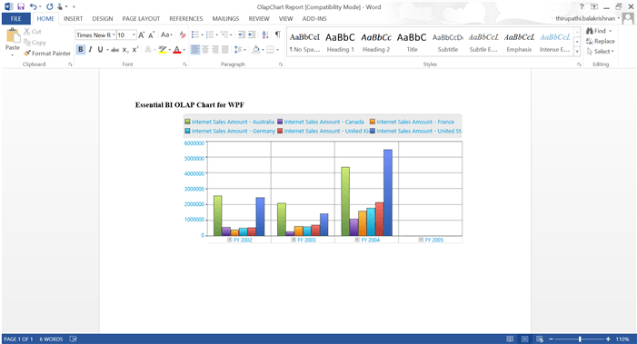

# Exporting

OlapChart can be exported into various image and document formats. The following topics illustrate this in detail:

* Exporting as an Image
* Exporting to Word Document
* Exporting to PDF Document

## Exporting as an Image

OlapChart can be copied to the clipboard or exported as an image. It can be exported in any one of the following image formats:

* Bitmap
* JPG
* PNG
* XPS
* GIF
* TIFF
* WDP

## Exporting to Word Document

OlapChart for WPF supports exporting an OlapChart into an Microsoft Word Document. It can also be exported into a Template Word Document file at a position specified by a marker.

The following methods are used to export an OlapChart to an Microsoft Word Document:

### Methods

* **ExportIntoNewDoc**      - Exports a Chart into a new Word Document file with the specified file name.
* **ExportIntoTemplateDoc** - Exports a Chart into an existing Word Document file in the default marker string location.
* **ExportIntoTemplateDoc** - Exports a Chart into an existing Word Document file in the given marker string location.
* **ExportIntoTemplateDoc** - Exports a Chart into an existing instance of a Word Document in the default marker string location.
* **ExportIntoTemplateDoc** - Exports a Chart into an existing instance of a Word Document in the marker string location.

The following code sample illustrate how to export an OlapChart to an Microsoft Word Document:




 
// Export the OlapChart into a new Word Document.
OlapChartWordExport olapChartWordExport = new OlapChartWordExport(this.olapChart);
olapChartWordExport.ExportintoNewDoc(@"..\..\OutputDocument\Document.doc");
// Export the OlapChart into a new Word Document file in the default marker string location.
OlapChartWordExport olapChartWordExport = new OlapChartWordExport(this.olapChart);
olapChartWordExport.ExportIntoTemplateDoc(@"..\..\OutputDocument\Document.doc");
// Export the OlapChart into an existing Word Document file in the given marker string location.
OlapChartWordExport olapChartWordExport = new OlapChartWordExport(this.olapChart);
olapChartWordExport.ExportIntoTemplateDoc(@"..\..\OutputDocument\Document.doc", "MarkerString1");




  
' Export the OlapChart into a new Word Document.
Dim olapChartWordExport As New olapChartWordExport(Me.olapChart)
olapChartWordExport.ExportintoNewDoc("..\..\OutputDocument\Document.doc")
' Export the OlapChart into a new Word Document file in the default marker string location.
Dim olapChartWordExport As New olapChartWordExport(Me.olapChart)
olapChartWordExport.ExportIntoTemplateDoc("..\..\OutputDocument\Document.doc")
' Export the OlapChart into an existing Word Document file in the given marker string location.
Dim olapChartWordExport As New olapChartWordExport(Me.olapChart)
olapChartWordExport.ExportIntoTemplateDoc("..\..\OutputDocument\Document.doc", "MarkerString1")





## Exporting to a PDF Document

OlapChart exported into a Word Document can also be inserted into a PDF document. The **ExportIntoNewPDF** method is used for this purpose. 

The following code sample illustrates how to set this method:




 
OlapChartPdfExport chartPdfExport = new OlapChartPdfExport(this.olapChart);
chartPdfExport.ExportIntoNewPdf(@"..\..\TemplateDocument\PdfDocument.pdf");




  
Dim chartPdfExport As New OlapChartPdfExport(Me.olapChart)
chartPdfExport.ExportIntoNewPdf("..\..\TemplateDocument\PdfDocument.pdf")





A sample demo is available at the following location:

{system drive}:\Users\&lt;User Name&gt;\AppData\Local\Syncfusion\EssentialStudio\&lt;Version Number&gt;\WPF\OlapChart.WPF\Samples\Exporting\Exporting Chart Demo

