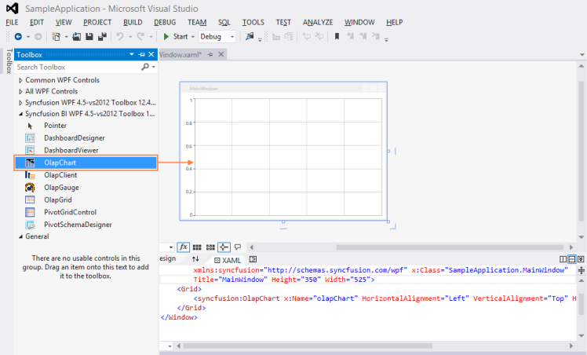
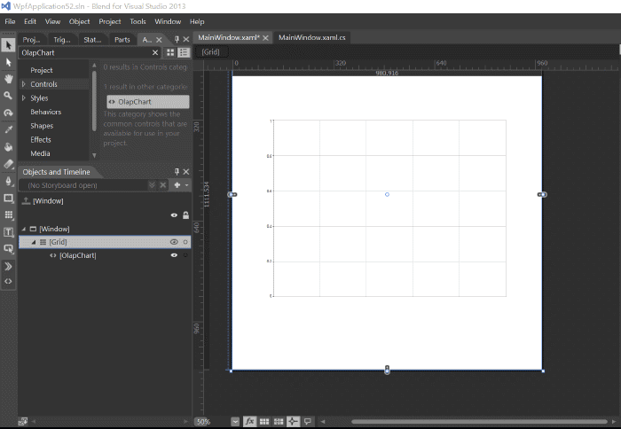
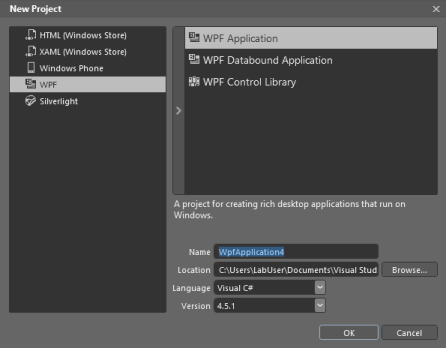
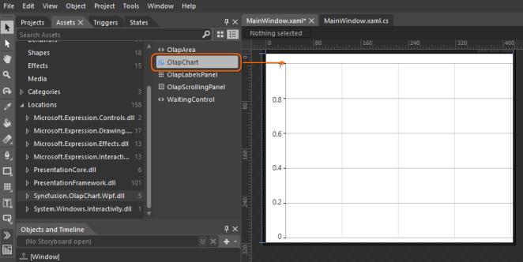
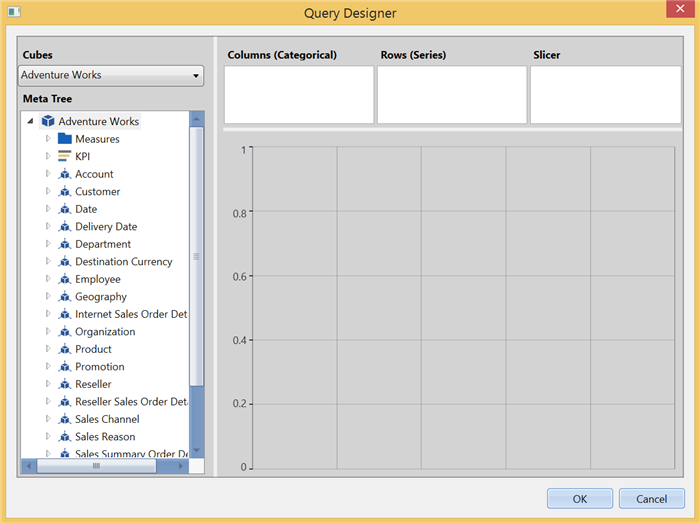
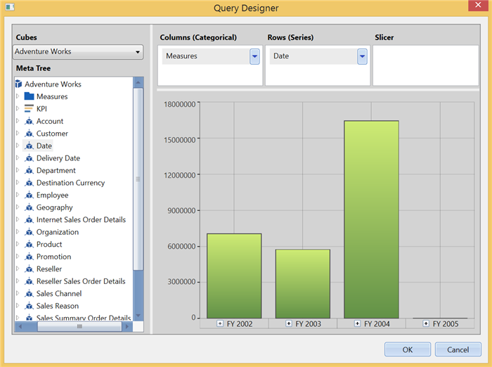
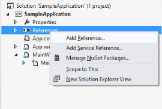
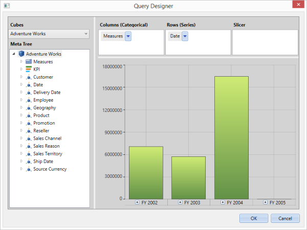
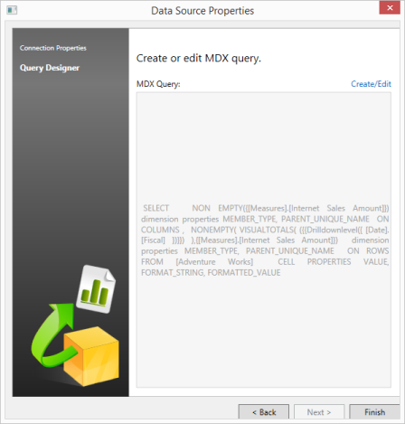

# Getting Started

This section enables you to understand the basics of the OlapChart.

## Configuring OLAP Chart control

This section encompasses on how to configure an OLAP Chart component in an application. You can also learn how to pass the required data to OLAP Chart and to customize its various options according to your requirements.

In the following example, the OLAP Chart component displays the Internet Sales Amount over different fiscal years against various geographical locations. This enables you to analyze the summarized data over different fiscal years.

## Through Visual Studio

1. Open Visual Studio IDE and from the File menu, select New  Project.
2. In the New Project Dialog box, click the tree node item Windows under Visual C# and select WPF Application. 
3. Then type a name for the application and click OK. Here, name of the application is “SampleApplication”.

   

4. From the Visual Studio toolbox, drag and drop the OlapChart under Syncfusion BI WPF tag. It automatically adds the required assemblies.

   

5. Add a name to OlapChart for accessing it through code-behind as illustrated in the following code example.

  
   
            <Window

                xmlns="http://schemas.microsoft.com/winfx/2006/xaml/presentation"

                xmlns:x="http://schemas.microsoft.com/winfx/2006/xaml"

                xmlns:syncfusion="http://schemas.syncfusion.com/wpf" x:Class="SampleApplication.MainWindow"

                Title="MainWindow" Height="350" Width="525">

            <Grid>

                <syncfusion:OlapChart x:Name="olapChart" HorizontalAlignment="Left" VerticalAlignment="Top" Height="319" Width="517"/>

            </Grid>

            </Window>
	
  

6. Include the following namespaces in the code-behind for handling - OlapReport and OlapDataManger.

    i. Syncfusion.Olap.Reports
	
	ii. Syncfusion.Olap.Manager

   ~~~ cs

        

            using Syncfusion.Olap.Manager;

            using Syncfusion.Olap.Reports;

            namespace SampleApplication

            {

                public partial class MainWindow : SampleWindow

                {

                    private string _connectionString;

                    private OlapDataManager _olapDataManager;

                    public MainWindow()

                    {  

                        InitializeComponent();

                        _connectionString = " Enter a valid connection string ";
						
						//Connection string is passed to OlapDataManager as an argument
						
						_olapDataManager = new OlapDataManager(_connectionString);
						
						//A default OlapReport is set to OlapDataManager
						
						_olapDataManager.SetCurrentReport(CreateOlapReport());
						
						// Finally OlapChart gets the information from the OlapDataManager
						
						this.olapChart.OlapDataManager = _olapDataManager;
						
						this.olapChart.DataBind();
						
					}
					
					/// 

					
					/// Defining OlapReport with Dimension and Measure
					
					/// 

					
					private OlapReport CreateOlapReport()
					
					{

                        OlapReport olapReport = new OlapReport();
						
						// Setting the Cube name
						
						olapReport.CurrentCubeName = "Adventure Works";
						
						DimensionElement dimensionElementColumn = new DimensionElement();
						
						// Specifying the name of the Dimension
						
						dimensionElementColumn.Name = "Customer";
						
						// Specifying the Hierarchy and Level name
						
						dimensionElementColumn.AddLevel("Customer Geography", "Country");
						
						MeasureElements measureElementColumn = new MeasureElements();
						
						//Specifying the Measure name
						
						measureElementColumn.Elements.Add(new MeasureElement { Name = "Internet Sales Amount" });

                        DimensionElement dimensionElementRow = new DimensionElement();

                        // Specifying the name of the Dimension

                        dimensionElementRow.Name = "Date";

                        // Specifying the Hierarchy and Level name

                        dimensionElementRow.AddLevel("Fiscal", "Fiscal Year");

                        ///Adding Dimension in column axis

                        olapReport.CategoricalElements.Add(dimensionElementColumn);

                        ///Adding Measure in column axis

                        olapReport.CategoricalElements.Add(measureElementColumn);

                        ///Adding Dimension in row axis

                        olapReport.SeriesElements.Add(dimensionElementRow);

                        return olapReport;

                    }

                }

            }  
	
   ~~~
   {:.prettyprint }
         

        

            Imports Syncfusion.Olap.Manager

            Imports Syncfusion.Olap.Reports

            Namespace SampleApplication

            Partial Public Class MainWindow Inherits SampleWindow

            Private _connectionString As String

            Private _olapDataManager As OlapDataManager

            Public Sub New()

            InitializeComponent()

            _connectionString = "Enter a valid connection string"

            ' Connection string is passed to OlapDataManager as an argument

            _olapDataManager = New OlapDataManager(_connectionString)

            ' A default OlapReport is set to OlapDataManager

            _olapDataManager.SetCurrentReport(CreateOlapReport())

            ' Finally OlapChart gets the information from the OlapDataManager 

            Me.olapChart.OlapDataManager = _olapDataManager

            Me.olapChart.DataBind()

            End Sub

            ''' 

            ''' Defining OlapReport with Dimension and Measure

            ''' 

            Private Function CreateOlapReport() As OlapReport
			
			Dim olapReport As OlapReport = New OlapReport()
			
			' Setting the Cube name
			
			olapReport.CurrentCubeName = "Adventure Works"
			
			Dim dimensionElementColumn As DimensionElement = New DimensionElement()
			
			' Specifying the name of the Dimension
			
			dimensionElementColumn.Name = "Customer"
			
			' Specifying the Hierarchy and Level name
			
			dimensionElementColumn.AddLevel("Customer Geography", "Country")
			
			Dim measureElementColumn As MeasureElements = New MeasureElements()
			
			' Specifying the Measure name
			
			measureElementColumn.Elements.Add(New MeasureElement With {.Name = "Internet Sales Amount"})
			
			Dim dimensionElementRow As DimensionElement = New DimensionElement()
			
			' Specifying the name of the Dimension
			
			dimensionElementRow.Name = "Date"
			
			' Specifying the Hierarchy and Level name
			
			dimensionElementRow.AddLevel("Fiscal", "Fiscal Year")
			
			''' Adding Dimension in column axis
			
			olapReport.CategoricalElements.Add(dimensionElementColumn)
			
			''' Adding Measure in column axis
			
			olapReport.CategoricalElements.Add(measureElementColumn)
			
			''' Adding Dimension in row axis
			
			olapReport.SeriesElements.Add(dimensionElementRow)
			
			Return olapReport

            End Function

            End Class

            End Namespace
	
  

7. Run the application

   
   {:.prettyprint}

## Through Expression Blend

You can also create and configure OLAP Chart by using Expression Blend as illustrated in the following steps.

1. Open Blend for Visual Studio and from the File menu, select New  Project. Enter a valid project name and click OK.

   

2. Select Project tab in the application window.

   

3. Right-click on References and select Add Reference…, then add the following assemblies into the project from installed location.

   i. Syncfusion.Olap.Base
   
   ii. Syncfusion.OlapChart.WPF
   
   iii. Syncfusion.OlapChartConverter.WPF

   ## Assemblies Location

      <SystemDrive/>:\Program Files (x86)\Syncfusion\EssentialStudio\<version/>\precompiledassemblies\<version/>\<Framework/>\

4. After adding the above assemblies, OlapChat control is automatically added in the Assests.
5. Now, find the OlapChart and drag it to the designer window. 

   

6. Add a name to OlapChart for accessing it through code-behind as illustrated in the following code example.

    

			<Window

				xmlns="http://schemas.microsoft.com/winfx/2006/xaml/presentation"

				xmlns:x="http://schemas.microsoft.com/winfx/2006/xaml"

				xmlns:syncfusion="http://schemas.syncfusion.com/wpf" x:Class="SampleApplication.MainWindow"

				Title="MainWindow" Height="350" Width="525">

			<Grid>

				<syncfusion:OlapChart x:Name="olapChart" HorizontalAlignment="Left" VerticalAlignment="Top" Height="319" Width="517"/>

			</Grid>

		   </Window>
	
  

7. Include the following namespaces in the code-behind for using OlapReport and OlapDataManger in the application.
1. Syncfusion.Olap.Reports
2. Syncfusion.Olap.Manager

   ~~~ cs

			using Syncfusion.Olap.Manager;

			using Syncfusion.Olap.Reports;

			namespace SampleApplication

			{

			public partial class MainWindow : SampleWindow

			{

				private string _connectionString;

				private OlapDataManager _olapDataManager;

				public MainWindow()

				{  

					InitializeComponent();

					_connectionString = " Enter a valid connection string ";

					//Connection string is passed to OlapDataManager as an argument

					_olapDataManager = new OlapDataManager(_connectionString);

					//A default OlapReport is set to OlapDataManager

					_olapDataManager.SetCurrentReport(CreateOlapReport());

					// Finally OlapChart gets the information from the OlapDataManager

					this.olapChart.OlapDataManager = _olapDataManager;

					this.olapChart.DataBind();

				}

				/// 

				/// Defining OlapReport with Dimension and Measure

				/// 

				private OlapReport CreateOlapReport()

				{

					OlapReport olapReport = new OlapReport();

					// Setting the Cube name

					olapReport.CurrentCubeName = "Adventure Works";

					DimensionElement dimensionElementColumn = new DimensionElement();

					// Specifying the name of the Dimension

					dimensionElementColumn.Name = "Customer";

					// Specifying the Hierarchy and Level name

					dimensionElementColumn.AddLevel("Customer Geography", "Country");

					MeasureElements measureElementColumn = new MeasureElements();

					//Specifying the Measure name

					measureElementColumn.Elements.Add(new MeasureElement { Name = "Internet Sales Amount" });

					DimensionElement dimensionElementRow = new DimensionElement();

					// Specifying the name of the Dimension

					dimensionElementRow.Name = "Date";

					// Specifying the Hierarchy and Level name

					dimensionElementRow.AddLevel("Fiscal", "Fiscal Year");

					///Adding Dimension in column axis

					olapReport.CategoricalElements.Add(dimensionElementColumn);

					///Adding Measure in column axis

					olapReport.CategoricalElements.Add(measureElementColumn);

					///Adding Dimension in row axis

					olapReport.SeriesElements.Add(dimensionElementRow);

					return olapReport;

				}

			}

			}
	
   ~~~
   {:.prettyprint }

    

			Imports Syncfusion.Olap.Manager

			Imports Syncfusion.Olap.Reports

			Partial Public Class MainWindow Inherits SampleWindow

			Private _connectionString As String

			Private _olapDataManager As OlapDataManager

			Public Sub New()

			InitializeComponent()

			_connectionString = " Enter a valid connection string "

			' Connection string is passed to OlapDataManager as an argument

			_olapDataManager = New OlapDataManager(_connectionString)

			' A default OlapReport is set to OlapDataManager

			_olapDataManager.SetCurrentReport(CreateOlapReport())

			' Finally OlapChart gets the information from the OlapDataManager		Me.olapChart.OlapDataManager = _olapDataManager

			Me.olapChart.DataBind()

			End Sub

			  ''' 

			  ''' Defining OlapReport with Dimension and Measure

			  ''' 

			  Private Function CreateOlapReport() As OlapReport

		            Dim olapReport As OlapReport = New OlapReport()

		            ' Setting the Cube name

		            olapReport.CurrentCubeName = "Adventure Works"

		            Dim dimensionElementColumn As DimensionElement = New DimensionElement()

		            ' Specifying the name of the Dimension

		            dimensionElementColumn.Name = "Customer"

		            ' Specifying the Hierarchy and Level name

		            dimensionElementColumn.AddLevel("Customer Geography", "Country")

		            Dim measureElementColumn As MeasureElements = New MeasureElements()

		            ' Specifying the Measure name

		            measureElementColumn.Elements.Add(New MeasureElement With {.Name = "Internet Sales Amount"})

		            Dim dimensionElementRow As DimensionElement = New DimensionElement()

		            ' Specifying the name of the Dimension

		            dimensionElementRow.Name = "Date"

		            ' Specifying the Hierarchy and Level name

		            dimensionElementRow.AddLevel("Fiscal", "Fiscal Year")

		            ''' Adding Dimension in column axis

		            olapReport.CategoricalElements.Add(dimensionElementColumn)

		            ''' Adding Measure in column axis

		            olapReport.CategoricalElements.Add(measureElementColumn)

		            ''' Adding Dimension in row axis

		            olapReport.SeriesElements.Add(dimensionElementRow)

		            Return olapReport

			  End Function

			  End Class

			  End Namespace
	

8. Run the application

   

   {:.prettyprint}

# Through Code-Behind

1. Open Visual Studio IDE and from the File menu, select New  Project.
2. In the New Project Dialog box, click the tree node Windows under Visual C# and select WPF Application. 
3. Type a name for the application and click OK. Here, name of the application is “SampleApplication”.

   

   

4. Right-click on References and select Add Reference.., then add the following Syncfusion assemblies manually to the project from installed location.
   1. Syncfusion.Chart.WPF
   2. Syncfusion.Core
   3. Syncfusion.Olap.Base
   4. Syncfusion.OlapChart.WPF
   5. Syncfusion OlapChartConverter.WPF
   6. Syncfusion.OlapShared.WPF
   7. Syncfusion.Shared.WPF
   8. Syncfusion.Tools.WPF

   {:.prettyprint}

   
## Assemblies Location

&lt;SystemDrive&gt;:\Program Files (x86)\Syncfusion\EssentialStudio\<version>\precompiledassemblies\<version>\<Framework>\

1. Include the following namespaces in code-behind to use OlapChart, OlapReport and OlapDataManger in the program.
1. Syncfusion.Olap.Reports
2. Syncfusion.Olap.Manager
3. Syncfusion.Windows.Chart.Olap;

   ~~~ cs

    
				using Syncfusion.Olap.Manager;

				using Syncfusion.Olap.Reports;

				using Syncfusion.Windows.Chart.Olap;

				namespace SampleApplication

				{

				public partial class MainWindow : SampleWindow

				{

					private string _connectionString;

					private OlapDataManager _olapDataManager;

					public MainWindow()

					{  

						InitializeComponent();

						OlapChart olapChart = new OlapChart();

						_connectionString = " Enter a valid connection string ";

						//Connection string is passed to OlapDataManager as an argument

						_olapDataManager = new OlapDataManager(_connectionString);

						//A default OlapReport is set to OlapDataManager

						_olapDataManager.SetCurrentReport(CreateOlapReport());

						// Finally OlapChart gets the information from the OlapDataManager

						this.olapChart.OlapDataManager = _olapDataManager;

						this.olapChart.DataBind();

						this.AddChild(olapChart);

					}

					/// 

					/// Defining OlapReport with Dimension and Measure

					/// 

					private OlapReport CreateOlapReport()

					{

						OlapReport olapReport = new OlapReport();

						// Setting the Cube name

						olapReport.CurrentCubeName = "Adventure Works";

						DimensionElement dimensionElementColumn = new DimensionElement();

						// Specifying the name of the Dimension

						dimensionElementColumn.Name = "Customer";

						// Specifying the Hierarchy and Level name

						dimensionElementColumn.AddLevel("Customer Geography", "Country");

						MeasureElements measureElementColumn = new MeasureElements();

						//Specifying the Measure name

						measureElementColumn.Elements.Add(new MeasureElement { Name = "Internet Sales Amount" });

						DimensionElement dimensionElementRow = new DimensionElement();

						// Specifying the name of the Dimension

						dimensionElementRow.Name = "Date";

						// Specifying the Hierarchy and Level name

						dimensionElementRow.AddLevel("Fiscal", "Fiscal Year");

						///Adding Dimension in column axis

						olapReport.CategoricalElements.Add(dimensionElementColumn);

						///Adding Measure in column axis

						olapReport.CategoricalElements.Add(measureElementColumn);

						///Adding Dimension in row axis

						olapReport.SeriesElements.Add(dimensionElementRow);

						return olapReport;

					}

				}

				}
				
   ~~~
   {:.prettyprint}

    

			Imports Syncfusion.Olap.Manager

			Imports Syncfusion.Olap.Reports         

			Imports Syncfusion.Windows.Chart.Olap

			Namespace SampleApplication

			Partial Public Class MainWindow Inherits SampleWindow

			Private _connectionString As String

			Private _olapDataManager As OlapDataManager

			Public Sub New()

			InitializeComponent()

			Dim olapChart As New OlapChart()

			_connectionString = " Enter a valid connection string "

			' Connection string is passed to OlapDataManager as an argument

			_olapDataManager = New OlapDataManager(_connectionString)

			' A default OlapReport is set to OlapDataManager

			_olapDataManager.SetCurrentReport(CreateOlapReport())

			' Finally OlapChart gets the information from the OlapDataManager		Me.olapChart.OlapDataManager = _olapDataManager

			Me.olapChart.DataBind()

			Me.AddChild(olapChart)

			End Sub

			  ''' 

			  ''' Defining OlapReport with Dimension and Measure

			  ''' 

			  Private Function CreateOlapReport() As OlapReport

		            Dim olapReport As OlapReport = New OlapReport()

		            ' Setting the Cube name

		            olapReport.CurrentCubeName = "Adventure Works"

		            Dim dimensionElementColumn As DimensionElement = New DimensionElement()

		            ' Specifying the name of the Dimension

		            dimensionElementColumn.Name = "Customer"

		            ' Specifying the Hierarchy and Level name

		            dimensionElementColumn.AddLevel("Customer Geography", "Country")

		            Dim measureElementColumn As MeasureElements = New MeasureElements()

		            ' Specifying the Measure name

		            measureElementColumn.Elements.Add(New MeasureElement With {.Name = "Internet Sales Amount"})

		            Dim dimensionElementRow As DimensionElement = New DimensionElement()

		            ' Specifying the name of the Dimension

		            dimensionElementRow.Name = "Date"

		            ' Specifying the Hierarchy and Level name

		            dimensionElementRow.AddLevel("Fiscal", "Fiscal Year")

		            ''' Adding Dimension in column axis

		            olapReport.CategoricalElements.Add(dimensionElementColumn)

		            ''' Adding Measure in column axis

		            olapReport.CategoricalElements.Add(measureElementColumn)

		            ''' Adding Dimension in row axis

		            olapReport.SeriesElements.Add(dimensionElementRow)

		            Return olapReport

			  End Function

			  End Class

			  End Namespace
	

6. Run the application.

   

   {:.prettyprint}
   
## Design-Time Binding

Design-time support for OLAP Chart allows you to reduce the time spent on creating and customizing the report. Normally, it takes 10 to 15 minutes for creating a report and in the case of unfamiliar cubes it may extend further, but by using design time support you can create a report in a couple of minutes.

The following steps explain how to create a report during design-time

## Create a Basic Report during design-time

1. Drag and drop the control from the toolbox to the Visual Studio designer surface.

   

2. Right-click OlapChart available in designer.
3. Then, navigate to the Configure data source -> Create/Edit data source… option in the context menu.

   

4. Now, the Data Source Properties wizard opens.

   

5. From the Data Source Properties wizard select the connection type. 
6. When you want to connect to SSAS, select Use server name and data base to connect to a server. Specify the necessary information to connect to the server
7. When you want to connect to an Offline cube, select Use a connection string to connect to a server. Enter your connection string path.

   

8. When you want to test the connection, click the Test Connection button that is displayed on the bottom left corner of the window.
9. Click the Next button, to proceed. 

   N> The Next button is enabled only when any one of the connection option is filled properly.

10. When the connection is valid. It displays the summary page of the Data Source Properties Wizard.

    

11. When you create a query for the first time, the MDX query text box in the summary page is empty. When you edit an already existing query, it displays the current query in the text box.
12. For creating or editing a query, click the Create/Edit link that is displayed on the top-right side of the MDX query textbox. This opens a Query Designer dialog. 

    

13. When you edit an existing query, it displays the required dimensions in the specific axis of the query designer and the preview of that query is displayed in a Chart control.
    N> It does not display any style/formatting applied to the chart. It only displays the result of the query.

14. Drag and drop dimensions, to frame a new query. 

    

15. Then, click OK, to save the query or click Cancel, to revert the changes made during this session.
16. The summary page of the Data Source Properties displays the resultant MDX query. 

    

17. Click Finish. Run the application.

    
    {:.prettyprint}

