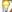

# Overview

Essential OLAP Chart control allows you to efficiently visualize the multidimensional data from the OLAP data source, with the help of a report, which is bound to it.

{{ '' | markdownify }}
{:.image }

Key Features

The important features of OLAP Chart controls are as follows:

* Provides multi-level drill down support – Enables you to visualize a multi-level data in the chart. You can drill down/up the hierarchies natively.
* Provides KPI support – Allows you to visualize the KPI Status, Trend, Goal, and value in different chart types.
* Enables you to customize the area, axis, series, legends, and chart types easily.
* Provides exporting support – Allows you to export the OlapChart into various formats such as Pdf, Excel, Word, and Image formats.
* Provides printing support – Allows you to customize and print either in color mode or in black and white.
* Provides zooming and scrolling support – Allows you to zoom and scroll across the chart.
* Provides ToolTip support – Allows you to visualize the data point related values in a form of ToolTip.
* Provides theme support – Allows you to customize the OlapChart with the 6 in-built business themes. 

User Guide Organization

The product comes with numerous samples as well as an extensive documentation to guide you. This User Guide provides detailed information on the features and functionalities of the OLAP Chart control. It is organized into the following sections:

* Overview - This section gives a brief introduction to our product and its key features.
* Getting Started - This section guides you on getting started with BI application, OLAP Chart control, and so on.
* Concepts and Features - The features of OLAP Chart control are illustrated with use case scenarios, code examples and screen shots under this section.

Document Conventions

The following conventions will help you to quickly identify the important sections of information while using the content.

_Document Conventions Table_

<table>
<tr>
<td>
Convention</td><td>
Icon</td><td>
Description</td></tr>
<tr>
<td>
Note</td><td>
> {{{ ''_Note:_'' | markdownify }}}</td><td>
Represents important information</td></tr>
<tr>
<td>
Example</td><td>
Example</td><td>
Represents an example</td></tr>
<tr>
<td>
Tip</td><td>

{:.image }
</td><td>
Represents useful hints that will help you in using the controls/features</td></tr>
<tr>
<td>
Additional Information</td><td>

{:.image }
</td><td>
Represents additional information on the topic</td></tr>
</table>

