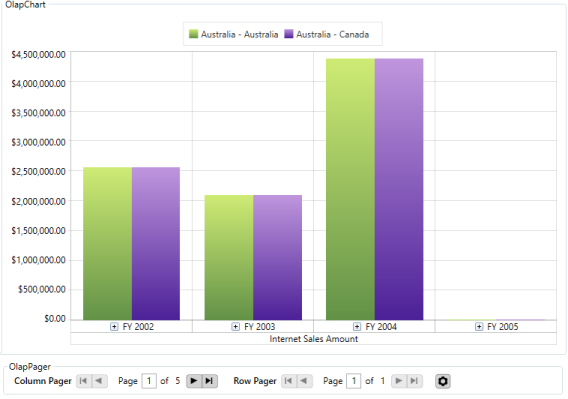

# Paging

Paging in OlapChart provides you the support to load and render large amount of data without any performance constraint.  

OlapPager (User Control) is included and bound with the OlapDataManager object of the respective OlapPager (User Cotrol) is included and bound with the OlapDataManager object of the respective OlapChart. To enable paging, set the **"EnablePaging"** property to true.

When you process large CellSet, it is splitted into several number of segments and each segment is assigned and rendered in a separate page. You can navigate back and forth in all possible way by using the UI options in OlapPager. You can also change the page size and other pager settings at run-time by using **PageSetting** window.

Include the following Syncfusion assembly from the installed location in-order to add the OlapPager (User Control) with OlapChart.

* Syncfusion.OlapShared.Wpf

N> You can also get the assemblies by browsing to the Default Assembly Location {System Drive}:\Program Files (x86)\Syncfusion\Essential Studio\\{version number}\precompiledassemblies\\{version number}\\{framework version}\

**ENABLE PAGING THROUGH XAML**

    

<Window xmlns="http://schemas.microsoft.com/winfx/2006/xaml/presentation"
	xmlns:x="http://schemas.microsoft.com/winfx/2006/xaml"
	xmlns:syncfusion="http://schemas.syncfusion.com/wpf"
	xmlns:pager="clr-namespace:Syncfusion.Windows.Shared.Olap;assembly=Syncfusion.OlapShared.WPF"
	x:Class="SampleApplication.MainWindow"
	Title="MainWindow" Height="350" Width="525">
	<Grid>
		<Grid.RowDefinitions>
			<RowDefinition Height="*"/>
			<RowDefinition Height="Auto"/>
		</Grid.RowDefinitions>
		<GroupBox  Header="OlapChart" Grid.Row="0">
			<syncfusion:OlapChart  Name="olapChart" Background="Transparent" SeriesStrokeThickness="0"></syncfusion:OlapChart>
		</GroupBox>
		<GroupBox Grid.Row="1" Header="OlapPager" Margin="5" >
			<pager:OlapPager x:Name="olapPager" ></pager:OlapPager>
		</GroupBox>
	</Grid>
</Window>


 
**ENABLE PAGING THROUGH REPORT:**





using Syncfusion.Olap.Manager;
using Syncfusion.Olap.Reports;
namespace SampleApplication
{
	public partial class MainWindow : SampleWindow
	{
		private string _connectionString;
		private OlapDataManager _olapDataManager;
		public MainWindow()
		{  
			InitializeComponent();
			_connectionString = "Enter a valid connection string";
			//Created connection string is passed to OlapDataManager as argument
			_olapDataManager = new OlapDataManager(_connectionString);
			//Created OlapReport is set as a current report to OlapDataManager
			_olapDataManager.SetCurrentReport(SimpleDimensions());
			//Finally OlapChart control gets the data from the created OlapDataManager
			this.olapChart.OlapDataManager = _olapDataManager;
			this.olapChart.DataBind();
		}
		private OlapReport SimpleDimensions()
		{
			OlapReport olapReport = new OlapReport();
			olapReport.CurrentCubeName = "Adventure Works";
			olapReport.EnablePaging = true;
			olapReport.PagerOptions.CategorialPageSize = 10;
			olapReport.PagerOptions.SeriesPageSize = 10;
			DimensionElement dimensionElement = new DimensionElement() { Name = "Customer", HierarchyName = "Customer" };
			dimensionElement.AddLevel("Customer Geography", "Country");
			olapReport.CategoricalElements.Add(dimensionElement);
			MeasureElements measureElements = new MeasureElements();
			measureElements.Add(new MeasureElement { Name = "Internet Sales Amount" });
			olapReport.SeriesElements.Add(measureElements);
			dimensionElement = new DimensionElement() { Name = "Geography", HierarchyName = "Geography" };
			dimensionElement.AddLevel("Geography", "Country");
			olapReport.CategoricalElements.Add(dimensionElement);
			dimensionElement = new DimensionElement() { Name = "Date" };
			dimensionElement.AddLevel("Fiscal", "Fiscal Year");
			olapReport.SeriesElements.Add(dimensionElement);
			return olapReport;
		}
	}
}   
			

 

   
Imports Syncfusion.Olap.Manager
Imports Syncfusion.Olap.Reports
Namespace SampleApplication
	Partial Public Class MainWindow
		Inherits SampleWindow
		Private _connectionString As String
		Private _olapDataManager As OlapDataManager
		Public Sub New()
			InitializeComponent()
			_connectionString = "Enter a valid connection string"
			'Created connection string is passed to OlapDataManager as argument
			_olapDataManager = New OlapDataManager(_connectionString)
			'Created OlapReport is set as a current report to OlapDataManager
			_olapDataManager.SetCurrentReport(SimpleDimensions())
			'Finally OlapChart control gets the data from the created OlapDataManager
			Me.olapChart.OlapDataManager = _olapDataManager
			Me.olapChart.DataBind()
		End Sub
		Private Function SimpleDimensions() As OlapReport
			Dim olapReport As New OlapReport()
			olapReport.CurrentCubeName = "Adventure Works"
			olapReport.EnablePaging = True
			olapReport.PagerOptions.CategorialPageSize = 10
			olapReport.PagerOptions.SeriesPageSize = 10
			Dim dimensionElement As New DimensionElement() With {.Name = "Customer", .HierarchyName = "Customer"}
			dimensionElement.AddLevel("Customer Geography", "Country")
			olapReport.CategoricalElements.Add(dimensionElement)
			Dim measureElements As New MeasureElements()
			measureElements.Add(New MeasureElement With {.Name = "Internet Sales Amount"})
			olapReport.SeriesElements.Add(measureElements)
			dimensionElement = New DimensionElement() With {.Name = "Geography", .HierarchyName = "Geography"}
			dimensionElement.AddLevel("Geography", "Country")
			olapReport.CategoricalElements.Add(dimensionElement)
			dimensionElement = New DimensionElement() With {.Name = "Date"}
			dimensionElement.AddLevel("Fiscal", "Fiscal Year")
			olapReport.SeriesElements.Add(dimensionElement)
			Return olapReport
		End Function
	End Class
End Namespace





A sample demo is available at the following link:

{system drive}:\Users\\{User Name}\AppData\Local\Syncfusion\EssentialStudio\\{Version Number}\WPF\OlapChart.WPF\Samples\Paging

