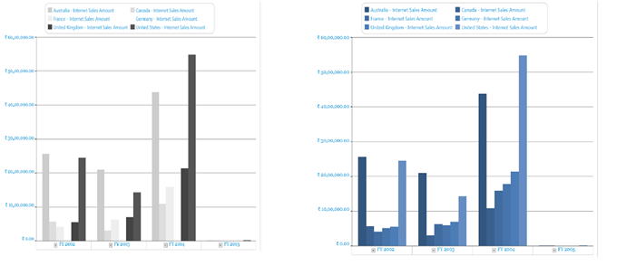
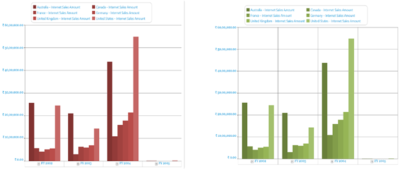

# Palette

Chart Palette is a pre-defined collection of a set of colors that can be applied to a chart series. OlapChart comes with a support of 23 chart palette, which can be used to provide a rich look for your business applications.

The available palettes in the OlapChart control are as follows:      

* Default
* DefaultAlpha
* EarthTone
* Analog
* Colorful
* Nature
* Pastel
* Triad
* WarmCold
* Grayscale
* Office2007Blue
* Office2007Black 
* Office2007Silver
* Gradient
* Grayscale
* BlueScale
* MaroonRed
* GreenScale
* MixedViolet
* CoolBlueScale
* ChocolateOrange
* MixedFantasy
* Custom

The following code sample shows how to apply a palette to an OlapChart:




 
	this.olapchart1.ColorModel.Palette = (Syncfusion.Windows.Chart.ChartColorPalette)Enum.Parse(typeof(Syncfusion.Windows.Chart.ChartColorPalette), "EarthTone");




  
	Me.olapchart1.ColorModel.Palette = CType(System.Enum.Parse(GetType(Syncfusion.Windows.Chart.ChartColorPalette), "EarthTone"), Syncfusion.Windows.Chart.ChartColorPalette)





The following image shows before and after applying the *EarthTone* palette:

## Custom Palette

Custom palettes can be applied to an OlapChart by setting the _“Interior”_ property with the custom brush to each series in the OlapChart.

A sample demo is available at the following link:

[system drive]:\Users\\{User Name}\AppData\Local\Syncfusion\EssentialStudio\\{Version Number}\WPF\OlapChart.WPF\Samples\Customization\Series Customization Demo

## Excel-like Palette

Excel-like palettes are very useful in displaying the OlapChart in business applications. 

The following type of excel like palettes are available:

**GrayScale, BlueScale**

**MaroonRed, GreenScale**

**MixedViolet, CoolBlueScale**

**ChocolateOrange, MixedFantasy**

The following code sample show how you can apply excel like palettes.

### Grayscale




 
	this.olapchart1.ColorModel.Palette = (Syncfusion.Windows.Chart.ChartColorPalette)Enum.Parse(typeof(Syncfusion.Windows.Chart.ChartColorPalette), "Grayscale");




  
	Me.olapchart1.ColorModel.Palette = CType(System.Enum.Parse(GetType(Syncfusion.Windows.Chart.ChartColorPalette), "Grayscale"), Syncfusion.Windows.Chart.ChartColorPalette)





### BlueScale




 
	this.olapchart1.ColorModel.Palette = (Syncfusion.Windows.Chart.ChartColorPalette)Enum.Parse(typeof(Syncfusion.Windows.Chart.ChartColorPalette), "BlueScale");




  
	Me.olapchart1.ColorModel.Palette = CType(System.Enum.Parse(GetType(Syncfusion.Windows.Chart.ChartColorPalette), "BlueScale"), Syncfusion.Windows.Chart.ChartColorPalette)


 


### MaroonRed




 
	this.olapchart1.ColorModel.Palette = (Syncfusion.Windows.Chart.ChartColorPalette)Enum.Parse(typeof(Syncfusion.Windows.Chart.ChartColorPalette), "MaroonRed");




  
	Me.olapchart1.ColorModel.Palette = CType(System.Enum.Parse(GetType(Syncfusion.Windows.Chart.ChartColorPalette), "MaroonRed"), Syncfusion.Windows.Chart.ChartColorPalette)





### GreenScale




 
	this.olapchart1.ColorModel.Palette = (Syncfusion.Windows.Chart.ChartColorPalette)Enum.Parse(typeof(Syncfusion.Windows.Chart.ChartColorPalette), "GreenScale");




  
	Me.olapchart1.ColorModel.Palette = CType(System.Enum.Parse(GetType(Syncfusion.Windows.Chart.ChartColorPalette), "GreenScale"), Syncfusion.Windows.Chart.ChartColorPalette)





### MixedViolet




 
	this.olapchart1.ColorModel.Palette = (Syncfusion.Windows.Chart.ChartColorPalette)Enum.Parse(typeof(Syncfusion.Windows.Chart.ChartColorPalette), "MixedViolet");




  
	Me.olapchart1.ColorModel.Palette = CType(System.Enum.Parse(GetType(Syncfusion.Windows.Chart.ChartColorPalette), "MixedViolet"), Syncfusion.Windows.Chart.ChartColorPalette)





### CoolBlueScale




 
	this.olapchart1.ColorModel.Palette = (Syncfusion.Windows.Chart.ChartColorPalette)Enum.Parse(typeof(Syncfusion.Windows.Chart.ChartColorPalette), "CoolBlueScale");




  
	Me.olapchart1.ColorModel.Palette = CType(System.Enum.Parse(GetType(Syncfusion.Windows.Chart.ChartColorPalette), "CoolBlueScale"), Syncfusion.Windows.Chart.ChartColorPalette)




 
### ChocolateOrange




 
	this.olapchart1.ColorModel.Palette = (Syncfusion.Windows.Chart.ChartColorPalette)Enum.Parse(typeof(Syncfusion.Windows.Chart.ChartColorPalette), "ChocolateOrange");




  
	Me.olapchart1.ColorModel.Palette = CType(System.Enum.Parse(GetType(Syncfusion.Windows.Chart.ChartColorPalette), "ChocolateOrange"), Syncfusion.Windows.Chart.ChartColorPalette)





### MixedFantasy




 
	this.olapchart1.ColorModel.Palette = (Syncfusion.Windows.Chart.ChartColorPalette)Enum.Parse(typeof(Syncfusion.Windows.Chart.ChartColorPalette), "MixedFantasy");




  
	Me.olapchart1.ColorModel.Palette = CType(System.Enum.Parse(GetType(Syncfusion.Windows.Chart.ChartColorPalette), "MixedFantasy"), Syncfusion.Windows.Chart.ChartColorPalette)



