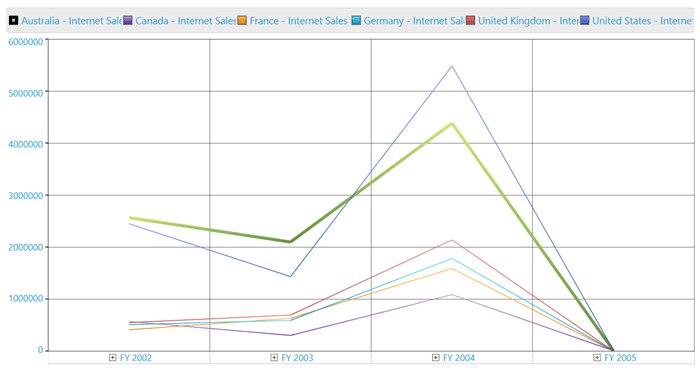
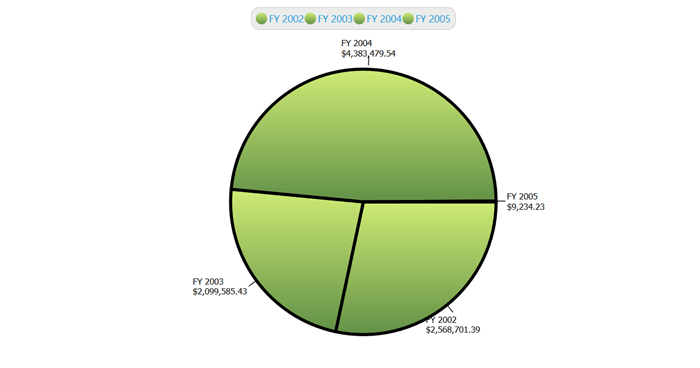
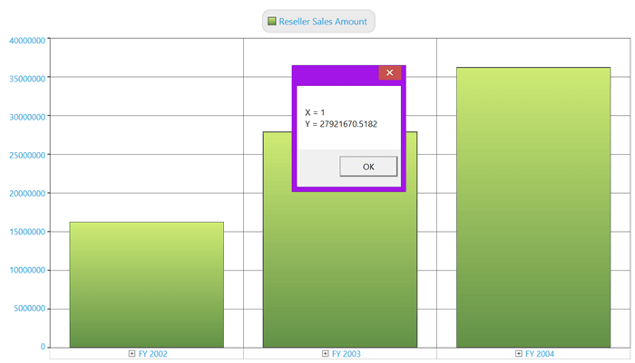
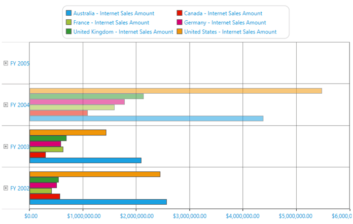
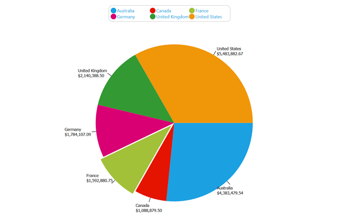

# Series

Series are the data points plotted in the rectangular co-ordinate system.

## Point Label

Point label provides information about the data point. Data point can be added to a series by using the following code sample:





for(int i=0; i< this.olapChart.Series.Count; i++)
{ 
    //// Setting the visibility of adornment.
    this.olapChart.Series[i].AdornmentsInfo.Visible = true;
    //// Setting horizontal alignment
    this.olapChart.Series[i].AdornmentsInfo.SegmentHorizontalAlignment = System.Windows.HorizontalAlignment.Right;
    //// Makes the segment out from the series.
    this.olapChart.Series[i].AdornmentsInfo.SegmentIsOut = true;
    this.olapChart.Series[i].AdornmentsInfo.LabelContentPath = "DataPoint.Y";
    this.olapChart.Series[i].AdornmentsInfo.SegmentLabelFontSize = 12;
    this.olapChart.Series[i].AdornmentsInfo.SegmentLabelRotation = 325;
}





For i As Integer = 0 To Me.olapChart.Series.Count - 1
    ' Setting the visibility of adornment.
    Me.olapChart.Series(i).AdornmentsInfo.Visible = True
    ' Setting horizontal alignment
    Me.olapChart.Series(i).AdornmentsInfo.SegmentHorizontalAlignment = System.Windows.HorizontalAlignment.Right
    ' Makes the segment out from the series.
    Me.olapChart.Series(i).AdornmentsInfo.SegmentIsOut = True
    Me.olapChart.Series(i).AdornmentsInfo.LabelContentPath = "DataPoint.Y"
    Me.olapChart.Series(i).AdornmentsInfo.SegmentLabelFontSize = 12
    Me.olapChart.Series(i).AdornmentsInfo.SegmentLabelRotation = 325
Next i





The following screen-shot shows an OlapChart with Point Labels enabled:

## Color Customization

You can set a custom color for each series in the OlapChart. To apply different colors to different series iterate through the series and apply the custom brush to the series.





this.olapChart.Series[0].Interior = Brushes.Orange;





Me.olapChart.Series(0).Interior = Brushes.Orange





## Border Customization

You can customize the thickness of the series border of an OlapChart by using the following code sample:




    
this.olapchart.Series[0].Stroke = Brushes.Black;
this.olapChart.Series[0].StrokeThickness = 4;





Me.olapChart.Series(0).Stroke = Brushes.Black
Me.olapChart.Series(0).StrokeThickness = 4





N> The behavior of the series border will vary for different chart types. The following illustration describes them in detail.

The series border is applied for the first series of a Column chart by using the **StrokeThickness** property. Notice that the first series element is surrounded with the applied border.

Notice the variation. The same series border property is applied for a series in the Line chart. Instead of creating a 4 pixel width border it increases the thickness of the particular series line.

Since, you know that the Pie chart renders everything in a single series each block in the Pie chart known as segments will have the border applied on them. This is described in the following illustration:

## Custom Data Templates

Series can be customized with user-defined data templates. The following sample usage describes how to apply a data template to the series in an OlapChart.

The following data template will be used to customize the series:





<DataTemplate x:Key="ColumnTemplate">
  <Canvas Name="myCanvas">
     <Grid Name="OuterGrid" Canvas.Left="{Binding X}" Width="{Binding Width}" 
           Height="{Binding ElementName=myCanvas, Path=ActualHeight}" >
           <Border Name="ColumnRect" VerticalAlignment="Bottom"   Width="{Binding Width}" Height="{Binding Height}" 
               CornerRadius="8,8,0,0" Background="{Binding Interior}">
           </Border>
     </Grid>
  </Canvas>
</DataTemplate>





for (int i = 0; i < this.olapchart1.Series.Count; i++)
{
    //Apply Series Template to display the series cylindrical style.
    this.olapchart1.Series[i].Template = this.Resources["ColumnTemplate"] as DataTemplate;
    //Apply Series Interior to display the series in different colors.
    this.olapchart1.Series[i].Interior = App.Current.Resources["SeriesInterior" + i] as LinearGradientBrush;
}





For i As Integer = 0 To Me.olapchart1.Series.Count - 1
    'Apply Series Template to display the series cylindrical style
    Me.olapchart1.Series(i).Template = TryCast(Me.Resources("ColumnTemplate"), DataTemplate)
    'Apply Series Interior to display the series in different colors.
    Me.olapchart1.Series(i).Interior = TryCast(App.Current.Resources("SeriesInterior" & i), LinearGradientBrush)
Next i





A sample demo is available at the following location:

{system drive}:\Users\&lt;User Name&gt;\AppData\Local\Syncfusion\EssentialStudio\&lt;Version Number&gt;\WPF\OlapChart.WPF\Samples\Customization\Series Customization Demo

## Event

**ChartMouseEventArgs** are the arguments returned when the mouse events are triggered by the ChartSeries. **ChartMouseEventArgs** return the segment on which the mouse events are triggered along with the default mouse event args. This event args can be used to perform customization of a segment when a mouse event is encountered. The segment returns different values that can be used to perform calculations or operations.

The following code sample demonstrates how the **ChartMouseEventArgs** can be used to retrieve information on the ChartSeries segment:





//// Event Tagging
this.olapchart1.Series[0].MouseClick += new ChartMouseEventHandler(series_MouseClick);
//// Mouse click event for a series.
void series_MouseClick(object sender, ChartMouseEventArgs e)
{
    ChartPoint point = (ChartPoint)e.Segment.CorrespondingPoints[0].DataPoint;
    MessageBox.Show("X = " + point.X.ToString() + "\n" + "Y = " + point.Y.ToString());
}





' Event Tagging
AddHandler olapchart1.Series(0).MouseClick, AddressOf series_MouseClick
' Mouse click event for a series.
Private Sub series_MouseClick(ByVal sender As Object, ByVal e As ChartMouseEventArgs)
    Dim point As ChartPoint = CType(e.Segment.CorrespondingPoints(0).DataPoint, ChartPoint)
    MessageBox.Show("X = " & point.X.ToString() & Constants.vbLf & "Y = " & point.Y.ToString())
End Sub







[Chart Series](http://help.syncfusion.com/wpf/sfchart/series)



## Chart Animation

Animations can be added in the OlapChart control. It can be achieved through the following properties:

* **SeriesAnimateOption** - Gets or sets animation for each series
* **SeriesAnimateOneByOne** - Gets or sets whether each series animate one by one. By default false.
* **EnableSeriesAnimation** - Gets or sets whether enable animation for each series.
* **SeriesAnimationDuration** - Gets or sets the animation duration for each series.

We can use the following code sample for enabling Chart animations: 





<syn:OlapChart ChartType="{Binding OlapChartType}" Name="olapChart"   
    OlapDataManager="{Binding DataManager}" Grid.Row="1"  
    Background="Transparent" ColorPalette="Metro"      
    SeriesAnimateOption="Bottom"  
    SeriesAnimateOneByOne="True"        
    EnableSeriesAnimation="True"
    SeriesAnimationDuration="00:00:3" />





// To set the Series Animate Option to Bottom in OlapChart.
this.olapChart.SeriesAnimateOption = Syncfusion.Windows.Chart.AnimationOptions.Bottom;
// To enable the Series Animate OneByOne in OlapChart.
this.olapChart.SeriesAnimateOneByOne = true;
// To disable Series Animate OneByOne in OlapChart.
this.olapChart.SeriesAnimateOneByOne = false;
// To disable Series Animation in OlapChart.
this.olapChart.EnableSeriesAnimation = false;
// To set the Series Animation Duration in OlapChart.
this.olapChart.SeriesAnimationDuration = new TimeSpan(1);





The following illustration shows the Chart Animations:

A sample demo is available at the following location:

{system drive}:\Users\&lt;User Name&gt;\AppData\Local\Syncfusion\EssentialStudio\&lt;Version Number&gt;\WPF\OLAPChart.WPF\Samples\Appearance\Chart Animations Demo\

## Pie Chart Customization

We can set the explode index, explode radius, and enable or disable the series effects for the each series in a Pie chart.

The following code sample demonstrates the customization each series of the Pie chart.



foreach (ChartSeries series in this. olapchart.Series)
{
    //To enable the chart to explode we have pass the ChartSeries and true as parameter to SetExplodedAll method
    ChartPieType.SetExplodedAll(series, true);
}
foreach (ChartSeries series in this. olapchart.Series)
{
    //To enable the chart to explode we have pass the ChartSeries and false as parameter to disable the SetExplodedAll method
    ChartPieType.SetExplodedAll(series, false);
}
foreach (ChartSeries series in this.olapchart.Series)
{
    //To enable the effects in Pie chart
        series.EnableEffects = true;
}
foreach (ChartSeries series in this. olapchart.Series)
{
    //To disable the effects in Pie chart
    series.EnableEffects = false;
}
foreach (ChartSeries series in this. olapchart.Series)
{
    //To set the explore index value we have to pass the ChartSeries and the index value of which part of the Chart to explode
    ChartPieType.SetExplodedIndex(series, 2);
}
foreach (ChartSeries series in this. olapchart.Series)
{
    //To set the radius of the exploded chart we have to pass the ChartSeries and the radius which is n double value
    ChartPieType.SetExplodeRadius(series, 8.0);
}
    

  
The following illustration shows the customization:

A sample demo is available at the following location:

{system drive}:\Users\&lt;User Name&gt;\AppData\Local\Syncfusion\EssentialStudio\&lt;Version Number&gt;\WPF\OLAPChart.WPF\Samples\Chart Types\Pie Chart Demo
