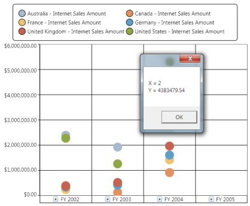

# Series

Series are the data points plotted in the rectangular co-ordinate system. In this section the following topics will be discussed:

## Series customization quick reference

<table>
<tr>
<th>
Chart Type</th><th>
Series Stroke</th><th>
Series Stroke Thickness</th><th>
Series Interior</th></tr>
<tr>
<td>
{{ 'Column/Bar/Area' | markdownify }}</td><td>
Affects the border color of the series.</td><td>
Affects the border thickness of the series.</td><td>
Affects the series color.</td></tr>
<tr>
<td>
{{ 'Line/Spline' | markdownify }}</td><td>
No effect</td><td>
Affects the thickness of the particular line (series).</td><td>
Affects the color of the particular line (series).</td></tr>
<tr>
<td>
{{ 'Pie' | markdownify }}</td><td>
Affects the border color of the series.</td><td>
Affects the border thickness of the series.</td><td>
No effect</td></tr>
</table>

## How to display a point label in an OlapChart?

Point label provides information about the data point. Data point can be added to a series by using the following code snippet:
  

   

for(int i=0; i< this.olapchart1.Series.Count; i++)
{
    //// Setting the visibility of adornment.
    this.olapchart1.Series[i].AdornmentsInfo.Visible = true;

    //// Setting horizontal alignment
    this.olapchart1.Series[i].AdornmentsInfo.SegmentHorizontalAlignment = 

System.Windows.HorizontalAlignment.Right;

    //// Makes the segment out from the series.
    this.olapchart1.Series[i].AdornmentsInfo.SegmentIsOut = true;

    this.olapchart1.Series[i].AdornmentsInfo.SegmentLabelContent = 

LabelContent.LabelContentPath;

    this.olapchart1.Series[i].AdornmentsInfo.SegmentLabelFontSize = 12;
    this.olapchart1.Series[i].AdornmentsInfo.SegmentLabelRotation = 325;
}

    

  

    

For i As Integer = 0 To Me.olapchart1.Series.Count - 1

' Setting the visibility of adornment.

Me.olapchart1.Series(i).AdornmentsInfo.Visible = True

' Setting horizontal alignment

Me.olapchart1.Series(i).AdornmentsInfo.SegmentHorizontalAlignment = System.Windows.HorizontalAlignment.Right

' Makes the segment out from the series.

Me.olapchart1.Series(i).AdornmentsInfo.SegmentIsOut = True

Me.olapchart1.Series(i).AdornmentsInfo.SegmentLabelContent = LabelContent.LabelContentPath

Me.olapchart1.Series(i).AdornmentsInfo.SegmentLabelFontSize = 12

Me.olapchart1.Series(i).AdornmentsInfo.SegmentLabelRotation = 325

Next i

    

The following figure shows an OlapChart with PointLabels enabled:

## How to customize the chart series color?

You can set a custom color for each series in the OlapChart. The following code snippet explains this. To apply different colors to different series iterate through the series and apply the custom brush to the series.

  

   

       this.olapChart1.Series[0].Interior = Brushes.Orange;

    

  

    

      Me.olapChart1.Series(0).Interior = Brushes.Orange

    

## How to customize the series border properties?

You can customize the thickness of the series border of an OlapChart by using the following code snippet:

  

  

       this.olapchart1.Series[0].Stroke = Brushes.Black;
       this.olapchart1.Series[0].StrokeThickness = 4;

    

  

   

Me.olapchart1.Series(0).Stroke = Brushes.Black

Me.olapchart1.Series(0).StrokeThickness = 4

    

N> The behaviour of the series border will vary for different chart types. The following illustration describes them in detail.

The series border is applied for the first series of a Column chart by using the StrokeThickness property. Notice that the first series element is surrounded with the applied border.

Notice the variation. The same series border property is applied for a series in the line chart. Instead of creating a 4 pixel width border it increases the thickness of the particular series line.

Since, you know that the pie chart renders everything in a single series each block in the pie chart known as segments will have the border applied on them. This is described in the following illustration:

## How to customize the series with custom data templates?

Series can be customized with user defined data templates. The following sample usage describes how to apply a data template to the series in an OlapChart.

The following data template will be used to customize the series:

  

  

<DataTemplate x:Key="ColumnTemplate">
                <Canvas Name="myCanvas">
                    <Grid Name="OuterGrid" 

Canvas.Left="{Binding X}" 

Width="{Binding Width}" 

Height="{Binding ElementName=myCanvas, 

Path=ActualHeight}" >
                        <Border Name="ColumnRect"                           VerticalAlignment="Bottom"                           Width="{Binding Width}" Height="{Binding Height}"                          CornerRadius="8,8,0,0" Background="{Binding Interior}">
                        </Border>
                    </Grid>
                </Canvas>
</DataTemplate>

    

The following code snippet explains how to use a data template for a series:


  

   

       for (int i = 0; i < this.olapchart1.Series.Count; i++)
       {
           //Apply Series Template to display the series cylindrical style
           this.olapchart1.Series[i].Template = 

this.Resources["ColumnTemplate"] as DataTemplate;

           // Apply Series Interior to display the series in different colors.
           this.olapchart1.Series[i].Interior = 

App.Current.Resources["SeriesInterior" + i] as LinearGradientBrush;
       }

    

  

    

       For i As Integer = 0 To Me.olapchart1.Series.Count - 1

           'Apply Series Template to display the series cylindrical style

Me.olapchart1.Series(i).Template = TryCast(Me.Resources("ColumnTemplate"), DataTemplate)

           ' Apply Series Interior to display the series in different colors.

           Me.olapchart1.Series(i).Interior = TryCast(App.Current.Resources("SeriesInterior" & i), LinearGradientBrush)

       Next i

    



A sample, which demonstrates all the series customization, can be found in the following installation location:

..\Syncfusion\<Version Number>\BI\WPF\OlapChart.WPF\Samples\Customization\Series Customization Demo

## How to customize series thickness for line?

Series thickness in a line chart is the StrokeThickness. 

See the topic How to customize the series border properties, for more information.

## How to handle ChartMouseEventArgs

ChartMouseEventArgs are the arguments returned when the mouse events are triggered by the ChartSeries. ChartMouseEventArgs return the segment on which the mouse events are triggered along with the default mouse event args. This event args can be used to perform customization of a segment when a mouse event is encountered. The segment returns different values that can be used to perform calculations or operations.

The following code snippet demonstrates how the ChartMouseEventArgs can be used to retrieve information on the ChartSeries segment:


  

   

//// Event tagging

this.olapchart1.Series[0].MouseClick += new ChartMouseEventHandler(series_MouseClick);

//// Mouse click event for a series.
void series_MouseClick(object sender, ChartMouseEventArgs e)
{
    ChartPoint point = (ChartPoint)e.Segment.CorrespondingPoints[0].DataPoint;
    MessageBox.Show("X = " + point.X.ToString() + "\n" + "Y = " + point.Y.ToString());
}

    

  

   

' Event tagging

AddHandler olapchart1.Series(0).MouseClick, AddressOf series_MouseClick

' Mouse click event for a series.

Private Sub series_MouseClick(ByVal sender As Object, ByVal e As ChartMouseEventArgs)

Dim point As ChartPoint = CType(e.Segment.CorrespondingPoints(0).DataPoint, ChartPoint)

MessageBox.Show("X = " & point.X.ToString() & Constants.vbLf & "Y = " & point.Y.ToString())

End Sub

    




[Chart Series](http://docs.syncfusion.com/wpf/sfchart/series)



### How to enable chart animations

Animations can be added in the OlapChart control. It can be achieved through the following properties: SeriesAnimateOption, SeriesAnimateOnebyOne, EnableSeriesAnimation,and SeriesAnimationDuration for each chart series.

### Properties

<table>
<tr>
<th>
Property </th><th>
Description</th><th>
Type</th><th>
Data Type </th></tr>
<tr>
<td>
SeriesAnimateOption</td><td>
Gets or sets animation for each series </td><td>
Dependency</td><td>
AnimationOptions</td></tr>
<tr>
<td>
SeriesAnimateOnebyOne</td><td>
Gets or sets whether each series animate one by one. By default false.</td><td>
Dependency</td><td>
bool</td></tr>
<tr>
<td>
EnableSeriesAnimation</td><td>
Gets or sets whether enable animation for each series.</td><td>
Dependency</td><td>
bool</td></tr>
<tr>
<td>
SeriesAnimationDuration</td><td>
Gets or sets the animation duration for each series.</td><td>
Dependency</td><td>
TimeSpan</td></tr>
</table>

#### Sample Link

The samples can be found in the following location:

C:\Users\<username>\AppData\Local\Syncfusion\EssentialStudio\10.4.0.53\BI\WPF\OLAPChart.WPF\Samples\Appearance\Chart Animations Demo\

### Adding Chart Animation Support to an Application 

We can use the following code sample for enabling chart animations: 

  

  <syn:OlapChart ChartType="{Binding OlapChartType}" Name="olapChart1"   

            OlapDataManager="{Binding DataManager}" Grid.Row="1"  

            Background="Transparent" ColorPalette="Metro"      

            SeriesAnimateOption="Bottom"  

            SeriesAnimateOneByOne="true"        

            EnableSeriesAnimation="true"

            SeriesAnimationDuration="00:00:3" />

    

			  

   

// To set the Series Animate Option to Bottom in OlapChart.

this.olapChart1.SeriesAnimateOption = Syncfusion.Windows.Chart.AnimationOptions.Bottom;

// To enable the Series Animate OneByOne in OlapChart.

this.olapChart1.SeriesAnimateOneByOne = true;

// To disable Series Animate OneByOne in OlapChart.

this.olapChart1.SeriesAnimateOneByOne = false;

// To disable Series Animation in OlapChart.

this.olapChart1.EnableSeriesAnimation = false;

// To set the Series Animation Duration in OlapChart.

this.olapChart1.SeriesAnimationDuration = new TimeSpan(1);

    

## How to customize pie chart series

We can set the explode index, explode radius, and enable or disable the series effects for the each series in a pie chart.

#### Sample Link

The installed samples can be found here:

C:\Users\<username>\AppData\Local\Syncfusion\EssentialStudio\10.4.0.53\BI\WPF\OLAPChart.WPF\Samples\Chart Types\Pie Chart Demo

## Adding Pie Chart features to an Application 

The following code sample demonstrates the customization each series of the Pie chart.

  

    

foreach (ChartSeries series in this. olapchart.Series)

{

//To enable the chart to explode we have pass the ChartSeries and true as parameter to SetExplodedAll method

ChartPieType.SetExplodedAll(series, true);

}

foreach (ChartSeries series in this. olapchart.Series)

{

//To enable the chart to explode we have pass the ChartSeries and false as parameter to                      disable the SetExplodedAll method

ChartPieType.SetExplodedAll(series, false);

}

foreach (ChartSeries series in this.olapchart.Series)

{

//To enable the effects in Pie chart

series.EnableEffects = true;

}

foreach (ChartSeries series in this. olapchart.Series)

{

//To disable the effects in Pie chart

series.EnableEffects = false;

}

foreach (ChartSeries series in this. olapchart.Series)

{

// to set the explore index value we have to pass the ChartSeries and the index value of which part of the Chart to explode

ChartPieType.SetExplodedIndex(series, 2);

}

foreach (ChartSeries series in this. olapchart.Series)

{

// to set the radius of the exploded chart we have to pass the ChartSeries and the radius which is n double value

ChartPieType.SetExplodeRadius(series, 8.0);

}

    
