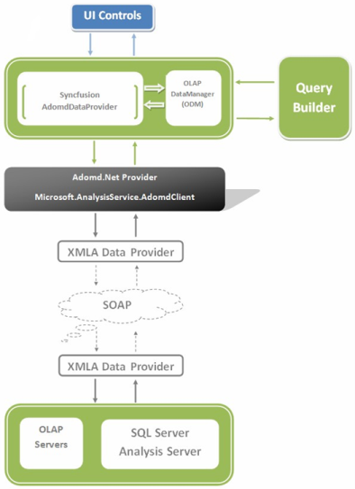
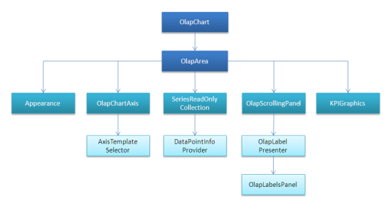

# Syncfusion OLAP Architecture

Syncfusion's OLAP architecture allows you to build a full life cycle Reporting solution for your enterprise. The important pieces of the architecture are as follows:

* OLAP Access Layer - Built on top of ADOMD.NET. It provides a high level object model to enable you to easily define reports.
* OLAP Controls - Chart, Grid, and Gauge for ASP.NET and WPF.
* OLAP Report Builder - RAD tool to enable you to select the dimensions you are interested in visualizing. Also it enables you to define the appearance for the Chart and the Grid.

Let us see how the Syncfusion OLAP components allow you to build a full life cycle Reporting solution for your enterprise.

## Class Structure Diagram

###  Public Properties

<table>
<tr>
<th>
DesignerSettings</th><th>
Gets or sets the designer settings that can be used for creating the XAML report during the design-time.</th></tr>
<tr>
<td>
ChartAppearance</td><td>
Gets or sets the chart appearance settings such as ChartArea background, BorderColor, ChartType, etc.</td></tr>
<tr>
<td>
ChartType</td><td>
Gets or sets the chart type.</td></tr>
<tr>
<td>
ColorModel</td><td>
Gets the color model used to paint series.</td></tr>
<tr>
<td>
CornerRadius</td><td>
Gets or sets the corner radius of the OLAP Chart.</td></tr>
<tr>
<td>
GridBackground</td><td>
Gets or sets the grid background.</td></tr>
<tr>
<td>
GridLineStroke</td><td>
Gets or sets the grid line stroke.</td></tr>
<tr>
<td>
Legend</td><td>
Gets or sets the chart legend.</td></tr>
<tr>
<td>
OlapDataManager</td><td>
Gets or sets the olap data manager.</td></tr>
<tr>
<td>
PrimaryAxis</td><td>
Gets or sets the primary axis.</td></tr>
<tr>
<td>
ShowPrimaryAxisLabelBorder</td><td>
Gets or sets a value indicating whether the primary axis label border should be visible or not.</td></tr>
<tr>
<td>
SecondaryAxis</td><td>
Gets or sets the secondary axis.</td></tr>
<tr>
<td>
Series</td><td>
Gets the series collection.</td></tr>
<tr>
<td>
DisplayMode</td><td>
Gets or sets the display mode.</td></tr>
<tr>
<td>
SeriesToolTipTemplate</td><td>
Gets or sets the series tool tip template.</td></tr>
<tr>
<td>
KpiAlignment</td><td>
Gets or sets the KPI alignment.</td></tr>
<tr>
<td>
PrimaryAxisLabelVisibility</td><td>
Gets or sets the primary axis label visibility.</td></tr>
</table>

#### Public Methods

Public Methods table

<table>
<tr>
<th>
DataBind</th><th>
Binds the data.</th></tr>
<tr>
<td>
ExportIntoNewDoc</td><td>
Exports the chart to a new word document.</td></tr>
<tr>
<td>
ExportIntoTemplateDoc</td><td>
Overloaded. Exports the chart to an existing word document by replacing the chart at the marker string position.</td></tr>
<tr>
<td>
ExportIntoNewPdf</td><td>
Exports the chart to a new PDF document.</td></tr>
<tr>
<td>
OnApplyTemplate</td><td>
Invoked whenever application code or internal processes call ApplyTemplate().</td></tr>
<tr>
<td>
SetChartAppearanceDetails</td><td>
Sets the chart appearance settings.</td></tr>
<tr>
<td>
ShowAppearanceDialog</td><td>
Displays the chart appearance customization dialog. It can be used for customizing the chart appearance properties.</td></tr>
</table>

### Public Events

<table>
<tr>
<th>
BeforeRefresh</th><th>
Occurs before the refresh of the OLAP area.</th></tr>
<tr>
<td>
AfterRefresh</td><td>
Occurs after the refresh of the OLAP area.</td></tr>
</table>

### Public Properties

<table>
<tr>
<th>
ChartType</th><th>
Gets or sets the ChartType.</th></tr>
<tr>
<td>
OlapDataManager</td><td>
Gets or sets the cube model.</td></tr>
<tr>
<td>
PivotEngine</td><td>
Gets the value of the PivotEngine.</td></tr>
<tr>
<td>
PrimaryOlapAxis</td><td>
Gets or sets the primary olap axis.</td></tr>
<tr>
<td>
Series</td><td>
Gets or sets the read only collection of the series.</td></tr>
</table>

### Public Methods

<table>
<tr>
<th>
DataBind</th><th>
Binds the data.</th></tr>
<tr>
<td>
IsToolTipSupported</td><td>
Determines whether the ToolTip is supported for the specified chart type or not.</td></tr>
<tr>
<td>
OnApplyTemplate</td><td>
Invoked whenever application code or internal processes call ApplyTemplate().</td></tr>
<tr>
<td>
UpdateKPIValues</td><td>
Updates the KPI values.</td></tr>
</table>

### Public Events

<table>
<tr>
<th>
BeforeRefresh</th><th>
Occurs before the refresh of the OLAP area.</th></tr>
<tr>
<td>
AfterRefresh</td><td>
Occurs after the refresh of the OLAP area.</td></tr>
</table>

### Public Properties

<table>
<tr>
<th>
Area</th><th>
Gets the parent area for the axis.</th></tr>
<tr>
<td>
GroupLineStroke</td><td>
Gets or sets the GroupLineStroke. This is a dependency property.</td></tr>
<tr>
<td>
LabelFormat</td><td>
Gets or sets the label format.</td></tr>
<tr>
<td>
ShowGroupLineStroke</td><td>
Gets or sets the ShowGroupLineStroke. This is a dependency property.</td></tr>
</table>



ChartAxis

