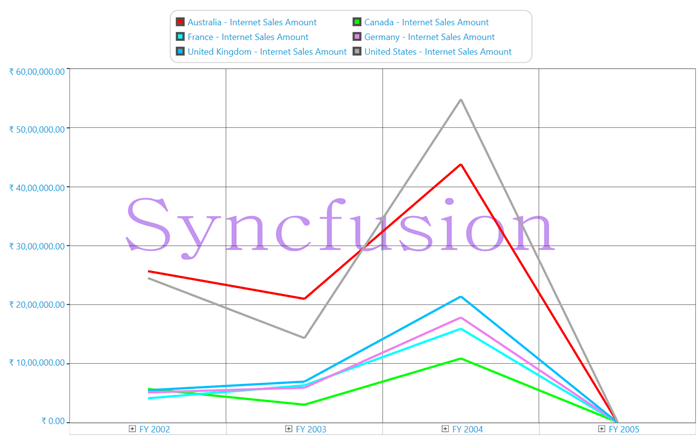
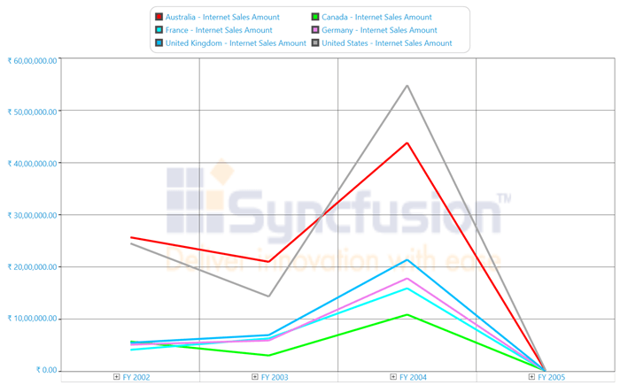

# Watermark

OlapChart for WPF supports watermark feature, which can be used to show text, image, or both as a watermark inside the Chart area. 

There are many customization options available for the watermarked content. The content can be aligned both horizontally and vertically. It's font style can be changed. The interior of the content can be customized and the opacity can also be varied.

The following screen shot shows the text as a watermark:

The following screen shot shows the image as a watermark:

A sample demo is available at the following link:

[system drive]:\Users\\{User Name}\AppData\Local\Syncfusion\EssentialStudio\\{Version Number}\WPF\OlapChart.WPF\Samples\Chart Appearance\Watermark Demo

