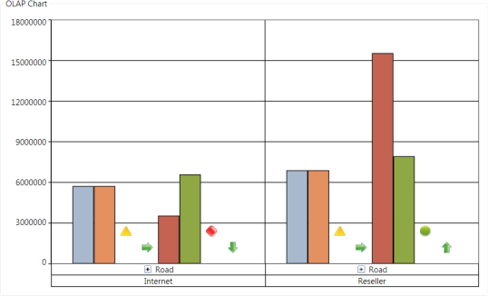

# XAML Configuration

XAML configuration is an important feature of OlapChart, as it helps the user to configure the control entirely using XAML by eliminating the need code in code behind. 

## Adding report to OLAP Chart

Adding an OLAP report to OLAP Chart control in design time is described in the following code snippet:

 

  

<syncfusion:OlapChart x:Name="olapChart" 

HorizontalAlignment="Stretch"

                      ReportName="SalesReport"

            CurrentCubeName="Adventure Works" 

SharedDataManagerName="localManager"

olapshared:DataSource.DataManagerName="localManager"

olapshared:DataSource.ConnectionString="datasource=localhost; initial catalog=adventure works dw">

<!- Adding Elements to Categorical Axis -->

<syncfusion:OlapChart.CategoricalAxis>

                    <syncfusion:Dimension Name="Date" HierarchyName="Fiscal" LevelName="Fiscal Year" IncludeMembers="FY 2002, FY 2003"  />   <!- Multiple Members where specified by comma separate -->                 

                    <syncfusion:Kpi Name="Revenue" ShowGoal="True" ShowStatus="True" ShowValue="True" ShowTrend="True" />

</syncfusion:OlapChart.CategoricalAxis>

<!- Adding Elements to Series Axis -->

<syncfusion:OlapChart.SeriesAxis>

                    <syncfusion:Dimension Name="Sales Channel" HierarchyName="Sales Channel" LevelName="Sales Channel" />

                    <syncfusion:Dimension Name="Product" HierarchyName="Product Model Lines" LevelName="Product Line" IncludeMembers="Road" />

</syncfusion:OlapChart.SeriesAxis>

</syncfusion:OlapChart>

 

### Sample Link

To access a XAML Configuration Demo sample:

1. Open the Syncfusion Dashboard
2. Select Business Intelligence
3. Click the WPF drop-down list and select Explore Samples
4. Navigate to OlapChart.WPF -> Samples -> Defining Reports -> XAML Configuration Demo

OLAP Chart with SalesReport created using XAML code
{:.caption}

