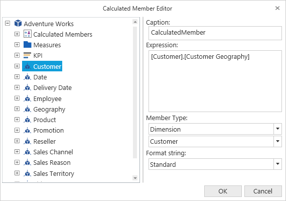

# Calculated Members And Measures

This feature allows users to define Measures and Members as they wish using Calculated Member Editor. The Calculated Member Editor can be opened just by clicking the respective icon available in the OlapClient toolbar. The icon will be visible only on setting **IsCalculatedMembersEnabled** property to true.





    <CheckBox Name="chk_CalcMember  ToolTip="Enable/Disable Calculated Members" Content="Enable Calculated Members" 
              IsChecked="{Binding ElementName=olapClient1, Path=IsCalculatedMembersEnabled}"/>



  

    this.olapClient1.IsCalculatedMembersEnabled = true; 

 



    Me.olapClient1.IsCalculatedMembersEnabled = True 





A sample demo is available at the following link:

[system drive]:\Users\\{User Name}\AppData\Local\Syncfusion\EssentialStudio\\{Version Number}\WPF\OlapClient.WPF\Samples\Product Showcase\CalculatedMembers

