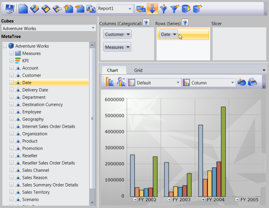
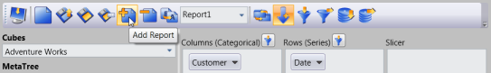
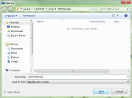
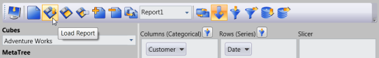

# Creating and Storing OLAP Report

OLAP Client allows you to create multiple reports and stored it as an XML file that contains all the reports. Each XML file may contain any number of reports. And also you can store the reports in Stream.

## Steps to create a report

To create a report:

   * First the client should connect to a Data source, a server or an Offline cube.
   * Select the elements from the Cube Dimension Browser and drag and dropping them in the required axis. The report will be created.
   * You can drag and drop any number of elements in any axis.
   * Once you finish the drag and drop of elements, you can store the current report.
* To add a report, click Add report and provide a name for the new report.
   * You can also add another report to the current report set and add the elements to a newly created report. 
   You can add any number of reports to the current report set.
   * Once you finish creating all the reports you can store the current report set as an XML file or to a Stream: 
* To save the report set as an XML file, click Save and provide the name for the XML file.
* To store the report set in stream, use the GetReportStream() method and get the report as stream and then store it in anywhere.

You can also load the saved report set by using the load option.

