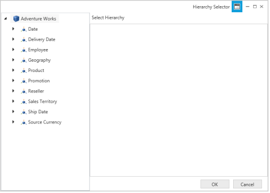
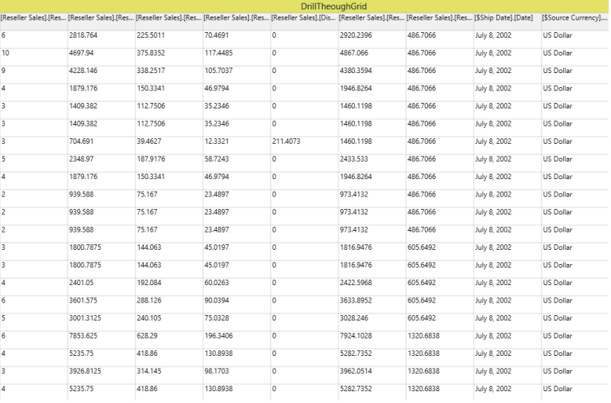

# Drill-Through Support

Drill-through retrieves the underlying table rows that are used to create a specified cell in a cube. 

## Property			

_Property Table_

<table>
<tr>
<td>
Property</td><td>
Description</td><td>
Type</td><td>
DataType</td></tr>
<tr>
<td>
EnableDrillThrough</td><td>
Gets or sets a value indicating whether to enable/disable drill-through action. </td><td>
Dependency</td><td>
Boolean</td></tr>
</table>
## Adding Drill-through for OLAP Client in an application

The following code example explains you on how to enable the drill-through option in your application.

[C#]

this.olapClient1.DisplayMode = Syncfusion.Windows.Client.Olap.DisplayModes.GridOnly;

this.olapClient1.OlapGrid.ValueCellStyle.IsHyperlinkCell = true;

this.olapClient1.OlapGrid.EnableDrillThrough = true;

this.olapClient1.OlapGrid.LinkClick += new Syncfusion.Windows.Grid.Olap.LinkLabelClickEventHander(OlapGrid_LinkClick);

void OlapGrid_LinkClick(object sender, Syncfusion.Windows.Grid.Olap.LinkLabelEventArgs e)

{

     DataTable DrillThroughData = e.DrillThroughData;

}

[VB]

Me.olapClient1.DisplayMode = Syncfusion.Windows.Client.Olap.DisplayModes.GridOnly

Me.olapClient1.OlapGrid.ValueCellStyle.IsHyperlinkCell = True

Me.olapClient1.OlapGrid.EnableDrillThrough = True

Me.olapClient1.OlapGrid.LinkClick += New Syncfusion.Windows.Grid.Olap.LinkLabelClickEventHander(OlapGrid_LinkClick)

Private Sub OlapGrid_LinkClick(sender As Object, e As Syncfusion.Windows.Grid.Olap.LinkLabelEventArgs)

    Dim DrillThroughData As DataTable = e.DrillThroughData

End Sub

{  | markdownify }
{:.image }

_Hyperlink Cell Click_

{  | markdownify }
{:.image }

_Attribute Hierarchy Selector_

{  | markdownify }
{:.image }

_Grid with drill-through data_

Sample Link

SystemDrive:\&lt;UserName&gt;\AppData\Local\Syncfusion\EssentialStudio\X.X.X.X\WPF\OlapClient.WPF\CS\Samples\Product Showcase\DrillThrough Demo\CS 

