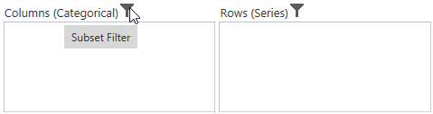
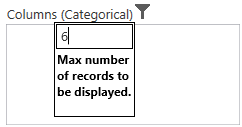

# Filtering

## Filtering by Member

After clicking Split Button of a dimension, Member Editor Dialog opens through which members are filtered by checking and unchecking the check boxes corresponding to the members. On clicking the "OK" button, based on the selected members in the Member Editor Dialog, OlapReport gets updated and refreshes the OlapGrid and OlapChart controls. The "Cancel" button is used for canceling the selection.

The above filter illustrates that the members "France" and "Germany", along with "New South Wales" and "Queensland" are filtered from the Grid and Chart view.

## Filtering by Value

The Filter tab in the Filtering and Sorting dialog box of OlapClient provides the options to specify custom filters on the multidimensional data. It enables the user to filter the rows and columns of the selected Measure.

* **Column Filter** - Column Filter will check each and every row of a column against the filter condition, if and only if all the rows of that column satisfy the condition, the column will be included in the result set else that column will be filtered.

* **Row Filter** - Row Filter will check each and every column of a row against the filter condition if and only if all the columns of that row satisfy the condition, the row will be included in the result set else that row will be filtered.

Filtering and Sorting dialog for rows/columns can be opened by clicking on the corresponding icon in the toolbar.

Filtering by row
{:.caption}

Filtering by column
{:.caption}

The following screenshot displays the Filter tab in Filtering and Sorting dialog.

The options in the Filtering tab are as follows:

**Filter Empty Rows/Columns** – By this option, user can filter the appearance of empty rows/columns in the result set.

**Filter 1 and Filter 2** - User can apply two filter expressions to a report at the same time. The options in the Filter group box are as follows:

* **Condition** – The user can choose any one condition that he wants to appear in the filter expression.
* **Filter On** – The user can choose any one Measure element from the list, on which the user wish to apply the filter.
* **Value** – The user needs to enter the conditional value for the expression.

User can toggle the visibility of the Filter and Sort buttons in the OlapClient toolbar by using the "ShowFilterSortButtons" property. 

 

  

    this.olapClient1.ShowFilterSortButtons = false;

 

 

    Me.olapClient1.ShowFilterSortButtons = False


 


## Subset Filter

Subset Filter is used to filter the number of records in the result set. Subset filter will get a numeric number as input and restrict the number of records within that count. We can specify the subset filter for both row and column.

Users can toggle the visibility of Subset Filter by using the "ShowSubsetFilters" property.



  

    this.olapClient1.ShowSubsetFilters = false;

 

 

    Me.olapClient1.ShowSubsetFilters = False




