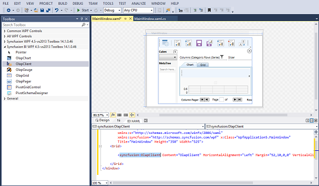
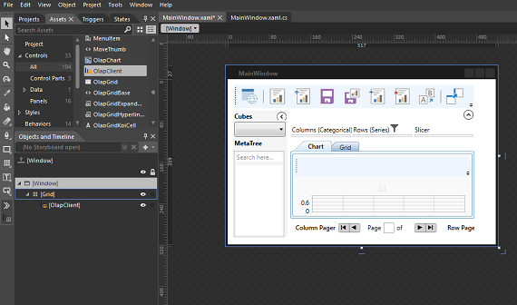
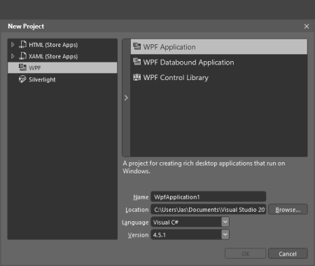
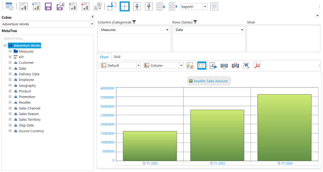
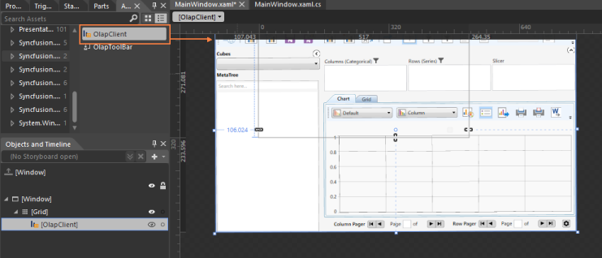
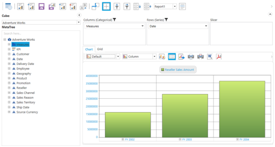

# Getting Started

## Configuring the OLAP Client Control

This section describes how to configure an OLAP Client component in an application. You can also learn how to pass the required data to the OLAP Client and to customize its various options according to your requirement.

In the following example, the OLAP Client is loaded with the default report by picking the default Measure and Dimension. In the Adventure Works Cube, default Measure is the Reseller Sales Amount and Dimension is the Date.

### Through Visual Studio

1. Open the Visual Studio IDE and from the File menu, select New  Project.
2. In the New Project Dialog box, click the tree node item Windows under Visual C# and select WPF Application and click OK.

3. Drag and drop the OLAP Client control from the Syncfusion BI WPF toolbox onto the Design page. The required Syncfusion assemblies are added automatically to the application.

4. Add a name for the OLAP Client in the XAML page for accessing it in code behind.

 

[XAML]

<Window

        xmlns="http://schemas.microsoft.com/winfx/2006/xaml/presentation"

        xmlns:x="http://schemas.microsoft.com/winfx/2006/xaml"

        xmlns:syncfusion="http://schemas.syncfusion.com/wpf" x:Class="WpfApplication5.MainWindow"

        Title="MainWindow" Height="350" Width="525">

    <Grid>

        <syncfusion:OlapClient Name="olapClient1" HorizontalAlignment="Stretch" VerticalAlignment="Stretch"/>

    </Grid>

</Window>



5. The height, width, and other properties of the OLAP Client control are set through the property window or manually in the source code as well as in the code behind region. For example, the height and width properties can be set in the source code region as follows:

  

[XAML]

<Window

       xmlns="http://schemas.microsoft.com/winfx/2006/xaml/presentation"

        xmlns:x="http://schemas.microsoft.com/winfx/2006/xaml"

        xmlns:syncfusion="http://schemas.syncfusion.com/wpf" x:Class="WpfApplication5.MainWindow"

        Title="MainWindow" Height="350" Width="525">

    <Grid>

<syncfusion:OlapClient Name="olapClient1" Height="600" Width="700"/>

    </Grid>

</Window>



6. Now, navigate to the code behind file. In order to bind the OLAP Client control with the Cube data, the OlapDataManager is instantiated first through any one of the methods in the page load event. The OlapDataManager contains the connection details, current report, cube name, cube schema, and pivotengine for rendering the client control. Then it is assigned to the OLAP Client’s OlapDataManager and databinding is done. Initialy, the OLAP Client is loaded with its default report by picking the default Measure and default Dimension.

  [C#]

using Syncfusion.Olap.Manager;

namespace WpfApplication

{

    public partial class MainWindow : SampleWindow

    { 

        public MainWindow()

        {

            InitializeComponent();

            //Connection string is passed to the OlapDataManager as an argument.

            OlapDataManager olapDataManager = new OlapDataManager("Enter a  valid connection string");

            // OlapClient gets information from the OlapDataManager.

            this.olapClient1.OlapDataManager = olapDataManager;

            this.olapClient1.DataBind();

        } 

    }

}



 

[VB]

Imports Syncfusion.Olap.Manager

Partial Public Class MainWindow

    Inherits SampleWindow

    Public Sub New()

        InitializeComponent()

        'Connection string is passed to the OlapDataManager as an argument.

        Dim olapDataManager As OlapDataManager = New OlapDataManager("Enter a valid connection string")

        'OlapClient gets information from the OlapDataManager.

        Me.olapClient1.OlapDataManager = olapDataManager

        Me.olapClient1.DataBind()

    End Sub

End Class

 

7. Run the application.

### Through Expression Blend

The OLAP Client control can also be created and configured by using the Expression Blend as illustrated.

1. Click Start Menu  All Programs  Microsoft Blend for the Visual Studio.
2. On the File menu, click New Project. The New Project dialog box appears as follows. 
3. In the New Project Dialog box, click WPF item and select the WPF Application. 

4. Select the Project tab in the application window. Right click the References and select Add References.
5. Then, add the following Syncfusion assemblies manually to the project from the installed location.
   1. Syncfusion.Grid.Wpf
   2. Syncfusion.Olap.Base
   3. Syncfusion.Chart.Wpf
   4. Syncfusion.OlapChart.Wpf
   5. Syncfusion.OlapGrid.Wpf
   6. Syncfusion.OlapGridCommon.Wpf
   7. Syncfusion.OlapClient.Wpf
   8. Syncfusion.OlapShared.Wpf
   9. Syncfusion.OlapTools.Wpf

Assembly Location: <system drive>\Program Files(x86)\Syncfusion\Essential Studio\<version number>\precompiledassemblies\<version number>\<framework version>

6. The OLAP Client is added under the Assets automatically.
7. Now, drag and drop the OLAP Client to the Designer.

8. Add a name for the OLAP Client in the XAML page for accessing it in code behind.

  [XAML]

<Window x:Class="WpfApplication.MainWindow"

    xmlns="http://schemas.microsoft.com/winfx/2006/xaml/presentation"

    xmlns:x="http://schemas.microsoft.com/winfx/2006/xaml"

    xmlns:syncfusion="clr-namespace:Syncfusion.Windows.Client.Olap;assembly=Syncfusion.OlapClient.WPF"

     Width="900" Height="630" >

    <Grid>

      <syncfusion:OlapClient Name="olapClient1" HorizontalAlignment="Stretch" VerticalAlignment="Stretch"/>

    </Grid>

</Window>



9. Add the following namespace in the code behind for manipulating the OlapReport and the OlapDataManager.
1. Syncfusion.Olap.Manager

  [C#]

using Syncfusion.Olap.Manager;

namespace WpfApplication

{

    public partial class MainWindow : SampleWindow

    {

        public MainWindow()

        {

            InitializeComponent();

            //Connection string is passed to the OlapDataManager as an argument.

            OlapDataManager olapDataManager = new OlapDataManager("Enter a valid connection string");

            // The OlapClient gets the information from the OlapDataManager.

            this.olapClient1.OlapDataManager = olapDataManager;

            this.olapClient1.DataBind();

        } 

    }

} 



 

[VB]

Imports Syncfusion.Olap.Manager

Partial Public Class MainWindow

    Inherits SampleWindow

    Public Sub New()

        InitializeComponent()

        'Connection string is passed to the OlapDataManager as an argument.

        Dim olapDataManager As OlapDataManager = New OlapDataManager("Enter a valid connection string")

        'The OlapClient gets the information from the OlapDataManager.

        Me.olapClient1.OlapDataManager = olapDataManager

        Me.olapClient1.DataBind()

    End Sub

End Class



10. Run the application and the following output is displayed.

### Through Code-Behind

1. Open the Visual Studio IDE and from the File menu, select New  Project.
2. In the New Project Dialog box, click the tree node item Windows under Visual C# and select the WPF Application and click OK.

3. Right-click on the References and select Add References. Then add the following Syncfusion assemblies manually to the project from the 
installed location.
   1. Syncfusion.Chart.WPF
   2. Syncfusion.Shared.WPF
   3. Syncfusion.Olap.Base
   4. Syncfusion.OlapChart.WPF
   5. Syncfusion.OlapChartConverter.WPF
   6. Syncfusion.OlapClient.WPF
   7. Syncfusion.OlapGrid.WPF
   8. Syncfusion.OlapGridCommon.WPF
   9. Syncfusion.OlapGridConverter.WPF
   10. Syncfusion.OlapSampleUtils
   11. Syncfusion.OlapShared.WPF
   12. Syncfusion.OlapTools.WPF
   13. Syncfusion.Tools.WPF

Assembly Location: <system drive>:\Program Files (x86)\Syncfusion\EssentialStudio\<version number>\precompiledassmblies\<version number>\<Framework version>\

4. Add the following namespaces in the code-behind for instantiating the OlapClient and manipulating the OlapDataManager.
1. Syncfusion.Olap.Manager
2. Syncfusion.Windows.Client.Olap

  [C#]

using Syncfusion.Windows.Client.Olap;

using Syncfusion.Olap.Manager;

namespace WpfApplication

{

    public partial class MainWindow : SampleWindow

    {

        public MainWindow()

        {

            InitializeComponent();

            //OLAP Client instantiation.

            OlapClient olapClient1 = new OlapClient();

            //Connection string is passed to the OlapDataManager as an argument.

            OlapDataManager olapDataManager = new OlapDataManager("Enter a valid connection string");

            // OLAP Client gets information from the OlapDataManager.

            olapClient1.OlapDataManager = olapDataManager;

            olapClient1.DataBind();

            //OLAP Client added to the Main Window.

            this.AddChild(olapClient1);

        }    

    }

}



  [VB]

Imports Syncfusion.Olap.Manager

Partial Public Class MainWindow

    Inherits SampleWindow

    Public Sub New()

        InitializeComponent()

        'OLAP Client instantiation.

        Dim olapClient1 As OlapClient =  New OlapClient()

        'Connection string is passed to the OlapDataManager as an argument.

        Dim olapDataManager As OlapDataManager =  New OlapDataManager       ("Enter a valid connection string")

        'OLAP Client gets information from the OlapDataManager.

        olapClient1.OlapDataManager = olapDataManager

        olapClient1.DataBind()

        'OLAP Client added to Main Window.

        Me.AddChild(olapClient1)

    End Sub

End Class 



