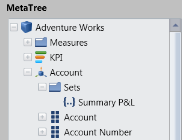

# Named Set Records

OLAP Client now supports the binding of OLAP data with named set records pre-defined in Cube. A named set is a collection of tuples and members, which can be defined and saved as a part of the cube definition. Named set records reside inside the sets folder, which is under a dimension element. These elements can be dragged to Categories/Series/Slicer axis of Axes Element Builder. To help make working with a lengthy, complex, or commonly used expression easier, Multidimensional Expressions (MDX) lets you define a named set.

The Cube Dimension Browser displays the Dimensions, Measures and KPIs along with named set, from the selected cube, inside a tree on the left. To visualize these members, you can drag the members to the Axes Element Builder area.

