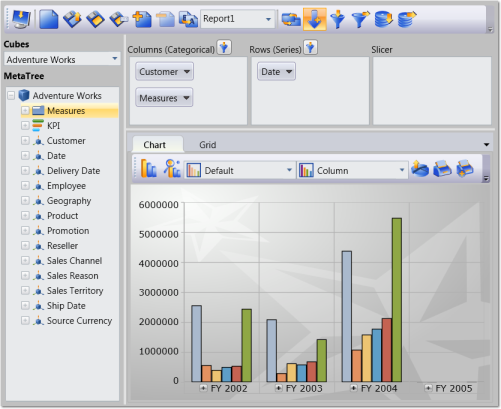

# Overview

Essential OLAP Client control lets you efficiently browse and analyze the multidimensional data from the OLAP data source. It lists all the Cubes, 
Dimensions, Measures and KPIs that are available in the data source, and lets you to slice and dice the cube. You can also create the report from 
the data source using OLAP Client and store it for later use. It also previews the report in the Grid and Chart while creating.

## OLAP Client is composed of following components:

* Cube Selector: Comprises multiple cubes obtained from data source.
* Cube dimension browser: Tree-View structure that comprises dimensions and measures belonging to the current cube into independent logical groups.
* Axis element builder: Contains the different elements of an axis.
* Member Editor: Tree-view control that displays the member element of current dimension.
* Measure Editor: Comprises a collection of measures.
* Toolbar: Contains the relevant button for report, filter and sorting.
* Chart: A chart is a graphical representation of [data](http://en.wikipedia.org/wiki/Data), in which "the data is represented by [symbols](http://en.wikipedia.org/wiki/Symbol), such as bars in a [bar chart](http://en.wikipedia.org/wiki/Bar_chart), lines in a [line chart](http://en.wikipedia.org/wiki/Line_chart), or slices in a [pie chart](http://en.wikipedia.org/wiki/Pie_chart)".
* Grid: A grid is a tabular representation of data, arranged in the form of rows and columns and categorized accordingly.

## Key Features

The Important features of OLAP Client controls are listed below.

Slice and Dice  - You can slice and dice the Cube Data Base. 

Saving the current session - You can save your current session in an XML file or in a Stream for future use and reload it whenever needed. 

Pivot Toggling - You can easily toggle the pivot if required by the click of button.

Filter and Sorting - You can specify filters and sorting criteria by using the dialog boxes provided. 

Export support - You can also export the OlapGrid and OlapChart to MS-Excel and other supported image formats.  

## User Guide Organization

The product comes with numerous samples as well as an extensive documentation to guide you. This User Guide provides detailed information on the features and functionalities of OLAP Client control. It is organized into the following sections:

* Overview - This section gives a brief introduction to our product and its key features.
* Getting Started - This section guides you on getting started with the BI application, OLAP Client control, and so on.
* Concepts and Features - The features of OLAP Client control are illustrated with use case scenarios, code examples and screen shots under this section.

## Document Conventions

The following conventions will help you to quickly identify the important sections of information while using the content.

_Conventions Table_

<table>
<tr>
<th>
Convention</th><th>
Icon</td><th>
Description</th></tr>
<tr>
<td>
Note</td><td>
> {{ '_Note:_' | markdownify }}</td><td>
Represents important information</td></tr>
<tr>
<td>
Example</td><td>
Example</td><td>
Represents an example</td></tr>
<tr>
<td>
Tip</td><td>
{{ '' | markdownify }}

</td><td>
Represents useful hints that will help you in using the controls/features</td></tr>
<tr>
<td>
Additional Information</td><td>
{{ '' | markdownify }}

</td><td>
Represents additional information on the topic</td></tr>
</table>

