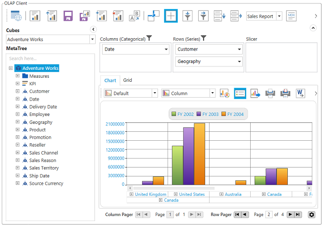

# Paging

Paging in OlapClient provides you support to load and render large amount of data without any performance constraint.  

OlapPager user control is included and bounded with the same OlapDataManager object of OlapClient. To enable paging, set EnablePaging 
property of OlapReport object to True.

When you process large CellSet, it is split into several number of segments and each segment is assigned and rendered in a separate page. 
You can navigate back and forth in all possible way by utilizing the GUI options in OlapPager. You can also change the page size at runtime
by using PageSetting window.

## Adding OlapPager in Application

1. Include the following Syncfusion assembly from the installed location.
   1. Syncfusion.OlapShared.Wpf

   Assembly Location: <system drive>:\Program Files (x86)\Syncfusion\EssentialStudio\<version number>\precompiledassemblies\<version number>\

2. Create a new OlapClient sample as follows.

			<Window       xmlns="http://schemas.microsoft.com/winfx/2006/xaml/presentation"

			xmlns:x="http://schemas.microsoft.com/winfx/2006/xaml"

			xmlns:syncfusion="http://schemas.syncfusion.com/wpf"

			x:Class="SampleApplication.MainWindow"

			Title="MainWindow" Height="350" Width="525">

				<Grid>

					<Grid.RowDefinitions>

							<RowDefinition Height="*"/>

							<RowDefinition Height="Auto"/>

					</Grid.RowDefinitions>

				<GroupBox  Header="OlapClient" Grid.Row="0">

					 <syncfusion:OlapClient  Name="olapClient" Background="Transparent" SeriesStrokeThickness="0">         

					 </syncfusion:OlapClient>

				</GroupBox>

				</Grid>

			</Window>

3. Enable paging in OlapReport.

				using Syncfusion.Olap.Manager;

				using Syncfusion.Olap.Reports;

				namespace SampleApplication

				{

				public partial class MainWindow : SampleWindow

				  {

					private string _connectionString;

					private OlapDataManager _olapDataManager;

					public MainWindow()

					 {  

					   InitializeComponent();

					   _connectionString = "Enter a valid connection string";

					   //Created connection string is passed to OlapDataManager as argument

					   _olapDataManager = new OlapDataManager(_connectionString);

					   //Created OlapReport is set as a current report to OlapDataManager

					   _olapDataManager.SetCurrentReport(SimpleDimensions());

					   //Finally OlapClient control gets the data from the created OlapDataManager

					   this.olapClient.OlapDataManager = _olapDataManager;

					   this.olapClient.DataBind();

					 }

					private OlapReport SimpleDimensions()

					{

					   OlapReport olapReport = new OlapReport();

					   olapReport.CurrentCubeName = "Adventure Works";

					   olapReport.EnablePaging = true;

					   olapReport.PagerOptions.CategorialPageSize = 10;

						olapReport.PagerOptions.SeriesPageSize = 10;

					   DimensionElement dimensionElement = new DimensionElement() { Name = "Customer", HierarchyName = "Customer" };

					   dimensionElement.AddLevel("Customer Geography", "Country");

					   olapReport.CategoricalElements.Add(dimensionElement);

					   MeasureElements measureElements = new MeasureElements();

					   measureElements.Add(new MeasureElement { Name = "Internet Sales Amount" });

					   olapReport.SeriesElements.Add(measureElements);

					   dimensionElement = new DimensionElement() { Name = "Geography", HierarchyName = "Geography" };

					   dimensionElement.AddLevel("Geography", "Country");

					   olapReport.CategoricalElements.Add(dimensionElement);

					   dimensionElement = new DimensionElement() { Name = "Date" };

					   dimensionElement.AddLevel("Fiscal", "Fiscal Year");

					   olapReport.SeriesElements.Add(dimensionElement);

					   return olapReport;

					 }

				  }

				} 

				Imports Syncfusion.Olap.Manager

				Imports Syncfusion.Olap.Reports

				Namespace SampleApplication

				Partial Public Class MainWindow

				Inherits SampleWindow

				Private _connectionString As String

				Private _olapDataManager As OlapDataManager

				Public Sub New()

				InitializeComponent()

				_connectionString = "Enter a valid connection string"

				'Created connection string is passed to OlapDataManager as argument

				_olapDataManager = New OlapDataManager(_connectionString)

				'Created OlapReport is set as a current report to OlapDataManager

				_olapDataManager.SetCurrentReport(SimpleDimensions())

				'Finally OlapClient control gets the data from the created OlapDataManager

				Me.olapClient.OlapDataManager = _olapDataManager

				Me.olapClient.DataBind()

				End Sub

				Private Function SimpleDimensions() As OlapReport

				Dim olapReport As New OlapReport()

				olapReport.CurrentCubeName = "Adventure Works"

				olapReport.EnablePaging = True

						 olapReport.PagerOptions.CategorialPageSize = 10

						  olapReport.PagerOptions.SeriesPageSize = 10

				Dim dimensionElement As New DimensionElement() With {.Name = "Customer", .HierarchyName = "Customer"}

				dimensionElement.AddLevel("Customer Geography", "Country")

				olapReport.CategoricalElements.Add(dimensionElement)

				Dim measureElements As New MeasureElements()

				measureElements.Add(New MeasureElement With {.Name = "Internet Sales Amount"})

				olapReport.SeriesElements.Add(measureElements)

				dimensionElement = New DimensionElement() With {.Name = "Geography", .HierarchyName = "Geography"}

				dimensionElement.AddLevel("Geography", "Country")

				olapReport.CategoricalElements.Add(dimensionElement)

				dimensionElement = New DimensionElement() With {.Name = "Date"}

				dimensionElement.AddLevel("Fiscal", "Fiscal Year")

				olapReport.SeriesElements.Add(dimensionElement)

				Return olapReport

				End Function

				End Class

				End Namespace

   

   

   {:.prettyprint}

### Sample Link:

Refer to the following location for the sample:

<system drive>\Users\<user name>\AppData\Local\Syncfusion\EssentialStudio\<version number>\

WPF\OlapClient.WPF\Paging

