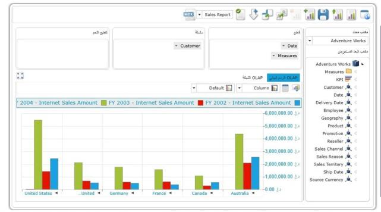

# RTL Support

Right-to-left support has been provided for the OLAP Client control for WPF. Users can now display content from right to left by setting 
the flow direction option in the control. 

### Use Case Scenario

Some cultures have a written language that reads from right to left. Controls deployed for such cultures should be rendered from right to left. In these cases, we can utilize RTL support of the OLAP Client component. 

### Properties

_Property Table_

<table>
<tr>
<td>
Property </td><td>
Description </td><td>
Type </td><td>
Data Type </td></tr>
<tr>
<td>
FlowDirection</td><td>
Gets or sets the flow direction for the OLAP Client control.</td><td>
Normal</td><td>
Enum</td></tr>
</table>

## Adding RTL Support for OLAP Client in an Application 

To enable RTL support, the FlowDirection property of the OLAP Client control needs to be set as RightToLeft. The following code sample explains how to set the FlowDirection property. It can be set through XAML or C# code.
 

[XAML]

<syncfusion:OlapClient x:Name="olapClient1" FlowDirection="RightToLeft" HorizontalAlignment="Stretch" VerticalAlignment="Stretch"                                       OlapDataManager="{Binding ClientDataManager}" />



 

[C#]

  this.olapClient1.FlowDirection = System.Windows.FlowDirection.RightToLeft;
  
 

 

[VB]

  Me.olapClient1.FlowDirection = System.Windows.FlowDirection.RightToLeft;



_RTL support of OLAP Client_

#### Sample Link

A sample is available locally in the following location:

SystemDrive:\Users\<user_name>\AppData\Local\Syncfusion\EssentialStudio\<version_number>\BI\WPF\OlapClient.WPF\Localization\LocalizationDemo

