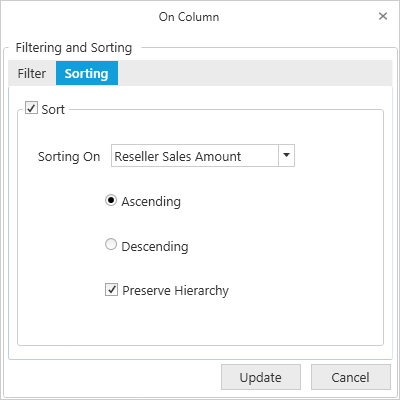

# Sorting of Rows and Columns

The Sorting tab in the Filtering and Sorting dialog box provides the option to sort the results by rows/columns, either in ascending or descending order.

* **Column Sorting** - Column sorting will sort the columns in the result set, based on the column total of each column.
* **Row Sorting** - Row sorting will sort the rows in the result set, based on the row total of each row.

Filtering and Sorting dialog box for rows/columns can be opened by clicking the corresponding icon in the toolbar.

Sorting by row
{:.caption}

Sorting by column
{:.caption}

The following screenshot displays the Sorting tab in Filtering and Sorting dialog box.

The options in the Sorting tab are as follows, 

* **Sorting On**: Display the list of Measure elements to choose one to set that as the key field.
* **Ascending or Descending**: Specify the sorting order.
* **Preserve Hierarchy**: Sort the records without changing the hierarchy order.

User can toggle the visibility of the Filter and Sort buttons in the OlapClient toolbar by using the "ShowFilterSortButtons" property. 

 

  

this.olapClient1.ShowFilterSortButtons = false;

 

 

Me.olapClient1.ShowFilterSortButtons = False


 
