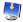
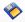
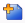
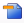

# Tool Bar support

Three toolbars are there in OLAP Client to provide the number of options to perform the different operations.

## OLAP Client Tool Bar

This toolbar contains menus to invoke the particular operation of OLAP Client.

{  | markdownify }
{:.image }

_Toolbar Table_

<table>
<tr>
<th>
Icon</th><th>
Name</th><th>
Description</th><th>
Reference Link</th></tr>
<tr>
<td>

{:.image }
</td><td>
Connection option</td><td>
Displays the Connection option dialog to connect to the server or Offline cube</td><td>
Connection option</td></tr>
<tr>
<td>

{:.image }
</td><td>
New Report</td><td>
Create a new session to create the report</td><td>
New Report</td></tr>
<tr>
<td>

{:.image }
</td><td>
Load Report</td><td>
Load the reports from the saved XML file</td><td>
Load Report</td></tr>
<tr>
<td>

{:.image }
</td><td>
Save Report</td><td>
Save the current session as an XML file</td><td>
Save Report</td></tr>
<tr>
<td>

{:.image }
</td><td>
Save As Report</td><td>
Save a copy of the current session as an XML file</td><td>
Save As Report</td></tr>
<tr>
<td>

{:.image }
</td><td>
Add Report</td><td>
Add a new report to the current report set</td><td>
Add Report</td></tr>
<tr>
<td>

{:.image }
</td><td>
Remove Report</td><td>
Remove the selected report from the current report set</td><td>
Remove Report</td></tr>
<tr>
<td>

{:.image }
</td><td>
Rename Report</td><td>
Rename the selected report in the current report set</td><td>
Rename Report</td></tr>
<tr>
<td>

{:.image }
</td><td>
Report list</td><td>
Displays the reports in the current report set</td><td>
Report list</td></tr>
<tr>
<td>

{:.image }
</td><td>
Toggle Pivot</td><td>
Toggle the axis of the selected report</td><td>
-</td></tr>
<tr>
<td>

{:.image }
</td><td>
Show/Hide expanders</td><td>
Show/Hide the expanders of the Chart and Grid control of the selected report</td><td>
-</td></tr>
<tr>
<td>

{:.image }
</td><td>
Column Filter</td><td>
Displays the Filter dialog window to filter the Column Elements in the selected report</td><td>
Column Filter</td></tr>
<tr>
<td>

{:.image }
</td><td>
Row Filter</td><td>
Displays the Filer dialog window to filter the Row Elements in the selected report</td><td>
Row Filter</td></tr>
<tr>
<td>

{:.image }
</td><td>
Sorting Column</td><td>
Displays the Sorting dialog window to sort the Column Elements in the selected report</td><td>
Sorting Column</td></tr>
<tr>
<td>

{:.image }
</td><td>
Sorting Row</td><td>
Displays the Sorting dialog window to sort the Row Elements in the selected report</td><td>
Sorting Row</td></tr>
</table>
## OLAP Chart Tool Bar

By using the menus in the OLAP ChartToolBar, the user can customise the appearance and style of the chart. And also the user can change the type of the chart.

{  | markdownify }
{:.image }

The following is the list of options in the OLAP Chart Tool Bar.

_List of options in the_ _OLAP Chart Tool Bar_

<table>
<tr>
<th>
Icon</th><th>
Name</th><th>
Description</th></tr>
<tr>
<td>

{:.image }
</td><td>
Chart Appearance</td><td>
Displays the Chart appearance dialog widow to change the chart appearance</td></tr>
<tr>
<td>

{:.image }
</td><td>
Show Legend</td><td>
Show/Hide the legend of the chart</td></tr>
<tr>
<td>

{:.image }
</td><td>
Chart Colour Palette</td><td>
Displays the list of colour palettes to change the current colour of the chart</td></tr>
<tr>
<td>

{:.image }
</td><td>
Chart Types</td><td>
Displays the list of chart types to change the current chart</td></tr>
<tr>
<td>

{:.image }
</td><td>
Export Chart</td><td>
Exports the current visual of the chart as Image</td></tr>
<tr>
<td>

{:.image }
</td><td>
Print</td><td>
Prints the current visual of the chart</td></tr>
<tr>
<td>

{:.image }
</td><td>
Print mode</td><td>
Used to fix the area of the chart to be printed</td></tr>
<tr>
<td>

{:.image }
</td><td>
Export to word</td><td>
Export the current visual of the chart to Word</td></tr>
<tr>
<td>

{:.image }
</td><td>
Export to Pdf</td><td>
Export the current visual of the chart to PDF</td></tr>
</table>
## OLAP Grid Tool Bar

By using the menus in the OLAP Grid Tool Bar, the user can customise the appearance and style of the Grid.

{  | markdownify }
{:.image }

The following are the options in the OLAP Grid Tool Bar.

_List of options in the_ _OLAP Grid Tool Bar_

<table>
<tr>
<td>
Icon</td><td>
Name</td><td>
Description</td></tr>
<tr>
<td>

{:.image }
</td><td>
Grid Style</td><td>
Displays the Grid Style Dialog to change the current style of the Grid</td></tr>
<tr>
<td>

{:.image }
</td><td>
Show header tooltip</td><td>
Show/Hide the Header cell tool tip.</td></tr>
<tr>
<td>

{:.image }
</td><td>
Show value cell tooltip</td><td>
Show/Hide the value cell tool tip.</td></tr>
<tr>
<td>

{:.image }
</td><td>
Freeze Headers</td><td>
Freeze the Header cells of the Grid</td></tr>
<tr>
<td>

{:.image }
</td><td>
Grid Layout</td><td>
Lists different types of grid layout to change the current layout</td></tr>
<tr>
<td>

{:.image }
</td><td>
Export to Excel</td><td>
Export the Grid to Excel</td></tr>
<tr>
<td>

{:.image }
</td><td>
Export to word</td><td>
Export the Grid to Word</td></tr>
<tr>
<td>

{:.image }
</td><td>
Export to Pdf</td><td>
Export the Grid to PDF</td></tr>
</table>
## Show/Hide Toolbar Options

It allows you to show/hide the OLAP Client toolbar options in an application.

Use Case Scenario 

You can customize the visibility of the toolbar options based on their requirement. 

Properties

_Properties_

<table>
<tr>
<td>
Property</td><td>
Description</td><td>
Type</td><td>
Data Type</td></tr>
<tr>
<td>
ShowConnectOptionButton</td><td>
Gets or sets a value indicating whether to show/hide Connection option.</td><td>
Dependency</td><td>
Boolean</td></tr>
<tr>
<td>
ShowNewReportButton</td><td>
Gets or sets a value indicating whether to show/hide New Report option. </td><td>
Dependency</td><td>
Boolean</td></tr>
<tr>
<td>
ShowAddReportButton</td><td>
Gets or sets a value indicating whether to show/hide Add Report option. </td><td>
Dependency</td><td>
Boolean</td></tr>
<tr>
<td>
ShowLoadReportButton</td><td>
Gets or sets a value indicating whether to show/hide Load Report option.</td><td>
Dependency</td><td>
Boolean</td></tr>
<tr>
<td>
ShowSaveReportButton</td><td>
Gets or sets a value indicating whether to show/hide Save Report option. </td><td>
Dependency</td><td>
Boolean</td></tr>
<tr>
<td>
ShowSaveAsReportButton</td><td>
Gets or sets a value indicating whether to show/hide SaveAs Report option.</td><td>
Dependency</td><td>
Boolean</td></tr>
<tr>
<td>
ShowRemoveReportButton</td><td>
Gets or sets a value indicating whether to show/hide Remove Report option.</td><td>
Dependency</td><td>
Boolean</td></tr>
<tr>
<td>
ShowRenameReportButton</td><td>
Gets or sets a value indicating whether to show/hide Rename Report option.</td><td>
Dependency</td><td>
Boolean</td></tr>
<tr>
<td>
ShowToggleButton</td><td>
Gets or sets a value indicating whether to show/hide Toggle Report option.</td><td>
Dependency</td><td>
Boolean</td></tr>
<tr>
<td>
ShowExpandersButton</td><td>
Gets or sets a value indicating whether to show/hide Expanders option.</td><td>
Dependency</td><td>
Boolean</td></tr>
<tr>
<td>
ShowFilterColumnButton</td><td>
Gets or sets a value indicating whether to show/hide Filter column option.</td><td>
Dependency</td><td>
Boolean</td></tr>
<tr>
<td>
ShowFilterRowButton</td><td>
Gets or sets a value indicating whether to show/hide Filter row option.</td><td>
Dependency</td><td>
Boolean</td></tr>
<tr>
<td>
ShowSortingColumnButton</td><td>
Gets or sets a value indicating whether to show/hide Sorting column option.</td><td>
Dependency</td><td>
Boolean</td></tr>
<tr>
<td>
ShowSortingRowButton</td><td>
Gets or sets a value indicating whether to show/hide Sorting row option.</td><td>
Dependency</td><td>
Boolean</td></tr>
<tr>
<td>
ShowReportList</td><td>
Gets or sets a value indicating whether to show/hide Report List option.</td><td>
Dependency</td><td>
Boolean</td></tr>
<tr>
<td>
ShowMdxButton</td><td>
Gets or sets a value indicating whether to show/hide MDX query dialog option.</td><td>
Dependency</td><td>
Boolean</td></tr>
<tr>
<td>
IsVirtualKpiEnabled</td><td>
Gets or sets a value indicating whether to show/hide Virtual KPI option.</td><td>
Dependency</td><td>
Boolean</td></tr>
<tr>
<td>
IsCalculatedMembersEnabled</td><td>
Gets or sets a value indicating whether to show/hide Calculated Members option.</td><td>
Dependency</td><td>
Boolean</td></tr>
</table>

Adding/Removing OLAP Client toolbar options in an application

[C#]

//Disable the Connection Option from current view of the OLAP Client Toolbar.

this.olapClient1.OlapClientToolBar.ShowConnectOptionButton = false;

// When set as true, then it shows from the toolbar.

[VB]

'Disable the Connection Option from current view of the OLAP Client Toolbar.

 Me.olapClient1.OlapClientToolBar.ShowConnectOptionButton = False

When set as True, then it shows from the toolbar.

Sample Link

{Installation Drive}:\Users\&lt;user name&gt;\AppData\Local\Syncfusion\EssentialStudio\&lt;version    number&gt;\BI\WPF\OlapClient.Wpf\Samples\Appearance\OlapClientCustomizationDemo

