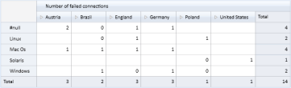
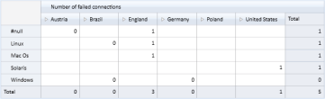

# Filtering slicer elements by range 

This feature enables you to specify a range for filter elements in the slicer field. You have to specify the start and end value to set the range. Multiple ranges can be added for the filter elements in slicer field. 

## Use Case Scenarios

It is not required to enter each member manually. This makes filtering easy.   

## Class 

_Table8: Class Table_

<table>
<tr>
<th>
Name </th><th>
Description </th></tr>
<tr>
<td>
SlicerRangeFiltersInfo</td><td>
Used to filter values from one range to another. Unique name of the member element for start and end value need to be specified. The name of the member element can also be specified for start and end value when custumer builds the unique name*.</td></tr>
</table>

* Name of the member element can be specified only when name is formed with dimension name, hierarchy name and level name.  

## Constructor 

_Table9: Constructor  Table_ 

<table>
<tr>
<th>
Syntax</th><th>
Description </th><th>
Parameter </th></tr>
<tr>
<td>
SlicerRangeFiltersInfo(string startValueUniqueName, string endValueUniqueName)</td><td>
Initializes SlicerRangeFiltersInfo with unique name as star and end values.  </td><td>
Unique name for start and end value.</td></tr>
<tr>
<td>
SlicerRangeFiltersInfo(string dimensionName, string hierarchyName, string levelName, string startValueName, string endValueName</td><td>
Initializes SlicerRangeFiltersInfo with name of dimension, hierarchy, level, star value and end value.  </td><td>
Name for dimension, hierarchy, level, start value and end value.</td></tr>
</table>

## Properties

Following table consists of SlicerRangeFiltersInfo class’s property:

_Table10: Properties Table_

<table>
<tr>
<th>
Property </th><th>
Description </th><th>
Type </th><th>
Data Type </th><th>
Reference links </th></tr>
<tr>
<td>
DimensionName</td><td>
Specify the dimension name</td><td>
None</td><td>
String </td><td>
NA</td></tr>
<tr>
<td>
HierarchyName</td><td>
Specify the hierarchy name</td><td>
None</td><td>
String </td><td>
NA</td></tr>
<tr>
<td>
LevelName</td><td>
Specify the level name</td><td>
None</td><td>
String </td><td>
NA</td></tr>
<tr>
<td>
StartValue</td><td>
Specify the unique name or name of the member element* </td><td>
None</td><td>
String </td><td>
NA</td></tr>
<tr>
<td>
EndValue</td><td>
Specify the unique name or name of the member element* </td><td>
None</td><td>
String </td><td>
NA</td></tr>
</table>

* Name of the member element can be specified only when the name is formed with dimension name, hierarchy name and level name. 

## Adding a range for the filter elements in slicer field:

There are two methods to add range for the filter elements in a slicer field.

In the first method, you can specify the unique name for start and end value. The following code illustrates this:  



olapReport.SlicerRangeFilters.Add(new SlicerRangeFiltersInfo("[TimeFlat].[201010100031]", "[TimeFlat].[201010100037]"));





olapReport.SlicerRangeFilters.Add(New SlicerRangeFiltersInfo ("[TimeFlat].[201010100031]", "[TimeFlat].[201010100037]"))



In the second method, you can specify the member name along with dimension name, hierarchy name and level name. Entering the unique name for start and end value is not mandatory.  The following code illustrates this: 



olapReport.SlicerRangeFilters.Add(new SlicerRangeFiltersInfo { DimensionName = "TimeFlat", HierarchyName = "TimeFlat", LevelName = "TimeId", StartValue = "201010100031", EndValue = "201010100037" });





olapReport.SlicerRangeFilters.Add(New SlicerRangeFiltersInfo With {.DimensionName = "TimeFlat", .HierarchyName = "TimeFlat", .LevelName = "TimeId", .StartValue = "201010100031", .EndValue = "201010100037"})



