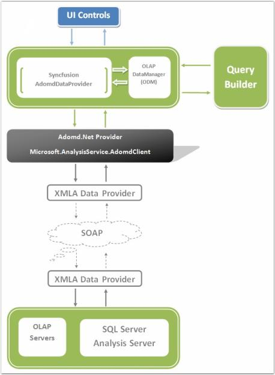
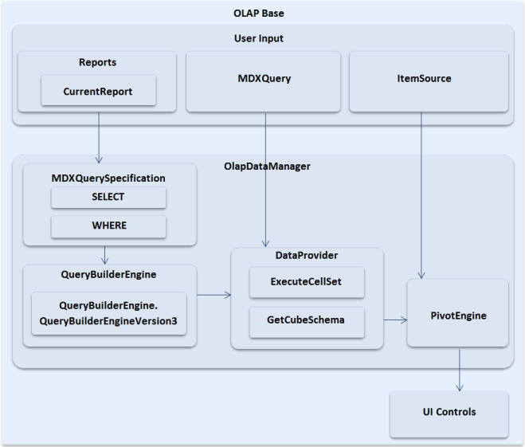
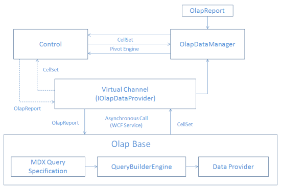

# Syncfusion OLAP Architecture

Syncfusion OLAP architecture allows you to build a full life cycle reporting solution for your enterprise. Here are the important pieces of the architecture:

* OLAP Access Layer - Built on top of ADOMD.NET and provides a high level object model to let you easily define reports.
* OLAP Controls - Chart, Grid, Gauge, Client for ASP.NET (excluding Gauge), WPF, Silverlight, ASP.NET MVC (Grid only).
* OLAP Report Builder – RAD (Rapid Application Development) tool lets you select the dimensions you are interested in visualizing and also lets you define the appearance for the Chart and Grid.

The following screenshot shows how the Syncfusion OLAP components allow you to build a full life cycle reporting solution for your enterprise.

Syncfusion OLAP Architecture
{:.caption}

## OLAP Base

The OLAP Base is a class library that contains several namespaces and classes to perform data processing operations required by OLAP controls. OLAP base is the processing unit of all Syncfusion OLAP controls. From establishing the connection and retrieving the data, processing it and providing the formatted input for each control, everything is taken care by the OLAP base.

Syncfusion OLAP controls communicate to the OLAP cube through the OlapDataManager class available in Syncfusion.Olap.Base namespace.

OLAP Base Architecture
{:.caption}

N> This class library was organized under Syncfusion.Olap.Base assembly.

## OLAP Silverlight Base

OLAP Silverlight Base is a class library, which contains several namespaces and classes to perform data processing operation required by OLAP Silverlight controls. The OlapDataManager retrieves OLAP data and binds the result to an OLAP Control.

N> This class library was organized under Syncfusion.OlapSilverlight.Base assembly.

## OLAP Silverlight Base Wrapper

The OLAP Silverlight Base Wrapper is a class library, which contains several namespaces and classes. This library helps to perform data conversion between OLAP Silverlight Base and OLAP Base. Data Conversion process is used to achieve the following features: 

1. Establishing the connection, retrieving data by converting the OLAP Silverlight Base information to OLAP Base information.
2. Send retrieved data to OLAP Silverlight Base by converting the OLAP Base data to OLAP Silverlight Base data.

Dataflow in Silverlight
{:.caption}

N> This class library was organized under Syncfusion.OlapSilverlight.BaseWrapper assembly.

### WCF Service

In order to query the database, OLAP Silverlight controls use WCF Service. The DataProvider property of OlapDataManager performs the service call operations. 

### Creating and connecting a WCF Service.
