# Appearance

## Gauge Radius

OlapGauge provides support to adjust its radius and it can be achieved by assigning a proper value to the **"Radius"** property of the OlapGauge. The following code sample illustrates setting Gauge radius.




 
this.olapGauge.Radius = 100;
this.olapGauge.DataBind();




 
Me.olapGauge.Radius = 100
Me.olapGauge.DataBind()





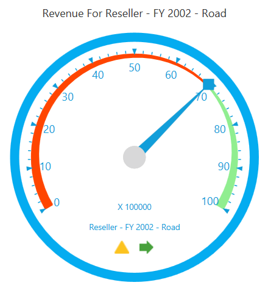

A sample demo is available at the following location:

{system drive}:\Users\\{User Name}\AppData\Local\Syncfusion\EssentialStudio\\{Version Number}\WPF\OlapGauge.WPF\Samples\Appearance\Customization\

## Built-In Frame Types

OlapGauge supports built-in frame types to provide effective rim styles. The **"FrameType"** property is used to set the frame type for the OlapGauge. The following are the frame types supported by OlapGauge.

* CircularCenterGradient
* CircularWithDarkOuterFrames
* FullCircle 
* HalfCircle 

The following code sample illustrates setting frame types for OlapGauge.




 
this.olapGauge.FrameType = GaugeFrameType.CircularWithInnerLeftGradient;




  
Me.olapGauge.FrameType = GaugeFrameType.CircularWithInnerLeftGradient





The following screen shots illustrate the various frame types.

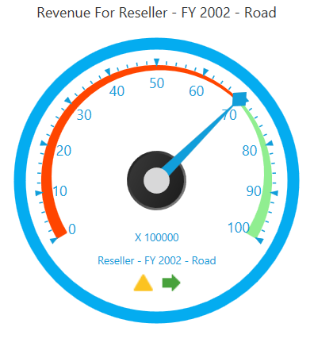

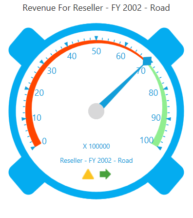

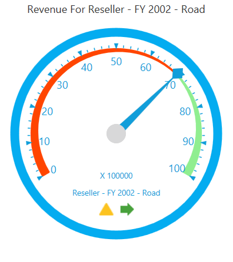

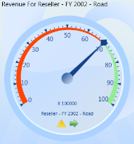

A sample demo is available at the following location:

{system drive}:\Users\\{User Name}\AppData\Local\Syncfusion\EssentialStudio\\{Version Number}\WPF\OlapGauge.WPF\Samples\Appearance\Customization\

## Skins

OlapGauge built-in-skins allow you to theme and style the look and feel of the control in various rich color schemes. You can use Skin Manager Framework to apply a wide range of skins to the OlapGauge. These skins have been designed to suit the needs of a wide range of audience. 

Types of Skins:

* Metro- This skin is similar to the Windows 8 Metro style.
* Blend- This skin is similar to the Microsoft Blend skin.
* Office2010Black- This skin is similar to the Microsoft Office2010Black skin. 
* Office2010Blue- This skin is similar to the Microsoft Office2010Blue skin. 
* Office2010Silver- This skin is similar to the Microsoft Office2010Silver skin. 
* Office2013LightGray- This skin is similar to the Microsoft Office2013LightGray skin. 
* Office2013DarkGray- This skin is similar to the Microsoft Office2013DarkGray skin. 
* Office2013White- This skin is similar to the Microsoft Office2013White skin.
* VisualStudio2013- This skin is similar to the VisualStudio2013 skin.

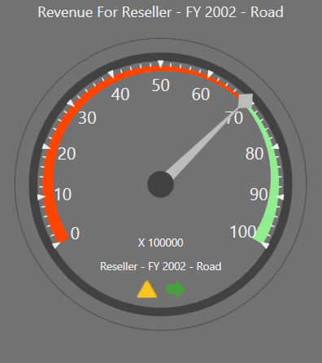

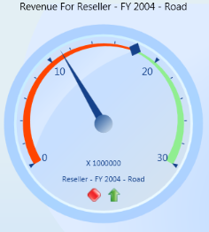

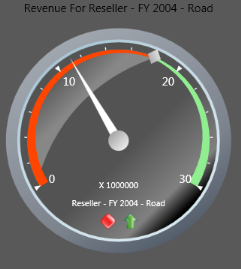

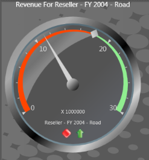

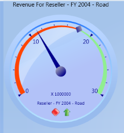

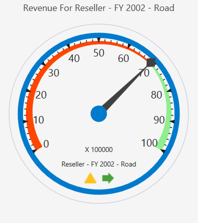

In order to apply skins, **SkinStorage.VisualStyle** property is used. To set the visual style for the control, follow the code sample given below.





<!--To set Metro visual style for OlapGauge-->
<gauge:OlapGauge Name="olapGauge1" Radius="120" sfshared:SkinStorage.VisualStyle="Metro"/>




 
//To set Metro visual style for OlapGauge
SfSkinManager.SetVisualStyle(olapGauge1, Syncfusion.SfSkinManager.VisualStyles.Metro);




  
'To set Metro visual style for OlapGauge
SfSkinManager.SetVisualStyle(olapGauge1, Syncfusion.SfSkinManager.VisualStyles.Metro);


 


The following output is obtained.

A sample demo is available at the following location:

{system drive}:\Users\\{User Name}\AppData\Local\Syncfusion\EssentialStudio\\{Version Number}\WPF\OlapGauge.WPF\Samples\Appearance\Visual Styles\

