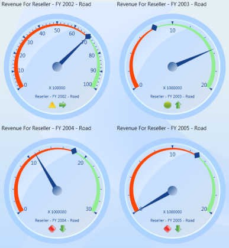
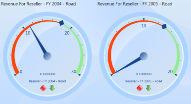
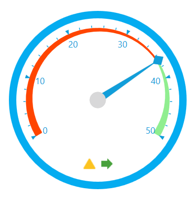

# Gauge Customization

## Layout Customization

OlapGauge provides support to display multiple gauges in a structured layout. You can customize the layout by using the **"ColumnsCount"** and **"RowsCount"** properties. These properties are used to specify the number of columns and rows for displaying the control.




 
this.olapGauge.ColumnsCount = 2;
this.olapGauge.RowsCount = 2;




  
Me.olapGauge.ColumnsCount = 2
Me.olapGauge.RowsCount = 2





A sample demo is available at the following location:

{system drive}:\Users\\{User Name}\AppData\Local\Syncfusion\EssentialStudio\\{Version Number}\WPF\OlapGauge.WPF\Samples\Product ShowCase\KPI\

## KPI

OlapGauge provides support to display Key Performance Indicators (KPIs) from the OLAP Cube. You can easily view the KPI Value and KPI Goal with the help of _Pointers_ and _Markers_, and the KPI Status and KPI Trend values through user friendly images (Traffic Light, Road Signs and Standard Arrow) in OlapGauge WPF. Each Gauge represents a member against one KPI combination.

A sample demo is available at the following location:

{system drive}:\Users\\{User Name}\AppData\Local\Syncfusion\EssentialStudio\\{Version Number}\WPF\OlapGauge.WPF\Samples\Product ShowCase\KPI\

## Show/Hide Gauge Header, Factor and Labels

OlapGauge provides support to customize the header, which displays the measure and KPI name. The **"ShowGaugeHeader"** property allows you to show or hide the Gauge header. If the property is set to true, it displays the Gauge header. If it is set to false, then it hides the Gauge header. Similarly **"ShowGaugeFactors"** and **"ShowGaugeLabels"** properties are used for showing and hiding the Gauge factors and labels. The following is the code sample. 




 
this.olapGauge1.ShowGaugeHeaders = false;
this.olapGauge1.ShowGaugeFactors = false;
this.olapGauge1.ShowGaugeLabels = false;




  
Me.olapGauge1.ShowGaugeHeaders = False
Me.olapGauge1.ShowGaugeFactors = False
Me.olapGauge1.ShowGaugeLabels = False





The following screen shot shows the output.

A sample demo is available at the following location:

{system drive}:\Users\\{User Name}\AppData\Local\Syncfusion\EssentialStudio\\{Version Number}\WPF\OlapGauge.WPF\Samples\Product ShowCase\KPI\

