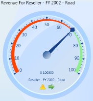

# Gauge Customization

## How to customize the layout of multiple gauge controls?

The OLAP Gauge control provides support to display multiple gauges in a structured layout. You can customize the layout by using the ColumnsCount and RowsCount properties. These properties are used to specify the number of columns and rows for displaying controls.

[C#]

this.olapGauge.ColumnsCount = 2;

this.olapGauge.RowsCount = 2;

[VB]

Me.olapGauge.ColumnsCount = 2

Me.olapGauge.RowsCount = 2

{{ '' | markdownify }}
{:.image }

Sample Location

A sample demo is available at the following location:

..\Syncfusion\EssentialStudio\<Version Number>\BI\WPF\OLAPGauge.WPF\Samples\Product ShowCase\Product Showcase Demo\

## How to represent KPI values in OLAP Gauge?

The OLAP Gauge control provides support to display Key Performance Indicators (KPIs) from the OLAP cube. KPIs are displayed with Trend and Status visualizations (Traffic Light, Road Signs and Standard Arrow types are supported).

You can easily view the KPI Value and KPI Goal with the help of _Pointers_ and _Markers_, and the KPI status and KPI trend values through user friendly images in OLAP Gauge WPF.  Each gauge represents a member against one KPI combination.

{{ '' | markdownify }}
{:.image }

Sample Location

A sample demo is available at the following location:

..\Syncfusion\EssentialStudio\<Version Number>\BI\WPF\OLAPGauge.WPF\Samples\Product ShowCase\Product Showcase Demo\

## How to show as well as hide gauge header, gauge factor and gauge labels? 

The OLAP Gauge control provides support to customize the header, which displays the measure and KPI name. The ShowGaugeHeader property allows you to show or hide the gauge header. If the property is set to true it displays the gauge header.If it is false, then it hides the gauge header. Similarly ShowGaugeFactors and ShowGaugeLabels properties are used for showing and hiding the gauge factors and labels. The following is the code snippet. 

[C#]

this.olapGauge1.ShowGaugeHeaders = true;

this.olapGauge1.ShowGaugeFactors = true;

this.olapGauge1.ShowGaugeLabels = true;

[VB]

Me.olapGauge1.ShowGaugeHeaders = True

Me.olapGauge1.ShowGaugeFactors = True

Me.olapGauge1.ShowGaugeLabels = True

The following screen shot shows the output:

{{ '' | markdownify }}
{:.image }

[C#]

this.olapGauge1.ShowGaugeHeaders = false;

this.olapGauge1.ShowGaugeFactors = false;

this.olapGauge1.ShowGaugeLabels = false;

[VB]

Me.olapGauge1.ShowGaugeHeaders = False

Me.olapGauge1.ShowGaugeFactors = False

Me.olapGauge1.ShowGaugeLabels = False

The following screen shot shows the output:

{{ '' | markdownify }}
{:.image }

Sample Location

A sample demo is available at the following location:

..\Syncfusion\EssentialStudio\<Version Number>\BI\WPF\OLAPGauge.WPF\Samples\Product ShowCase\Product Showcase Demo\

