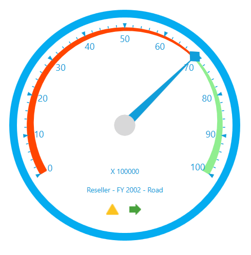
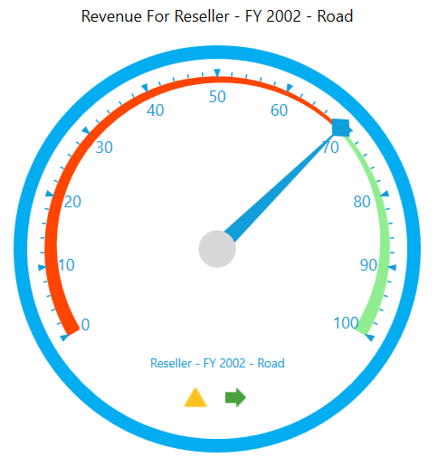

# Gauge Customization

## Layout Customization

OlapGauge provides support to display multiple gauges in a structured layout. You can customize the layout by using the `ColumnsCount` and `RowsCount` properties. These properties are used to specify the number of columns and rows for displaying the control.





<syncfusion:OlapGauge x:Name="OlapGauge1" RowsCount="2" ColumnsCount="2"/>





this.OlapGauge1.ColumnsCount = 2;
this.OlapGauge1.RowsCount = 2;





Me.OlapGauge1.ColumnsCount = 2
Me.OlapGauge1.RowsCount = 2





## Gauge header

Gauge header is the combination of details about the measure and KPI. The header components of the OlapGauge can be hidden by using the property of `ShowGaugeHeaders` as specified in the following code snippet:





<syncfusion:OlapGauge x:Name="OlapGauge1" ShowGaugeHeaders="False"/>





OlapGauge1.ShowGaugeHeaders = false;





OlapGauge1.ShowGaugeHeaders = False





## Gauge label

The visibility of gauge labels that are displayed inside the gauge can be toggled with the help of `ShowGaugeLabels` property. The following code snippet shows how to hide labels of the OlapGauge:





<syncfusion:OlapGauge x:Name="OlapGauge1" ShowGaugeLabels="False"/>





OlapGauge1.ShowGaugeLabels = false;





OlapGauge1.ShowGaugeLabels = False





## Gauge factor

Gauge factor component can be hidden by using the property of `ShowGaugeFactors` as specified in the below code snippet:





<syncfusion:OlapGauge x:Name="OlapGauge1" ShowGaugeFactors="False"/>





OlapGauge1.ShowGaugeFactors = false;





OlapGauge1.ShowGaugeFactors = False





