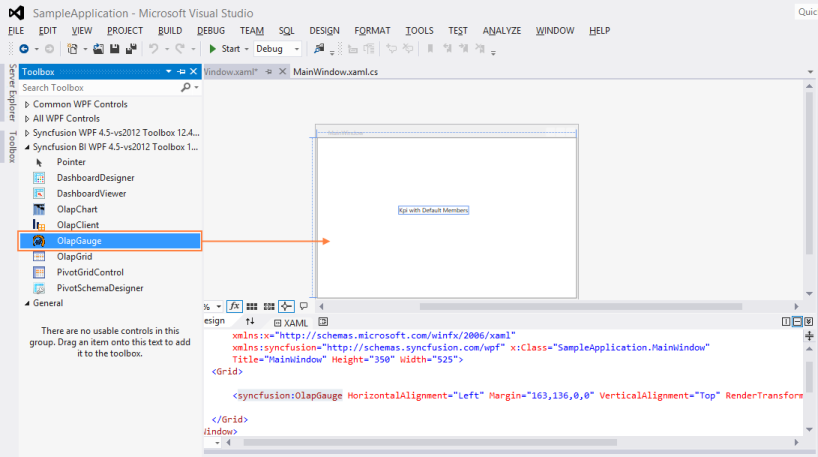
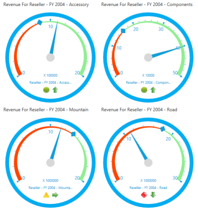
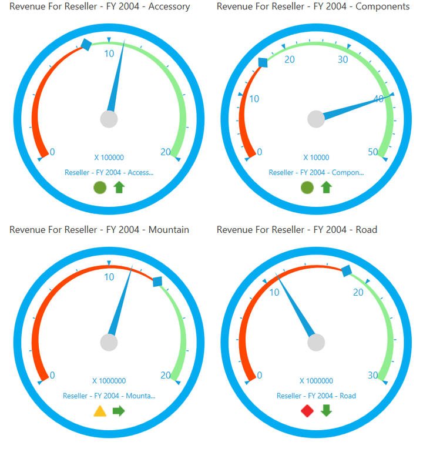
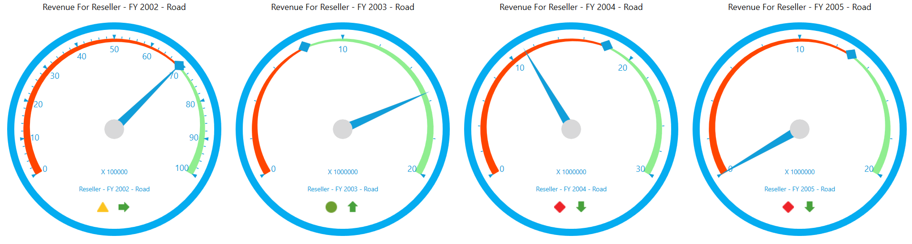

# Getting Started

# Configuring OLAP Gauge control

This section explains on how to configure an OLAP Gauge component in an application. You can also learn how to pass the required data to OLAP Gauge and to customize its various options according to your requirements.

# Through Visual Studio

1. Open Visual Studio IDE and from the File menu, select New  Project.
2. In the New Project Dialog box, click the tree node item Windows under Visual C# and select WPF Application.
3. Then type a name for the application and click OK. Here, name of the application is “SampleApplication”.

4. From the Visual Studio Toolbox, drag and drop the OlapGauge under Syncfusion BI WPF tag. It automatically add the required assemblies.

5. Add a name to OlapGauge for accessing it through code-behind as shown in the following code example.

  ~~~ xml

    [XAML]

    <Window

        xmlns="http://schemas.microsoft.com/winfx/2006/xaml/presentation"

        xmlns:x="http://schemas.microsoft.com/winfx/2006/xaml"

        xmlns:syncfusion="http://schemas.syncfusion.com/wpf" x:Class="SampleApplication.MainWindow"

        Title="MainWindow" Height="350" Width="525">

    <Grid>

        <syncfusion:OlapGauge x:Name="olapGauge" HorizontalAlignment="Left" VerticalAlignment="Top"/>

    </Grid>

    </Window>
	
  ~~~
  {:.pretty-print }

    

6. Include the following namespaces in the code-behind for handling OlapReport and OlapDataManger.
1. Syncfusion.Olap.Reports
2. Syncfusion.Olap.Manager

  ~~~ c#

    [C#]

    using Syncfusion.Olap.Manager;

    using Syncfusion.Olap.Reports;

    namespace SampleApplication

   {

    public partial class MainWindow : SampleWindow

    {

        private string _connectionString;

        private OlapDataManager _olapDataManager;

        public MainWindow()

        {  

            InitializeComponent();

            _connectionString = " Enter a valid connection string ";

            //Connection string is passed to OlapDataManager as an argument

            _olapDataManager = new OlapDataManager(_connectionString);

            //A default OlapReport is set to OlapDataManager

            _olapDataManager.SetCurrentReport(CreateOlapReport());

            // Finally OlapGauge gets the information from the OlapDataManager

            this.olapGauge.OlapDataManager = _olapDataManager;

            this.olapGauge.DataBind();

        }

        /// 

        /// Defining OlapReport with Dimension and Measure

        /// 

        private OlapReport CreateOlapReport()

        {

            OlapReport olapReport = new OlapReport();

            // Setting the Cube name

            olapReport.CurrentCubeName = "Adventure Works";

            DimensionElement dimensionElementColumn = new DimensionElement();

            // Specifying the name of the Dimension

            dimensionElementColumn.Name = "Customer";

            // Specifying the Hierarchy and Level name

            dimensionElementColumn.AddLevel("Customer Geography", "Country");

            MeasureElements measureElementColumn = new MeasureElements();

            //Specifying the Measure name

            measureElementColumn.Elements.Add(new MeasureElement { Name = "Internet Sales Amount" });

            DimensionElement dimensionElementRow = new DimensionElement();

            // Specifying the name of the Dimension

            dimensionElementRow.Name = "Date";

            // Specifying the Hierarchy and Level name

            dimensionElementRow.AddLevel("Fiscal", "Fiscal Year");

            ///Adding Dimension in column axis

            olapReport.CategoricalElements.Add(dimensionElementColumn);

            ///Adding Measure in column axis

            olapReport.CategoricalElements.Add(measureElementColumn);

            ///Adding Dimension in row axis

            olapReport.SeriesElements.Add(dimensionElementRow);

            return olapReport;

        }

    }

    }
	
  ~~~
  {:.pretty-print }

    

  ~~~ vbnet

    [VB]

    Imports Syncfusion.Olap.Manager

    Imports Syncfusion.Olap.Reports

    Namespace SampleApplication

    Partial Public Class MainWindow Inherits SampleWindow

    Private _connectionString As String

    Private _olapDataManager As OlapDataManager

    Public Sub New()

    InitializeComponent()

    _connectionString = "Enter a valid connection string"

    ' Connection string is passed to OlapDataManager as an argument

    _olapDataManager = New OlapDataManager(_connectionString)

    ' A default OlapReport is set to OlapDataManager

    _olapDataManager.SetCurrentReport(CreateOlapReport())

		' Finally OlapGauge gets the information from the OlapDataManager 

    Me.olapGauge.OlapDataManager = _olapDataManager

    Me.olapGauge.DataBind()

      End Sub

      ''' 

      ''' Defining OlapReport with Dimension and Measure

      ''' 

      Private Function CreateOlapReport() As OlapReport

            Dim olapReport As OlapReport = New OlapReport()

            ' Setting the Cube name

            olapReport.CurrentCubeName = "Adventure Works"

            Dim dimensionElementColumn As DimensionElement = New DimensionElement()

            ' Specifying the name of the Dimension

            dimensionElementColumn.Name = "Customer"

            ' Specifying the Hierarchy and Level name

            dimensionElementColumn.AddLevel("Customer Geography", "Country")

            Dim measureElementColumn As MeasureElements = New MeasureElements()

            ' Specifying the Measure name

            measureElementColumn.Elements.Add(New MeasureElement With {.Name = "Internet Sales Amount"})

            Dim dimensionElementRow As DimensionElement = New DimensionElement()

            ' Specifying the name of the Dimension

            dimensionElementRow.Name = "Date"

            ' Specifying the Hierarchy and Level name

            dimensionElementRow.AddLevel("Fiscal", "Fiscal Year")

            ''' Adding Dimension in column axis

            olapReport.CategoricalElements.Add(dimensionElementColumn)

            ''' Adding Measure in column axis

            olapReport.CategoricalElements.Add(measureElementColumn)

            ''' Adding Dimension in row axis

            olapReport.SeriesElements.Add(dimensionElementRow)

            Return olapReport

      End Function

      End Class

      End Namespace
	
  ~~~
  {:.pretty-print }

    

7. Run the application                                                    

# Through Expression Blend

OLAP Gauge control can also be created and configured by using Expression Blend as follows.

1. Open Blend for Visual Studio and from the File menu, select New  Project. Enter a valid project name and click OK.

2. Select Project tab in the application window. 

3. Right-click on References and select Add Reference, then add the following assemblies into the project from installed location.
1. Syncfusion.Olap.Base
2. Syncfusion.OlapGauge.WPF

## Assemblies Location:

<SystemDrive>:\ProgramFiles(x86)\Syncfusion\EssentialStudio\<version>\precompiledassemblies\<version>\<Framework>\

4. After adding the above assemblies, OlapGauge control is automatically added in the Assests.
5. Now, find OlapGauge and drag it to the designer window. 

6. Add a name to OlapGauge for accessing it through code-behind as shown in the following code example.

  ~~~ xml

    [XAML]

    <Window

        xmlns="http://schemas.microsoft.com/winfx/2006/xaml/presentation"

        xmlns:x="http://schemas.microsoft.com/winfx/2006/xaml"

        xmlns:syncfusion="http://schemas.syncfusion.com/wpf" x:Class="SampleApplication.MainWindow"

        Title="MainWindow" Height="350" Width="525">

    <Grid>

        <syncfusion:OlapGauge x:Name="olapGauge" HorizontalAlignment="Left" VerticalAlignment="Top"/>

    </Grid>

    </Window>
	
  ~~~
  {:.pretty-print }

    

7. Include the following namespaces in the code-behind for using OlapReport and OlapDataManger in the application.
1. Syncfusion.Olap.Reports
2. Syncfusion.Olap.Manager

  ~~~ c#

    [C#]

    using Syncfusion.Olap.Manager;

    using Syncfusion.Olap.Reports;

    namespace SampleApplication

    {

    public partial class MainWindow : SampleWindow

    {

        private string _connectionString;

        private OlapDataManager _olapDataManager;

        public MainWindow()

        {  

            InitializeComponent();

            _connectionString = " Enter a valid connection string ";

            //Connection string is passed to OlapDataManager as an argument

            _olapDataManager = new OlapDataManager(_connectionString);

            //A default OlapReport is set to OlapDataManager

            _olapDataManager.SetCurrentReport(CreateOlapReport());

            // Finally OlapGauge gets the information from the OlapDataManager

            this.olapGauge.OlapDataManager = _olapDataManager;

            this.olapGauge.DataBind();

        }

        /// 

        /// Defining OlapReport with Dimension and Measure

        /// 

        private OlapReport CreateOlapReport()

        {

            OlapReport olapReport = new OlapReport();

            // Setting the Cube name

            olapReport.CurrentCubeName = "Adventure Works";

            DimensionElement dimensionElementColumn = new DimensionElement();

            // Specifying the name of the Dimension

            dimensionElementColumn.Name = "Customer";

            // Specifying the Hierarchy and Level name

            dimensionElementColumn.AddLevel("Customer Geography", "Country");

            MeasureElements measureElementColumn = new MeasureElements();

            //Specifying the Measure name

            measureElementColumn.Elements.Add(new MeasureElement { Name = "Internet Sales Amount" });

            DimensionElement dimensionElementRow = new DimensionElement();

            // Specifying the name of the Dimension

            dimensionElementRow.Name = "Date";

            // Specifying the Hierarchy and Level name

            dimensionElementRow.AddLevel("Fiscal", "Fiscal Year");

            ///Adding Dimension in column axis

            olapReport.CategoricalElements.Add(dimensionElementColumn);

            ///Adding Measure in column axis

            olapReport.CategoricalElements.Add(measureElementColumn);

            ///Adding Dimension in row axis

            olapReport.SeriesElements.Add(dimensionElementRow);

            return olapReport;

        }

    }

    }
	
  ~~~
  {:.pretty-print }

    

  ~~~ vbnet

    [VB]

    Imports Syncfusion.Olap.Manager

    Imports Syncfusion.Olap.Reports

    Namespace SampleApplication

    Partial Public Class MainWindow Inherits SampleWindow

    Private _connectionString As String

    Private _olapDataManager As OlapDataManager

    Public Sub New()

    InitializeComponent()

    _connectionString = "Enter a valid connection string"

    ' Connection string is passed to OlapDataManager as an argument

    _olapDataManager = New OlapDataManager(_connectionString)

    ' A default OlapReport is set to OlapDataManager

    _olapDataManager.SetCurrentReport(CreateOlapReport())

    ' Finally OlapGauge gets the information from the OlapDataManager		Me.olapGauge.OlapDataManager = _olapDataManager

    Me.olapGauge.DataBind()

    End Sub

      ''' 

      ''' Defining OlapReport with Dimension and Measure

      ''' 

      Private Function CreateOlapReport() As OlapReport

            Dim olapReport As OlapReport = New OlapReport()

            ' Setting the Cube name

            olapReport.CurrentCubeName = "Adventure Works"

            Dim dimensionElementColumn As DimensionElement = New DimensionElement()

            ' Specifying the name of the Dimension

            dimensionElementColumn.Name = "Customer"

            ' Specifying the Hierarchy and Level name

            dimensionElementColumn.AddLevel("Customer Geography", "Country")

            Dim measureElementColumn As MeasureElements = New MeasureElements()

            ' Specifying the Measure name

            measureElementColumn.Elements.Add(New MeasureElement With {.Name = "Internet Sales Amount"})

            Dim dimensionElementRow As DimensionElement = New DimensionElement()

            ' Specifying the name of the Dimension

            dimensionElementRow.Name = "Date"

            ' Specifying the Hierarchy and Level name

            dimensionElementRow.AddLevel("Fiscal", "Fiscal Year")

            ''' Adding Dimension in column axis

            olapReport.CategoricalElements.Add(dimensionElementColumn)

            ''' Adding Measure in column axis

            olapReport.CategoricalElements.Add(measureElementColumn)

            ''' Adding Dimension in row axis

            olapReport.SeriesElements.Add(dimensionElementRow)

            Return olapReport

      End Function

      End Class

      End Namespace
	
  ~~~
  {:.pretty-print }

    

8. Run the application

# Through Code-Behind

1. Open Visual Studio IDE and from the File menu, select New  Project.
2. In the New Project Dialog box, click the tree node Windows under Visual C# and select WPF Application. 
3. Type a name for the application and click OK. Here, name of the application is “SampleApplication”.

4. Right-Click on References and select Add Reference, then add the following Syncfusion assemblies manually to the project from installed location.
1. Syncfusion.Gauge.WPF
2. Syncfusion.Core
3. Syncfusion.Olap.Base
4. Syncfusion.OlapGauge.WPF
5. Syncfusion.OlapShared.WPF
6. Syncfusion.Shared.WPF

## Assemblies Location

<SystemDrive>:\ProgramFiles(x86)\Syncfusion\EssentialStudio\<version>\precompiledassemblies\<version>\<Framework>\

5. Include the following namespaces in code-behind for using OlapGauge, OlapReport and OlapDataManger in the program.
1. Syncfusion.Olap.Reports
2. Syncfusion.Olap.Manager
3. Syncfusion.Windows.Gauge.Olap

  ~~~ c#

    [C#]

    using Syncfusion.Olap.Manager;

    using Syncfusion.Olap.Reports;

    using Syncfusion.Windows.Gauge.Olap;

    namespace SampleApplication

    {

    public partial class MainWindow : SampleWindow

    {

        private string _connectionString;

        private OlapDataManager _olapDataManager;

        public MainWindow()

        {  

            InitializeComponent();

            OlapGauge olapGauge = new OlapGauge();

            _connectionString = " Enter a valid connection string ";

            //Connection string is passed to OlapDataManager as an argument

            _olapDataManager = new OlapDataManager(_connectionString);

            //A default OlapReport is set to OlapDataManager

            _olapDataManager.SetCurrentReport(CreateOlapReport());

            // Finally OlapGauge gets the information from the OlapDataManager

            this.olapGauge.OlapDataManager = _olapDataManager;

            this.olapGauge.DataBind();

            this.AddChild(olapGauge);

        }

        /// 

        /// Defining OlapReport with Dimension and Measure

        /// 

        private OlapReport CreateOlapReport()

        {

            OlapReport olapReport = new OlapReport();

            // Setting the Cube name

            olapReport.CurrentCubeName = "Adventure Works";

            DimensionElement dimensionElementColumn = new DimensionElement();

            // Specifying the name of the Dimension

            dimensionElementColumn.Name = "Customer";

            // Specifying the Hierarchy and Level name

            dimensionElementColumn.AddLevel("Customer Geography", "Country");

            MeasureElements measureElementColumn = new MeasureElements();

            //Specifying the Measure name

            measureElementColumn.Elements.Add(new MeasureElement { Name = "Internet Sales Amount" });

            DimensionElement dimensionElementRow = new DimensionElement();

            // Specifying the name of the Dimension

            dimensionElementRow.Name = "Date";

            // Specifying the Hierarchy and Level name

            dimensionElementRow.AddLevel("Fiscal", "Fiscal Year");

            ///Adding Dimension in column axis

            olapReport.CategoricalElements.Add(dimensionElementColumn);

            ///Adding Measure in column axis

            olapReport.CategoricalElements.Add(measureElementColumn);

            ///Adding Dimension in row axis

            olapReport.SeriesElements.Add(dimensionElementRow);

            return olapReport;

        }

    }

    } 
	
  ~~~
  {:.pretty-print }

          

  ~~~ vbnet

    [VB]

    Imports Syncfusion.Olap.Manager

    Imports Syncfusion.Olap.Reports

    Imports Syncfusion.Windows.Gauge.Olap

    Namespace SampleApplication

    Partial Public Class MainWindowInherits SampleWindow

    Private _connectionString As String

    Private _olapDataManager As OlapDataManager

    Public Sub New()

    InitializeComponent()

    Dim olapGauge As New OlapGauge()

    _connectionString = "Enter a valid connection string"

    ' Connection string is passed to OlapDataManager as an argument

    _olapDataManager = New OlapDataManager(_connectionString)

    ' A default OlapReport is set to OlapDataManager

    _olapDataManager.SetCurrentReport(CreateOlapReport())

    ' Finally OlapGauge gets the information from the OlapDataManager		Me.olapGauge.OlapDataManager = _olapDataManager

    Me.olapGauge.DataBind()

    Me.AddChild(olapGauge)

    End Sub

      ''' 

      ''' Defining OlapReport with Dimension and Measure

      ''' 

      Private Function CreateOlapReport() As OlapReport

            Dim olapReport As OlapReport = New OlapReport()

            ' Setting the Cube name

            olapReport.CurrentCubeName = "Adventure Works"

            Dim dimensionElementColumn As DimensionElement = New DimensionElement()

            ' Specifying the name of the Dimension

            dimensionElementColumn.Name = "Customer"

            ' Specifying the Hierarchy and Level name

            dimensionElementColumn.AddLevel("Customer Geography", "Country")

            Dim measureElementColumn As MeasureElements = New MeasureElements()

            ' Specifying the Measure name

            measureElementColumn.Elements.Add(New MeasureElement With {.Name = "Internet Sales Amount"})

            Dim dimensionElementRow As DimensionElement = New DimensionElement()

            ' Specifying the name of the Dimension

            dimensionElementRow.Name = "Date"

            ' Specifying the Hierarchy and Level name

            dimensionElementRow.AddLevel("Fiscal", "Fiscal Year")

            ''' Adding Dimension in column axis

            olapReport.CategoricalElements.Add(dimensionElementColumn)

            ''' Adding Measure in column axis

            olapReport.CategoricalElements.Add(measureElementColumn)

            ''' Adding Dimension in row axis

            olapReport.SeriesElements.Add(dimensionElementRow)

            Return olapReport

       End Function

       End Class

       End Namespace
	
  ~~~
  {:.pretty-print }

    

6. Run the application.                                      

